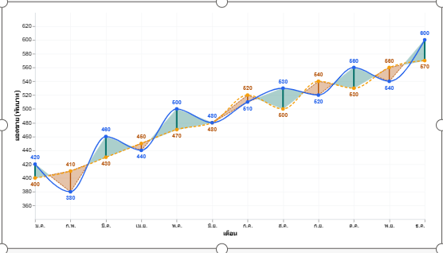
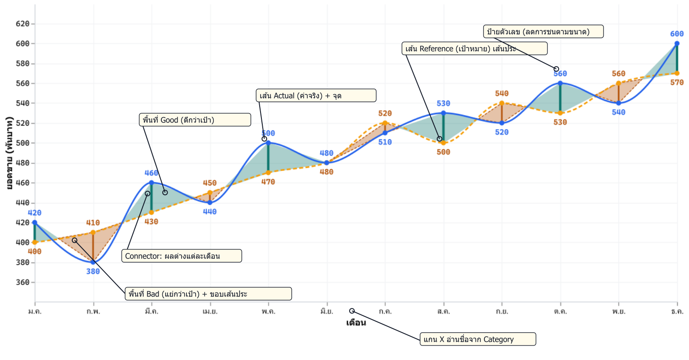

# บทที่ 1 รู้จัก Deneb

## สิ่งที่จะได้จากบทนี้

บทนี้เป็นบทปูพื้น ยังไม่มี Step ให้ลงมือทำใน Power BI เมื่ออ่านจบคุณควร

- อธิบายได้ว่า Deneb คืออะไร และทำงานร่วมกับ Power BI อย่างไร
- แยกได้ว่า Vega กับ Vega-Lite ต่างกันอย่างไร และทำไมเล่มนี้ใช้ Vega-Lite
- เลือกได้ว่าเมื่อไรควรใช้ Native Visual, Custom Visual ที่เขียนเอง หรือ Deneb
- เห็นภาพ Dual-Line Variance Chart ที่เราจะสร้างให้เสร็จในบทที่ 10 และรู้จักส่วนประกอบแต่ละส่วนของมัน

---

## 1.1 Deneb คืออะไร

**Deneb** คือ Custom Visual ตัวหนึ่งของ Power BI ที่เปิดให้เราสร้างกราฟเองด้วยภาษา **Vega** หรือ **Vega-Lite** ซึ่งเป็นภาษาแบบ declarative ที่เขียนเป็น JSON เอกสารของโครงการอธิบายตัวเองว่าเป็น Custom Visual ที่ให้นักพัฒนา "ใช้ JSON แบบ declarative ของ Vega หรือ Vega-Lite สร้าง data visualization ของตัวเอง" ([deneb-viz/deneb บน GitHub](https://github.com/deneb-viz/deneb))

หมายความว่าเราไม่ต้องเขียนโค้ดวาดกราฟทีละเส้นเอง เราแค่ **บรรยาย** ว่าอยากได้กราฟหน้าตาแบบไหน เช่น "ใช้ field นี้เป็นแกน X ใช้ field นั้นเป็นแกน Y วาดเป็นเส้น" แล้วให้ Vega-Lite คำนวณและวาดให้ ส่วน Deneb ทำหน้าที่เป็นสะพานระหว่างสองฝั่ง

- รับข้อมูลจากช่อง **Values** ของ Visual ใน Power BI แล้วส่งต่อให้ Vega-Lite ในรูปตารางชื่อ `dataset`
- มี Editor ให้เขียนและทดลอง spec ได้ทันทีในรายงาน (รายละเอียดในบทที่ 2)
- เชื่อมพฤติกรรมของ Power BI เข้ากับกราฟ ได้แก่ Tooltip, Context menu, Cross-filtering และ Cross-highlighting (บทที่ 8)

ข้อเท็จจริงที่ควรรู้ก่อนเริ่ม

| หัวข้อ | รายละเอียด | แหล่งอ้างอิง |
| --- | --- | --- |
| ผู้พัฒนา | Daniel Marsh-Patrick (ชื่อ Publisher ที่แสดงในหน้าต่าง About ของ Visual) | หน้าต่าง About ของ Deneb 2.0.0.0 บนเครื่องที่ใช้ทดสอบเล่มนี้ |
| สัญญาอนุญาต | Open source ภายใต้ MIT License ใช้งานได้ฟรี | [deneb.guide](https://deneb.guide/docs/getting-started), [GitHub](https://github.com/deneb-viz/deneb) |
| ช่องทางติดตั้ง | AppSource (ผ่านการรับรองของ Microsoft) | [deneb.guide](https://deneb.guide/docs/getting-started) |
| เวอร์ชันที่ใช้ทั้งเล่ม | Deneb **2.0.0.0** บน Power BI Desktop **2.157.1354.0** (August 2026) ภายในใช้ Vega-Lite **6.4.3** | หน้าต่าง About ของ Power BI/Deneb และแถบสถานะของ Deneb Editor |

> **หมายเหตุเรื่องความปลอดภัย** รุ่นที่ติดตั้งจาก AppSource เป็นรุ่นที่ผ่านการรับรอง จึงมีข้อจำกัดบางอย่าง เช่น โหลดรูปภาพจาก URL ภายนอกไม่ได้ เอกสารของ Deneb จึงมีรุ่น standalone แยกไว้สำหรับงานเฉพาะทาง เล่มนี้ใช้เฉพาะรุ่น AppSource และไม่ต้องใช้ความสามารถที่ถูกจำกัด

---

## 1.2 Vega และ Vega-Lite

ทั้งสองภาษาพัฒนาโดยกลุ่มที่มีรากมาจาก **University of Washington Interactive Data Lab** ทีมเดียวกับที่เคยสร้าง Prefuse และ Protovis ([vega.github.io/vega/about](https://vega.github.io/vega/about/))

| | Vega | Vega-Lite |
| --- | --- | --- |
| ระดับภาษา | ระดับล่าง เอกสารของ Vega เปรียบตัวเองว่าเป็น "assembly language" ของ visualization | ระดับสูง นิยามตัวเองว่าเป็น "high-level grammar of interactive graphics" ([vega.github.io/vega-lite](https://vega.github.io/vega-lite/)) |
| ความยาวของ spec | ยาว ต้องกำหนด scale, axis และ signal เองเกือบทั้งหมด | สั้น มีค่า default ที่เหมาะสมให้มาก |
| ความสัมพันธ์ | เป็นปลายทาง | spec ของ Vega-Lite ถูก **compile เป็น Vega** ก่อนวาดเสมอ |

เล่มนี้ใช้ **Vega-Lite** ทั้งเล่ม เพราะ spec สั้น อ่านง่าย และพอสำหรับทุกฟีเจอร์ของ Dual-Line Variance Chart ถ้าอยากดู Vega ที่ได้จากการ compile ให้กดปุ่ม "Show compiled Vega" ที่แถบล่างของ Deneb Editor ได้

ตัวอย่างข้างล่างคือ spec Vega-Lite ที่สั้นที่สุดที่ยังวาดเป็นเส้นได้ (ผ่านการ compile ด้วย Vega-Lite 6.4.3 แล้ว)

```json
{
  "$schema": "https://vega.github.io/schema/vega-lite/v6.json",
  "data": { "name": "dataset" },
  "mark": "line",
  "encoding": {
    "x": { "field": "Plot_Position", "type": "quantitative" },
    "y": { "field": "Plot_Actual", "type": "quantitative" }
  }
}
```

อ่านได้ตรงไปตรงมาว่า "เอาข้อมูลจาก `dataset` วาดเป็น `line` ให้แกน X คือ `Plot_Position` และแกน Y คือ `Plot_Actual`" บรรทัด `"data": { "name": "dataset" }` สำคัญมากใน Deneb เพราะเป็นตัวบอกให้ spec อ่านข้อมูลจากช่อง Values ของ Visual รายละเอียดของ `mark`, `encoding`, `field`, `type` และส่วนอื่นอยู่ในบทที่ 3 ส่วนข้อมูล `Plot_Position`/`Plot_Actual` มาจากตาราง `DualLine_PlotData` ในบทที่ 4

---

## 1.3 ประวัติย่อของ Deneb

ข้อมูลในตารางนี้มาจากหน้า Releases ของ repository [deneb-viz/deneb](https://github.com/deneb-viz/deneb/releases) และ [Changelog บน deneb.guide](https://deneb.guide/docs/changelog)

| ช่วงเวลา | เหตุการณ์ |
| --- | --- |
| ก.พ. 2021 | สร้าง repository บน GitHub |
| มี.ค. 2021 | ออกรุ่น beta แรก (0.2.0) ตามด้วยรุ่น 0.3–0.6 ตลอดปี 2021 |
| 24 พ.ย. 2021 | ออกรุ่น **1.0.0** |
| ก.พ. 2022 – มี.ค. 2026 | ออกรุ่น 1.1 ถึง 1.9.1 ต่อเนื่อง |
| ก.ค.–ส.ค. 2026 | ออกรุ่นทดสอบ alpha และ beta ของ 2.0 |
| 8 ก.ย. 2026 | ออกรุ่น **2.0.0** เขียนส่วนอ่านและ render spec ใหม่ทั้งหมด อัปเดต Vega เป็น 6.4.0 และ Vega-Lite เป็น 6.4.3 และเพิ่ม Continuous view ที่คงสถานะการแสดงผลไว้เมื่อ dataset อัปเดต |

เพราะรุ่น 2.0 เพิ่งออก ชื่อและตำแหน่งของเมนูบางอย่างจึงต่างจากบทความหรือวิดีโอสอนที่ทำไว้กับรุ่น 1.x ทุกชื่อเมนูในเล่มนี้ตรวจกับหน้าจอจริงของ Deneb 2.0.0.0 แล้ว ถ้าคุณใช้รุ่นอื่น ชื่อหรือตำแหน่งอาจไม่ตรงกับในหนังสือ

---

## 1.4 Native Visual, Custom Visual และ Deneb ต่างกันอย่างไร

| | Native Visual | Custom Visual ที่เขียนเอง (.pbiviz) | Deneb |
| --- | --- | --- | --- |
| ตัวอย่าง | Line chart, Clustered column chart | Visual ที่เขียนด้วย TypeScript + D3 แล้ว package เป็นไฟล์ `.pbiviz` | Custom Visual ที่ติดตั้งจาก AppSource แล้วเขียน spec เป็น JSON |
| สิ่งที่ต้องมี | ไม่ต้องมีอะไรเพิ่ม | Node.js, เครื่องมือ `pbiviz` และความรู้ TypeScript | Power BI Desktop กับ Deneb |
| ความยืดหยุ่นด้านรูปแบบ | จำกัดตามตัวเลือกใน Format pane | ทำได้ทุกอย่างที่เขียนโค้ดได้ | ทำได้ทุกอย่างที่ Vega/Vega-Lite บรรยายได้ |
| การแก้ไข | คลิกใน Format pane | แก้โค้ดแล้ว build และ import ใหม่ | แก้ JSON แล้วเห็นผลทันทีใน Editor |
| การนำไปใช้ซ้ำ | Copy visual หรือใช้ Theme | แจกไฟล์ `.pbiviz` | Export/Import **Template** ของ Deneb (บทที่ 9) |
| การรับรองขององค์กร | ใช้ได้ทันที | ต้องผ่านการอนุมัติขององค์กรเอง | ตัว Visual ผ่านการรับรองบน AppSource แล้ว |

**สรุปการเลือกใช้**

- **Native Visual** เหมาะกับกราฟมาตรฐานที่ตัวเลือกใน Format pane เพียงพอ
- **Custom Visual ที่เขียนเอง** เหมาะเมื่อต้องการพฤติกรรมที่ภาษาแบบ declarative ทำไม่ได้ เช่น animation ที่ควบคุมละเอียด
- **Deneb** เหมาะเมื่อต้องการกราฟที่ Native ไม่มี แต่ไม่อยากดูแลโปรเจกต์ TypeScript

Dual-Line Variance Chart ในเล่มนี้เคยมีรุ่นที่เขียนเป็น Custom Visual ด้วย D3 มาก่อน (`dualLineVarianceChart`) เล่มนี้จะพาคุณ **สร้างสิ่งที่ทำงานคล้ายกันด้วย Deneb** ไม่ใช่การแปลงโค้ด TypeScript มาทีละบรรทัด ความสามารถบางอย่างของรุ่นเดิม เช่น animation ด้วย Web Animations API จึงไม่มีในรุ่น Deneb ส่วนความสามารถบางอย่างที่รุ่นเดิมไม่มี เช่น การรับ Cross-highlight จาก Visual อื่น กลับทำได้ใน Deneb

---

## 1.5 ภาพรวม Visual ปลายทาง: Dual-Line Variance Chart



*ภาพที่ 1-1 ภาพหน้าจอจริงจาก Power BI Desktop 2.157.1354.0 และ Deneb 2.0.0.0: Dual-Line Variance Chart ขนาด 800×450 px แสดงยอดขายจริง (Actual) เทียบเป้าหมาย (Reference) รายเดือนของชุดข้อมูล Workshop (ถ่ายระหว่างการทดสอบในช่วงพัฒนาเล่ม)*

Dual-Line Variance Chart เปรียบเทียบค่าสองชุดตามลำดับเวลา แล้วระบายพื้นที่ระหว่างเส้นเพื่อบอกว่าแต่ละช่วง **ดีกว่า** หรือ **แย่กว่า** เป้าหมาย



*ภาพที่ 1-2 ภาพแผนผังแนวคิด ไม่ใช่ภาพหน้าจอจริง: กราฟ render ด้วย Vega-Lite 6.4.3 จาก spec ฉบับสุดท้ายของเล่ม (`specs/dual-line-variance-final.vl.json`) แล้วเพิ่มกล่องคำอธิบายชี้ส่วนประกอบ 7 ส่วน*

| ส่วนประกอบ | ทำหน้าที่อะไร | สอนในบท |
| --- | --- | --- |
| เส้น Actual และจุด | ค่าจริงรายเดือน เส้นทึบสีน้ำเงิน | 5 |
| เส้น Reference และจุด | ค่าเป้าหมาย เส้นประสีส้ม | 5 |
| พื้นที่ Good / Bad | ระบายช่วงระหว่างสองเส้น เขียวเมื่อดีกว่าเป้า น้ำตาลเมื่อแย่กว่าเป้า **แบ่งสีตรงจุดที่เส้นตัดกันพอดี** และช่วง Bad มีขอบเส้นประ เพื่อให้คนที่แยกสีไม่ออกก็ยังเห็นความต่าง | 6 |
| ทิศทางดี/แย่ (`Business_Type`) | ใช้ field `Business_Type` ในข้อมูลบอกทิศทาง "Higher is Good" (มากกว่าดี เช่น ยอดขาย) หรือ "Lower is Good" (น้อยกว่าดี เช่น ต้นทุน) โดยไม่ต้องแก้ spec | 4, 6 |
| Connector | เส้นแนวตั้งเชื่อม Actual กับ Reference ของแต่ละเดือน เพื่อแสดงขนาดผลต่าง | 6 |
| ป้ายตัวเลขและ Tooltip | ป้ายตัวเลขของทั้งสองค่า และ Tooltip ที่แสดงผลต่างทั้งเป็นค่าและเป็น % | 7 |
| แกน X แบบ responsive | อ่านชื่อจาก field `Category` เมื่อ Visual แคบลง ชื่อเดือนบนแกนจะแสดงห่างขึ้นเองโดยไม่ทับกัน | 5, 9 |

นอกจากหน้าตาแล้ว Visual นี้ยังทำงานร่วมกับ Visual อื่นในหน้ารายงานได้ (บทที่ 8)

- **Cross-filtering**: คลิกจุดของเดือนใดเดือนหนึ่ง แล้ว Visual อื่นจะกรองหรือ highlight เดือนนั้น
- **Cross-highlighting**: เมื่อเลือกเดือนใน Visual อื่น จุด เส้นเชื่อม และป้ายตัวเลขของเดือนอื่นจะจางลง
- **Context menu**: คลิกขวาแล้วได้เมนูของ Power BI เช่น Include/Exclude

### ข้อจำกัดที่ควรรู้ตั้งแต่ต้น

เล่มนี้ตั้งใจบอกข้อจำกัดตรงๆ ตั้งแต่บทแรก แทนที่จะปล่อยให้คุณไปเจอเองตอนท้าย

1. **เส้นโค้งกับขอบพื้นที่สี** เส้น Actual/Reference เป็นเส้นโค้ง (`monotone`) แต่ขอบพื้นที่สีเป็นเส้นตรงระหว่างจุด บางช่วงจึงเห็นเส้นโค้งล้ำออกนอกพื้นที่สีเล็กน้อย จุดข้อมูลทุกจุดยังอยู่ตรงตำแหน่งจริง
2. **คลิกที่พื้นที่สีจะเลือก "เดือนต้นช่วง"** ถ้าอยากเลือกเดือนใดให้แน่นอน ให้คลิกที่ **จุด** ของเดือนนั้น (บทที่ 8)
3. **ข้อมูลต้องเตรียมด้วย Power Query** พื้นที่ที่แบ่งสีตรงจุดตัดต้องใช้แถวข้อมูลเพิ่มที่คำนวณไว้ล่วงหน้า (บทที่ 4) Template จึงใช้กับข้อมูลใหม่ได้ก็ต่อเมื่อเตรียมตารางแบบเดียวกัน (บทที่ 9)
4. **ผล Interaction ขึ้นกับเวอร์ชัน** ทุกผลใน Cross-filtering, Cross-highlighting และ Context menu ทดสอบกับ Power BI Desktop 2.157.1354.0 และ Deneb 2.0.0.0 เท่านั้น

---

## 1.6 เส้นทางของเล่มนี้

| บท | เนื้อหา | สิ่งที่ได้ |
| --- | --- | --- |
| 1 | รู้จัก Deneb (บทนี้) | ภาพรวมและข้อจำกัด |
| 2 | เตรียม Power BI และ Deneb | ติดตั้ง Deneb และรู้จักส่วนต่างๆ ของ Editor |
| 3 | โครงสร้างภาษา Vega-Lite | อ่านและเขียน spec พื้นฐานได้ |
| 4 | ชุดข้อมูล Workshop | ตาราง `DualLine_PlotData` จาก Power Query และ measure ที่จำเป็น |
| 5 | กราฟสองเส้นแรก | เส้น Actual/Reference, จุด, เส้นโค้ง, แกน X และแกน Y |
| 6 | พื้นที่ Variance และ Connector | พื้นที่ Good/Bad ที่แบ่งสีตรงจุดตัด |
| 7 | Data Label และ Tooltip | ป้ายตัวเลขที่ลดการชน และ Tooltip ผลต่าง |
| 8 | Cross-filtering และ Cross-highlighting | ทำงานร่วมกับ Visual อื่นในหน้ารายงาน |
| 9 | Edge Case, Responsive และ Template | จัดการกรณีขอบ ทดสอบหลายขนาด และแจก Template |
| 10 | Final Workshop | สร้างทั้งหมดใหม่ตั้งแต่ต้นจนจบ |

ไฟล์ประกอบของเล่มนี้ ได้แก่ ข้อมูลใน `data/`, Power Query และ spec ใน `specs/`, measure ใน `dax/` และ Template ใน `templates/` แต่ละบทจะบอกว่าต้องใช้ไฟล์ไหน

---

## สรุปบทที่ 1

- Deneb คือ Custom Visual ที่ให้เราเขียนกราฟด้วย JSON ของ Vega หรือ Vega-Lite และส่งข้อมูลจากช่อง Values เข้าไปในชื่อ `dataset`
- Vega-Lite เป็นภาษาระดับสูงที่ compile เป็น Vega เล่มนี้ใช้ Vega-Lite ทั้งเล่ม
- Deneb อยู่ตรงกลางระหว่าง Native Visual ที่ใช้ง่ายแต่ยืดหยุ่นน้อย กับ Custom Visual ที่เขียนเองซึ่งยืดหยุ่นแต่ดูแลยาก
- Dual-Line Variance Chart ของเล่มนี้มี 7 ส่วนประกอบหลัก ทำงานร่วมกับ Visual อื่นได้ และมีข้อจำกัดที่รู้ล่วงหน้า 4 ข้อ

## คำถามทบทวน

1. บรรทัด `"data": { "name": "dataset" }` ใน spec ของ Deneb ทำหน้าที่อะไร
2. ถ้าหัวหน้าต้องการกราฟเส้นธรรมดาที่เปลี่ยนสีตาม Theme ขององค์กร ควรใช้ Native Visual, Custom Visual ที่เขียนเอง หรือ Deneb เพราะอะไร
3. ในภาพที่ 1-2 ถ้าข้อมูลเป็น "ต้นทุน" ซึ่งยิ่งน้อยยิ่งดี สีของพื้นที่ระหว่างสองเส้นจะเปลี่ยนอย่างไร และต้องแก้ที่ส่วนไหน
4. ถ้าต้องการ Cross-filter ไปที่เดือน ก.พ. ให้แน่นอน ควรคลิกที่ส่วนไหนของกราฟ

<details>
<summary>แนวคำตอบ</summary>

1. บอกให้ spec อ่านข้อมูลจากช่อง Values ของ Visual ซึ่ง Deneb ส่งมาในชื่อ `dataset`
2. Native Visual เพราะเป็นกราฟมาตรฐานที่รองรับ Theme อยู่แล้ว ไม่ต้องเขียน spec
3. สีจะกลับด้าน ช่วงที่ Actual สูงกว่า Reference จะกลายเป็น Bad ให้แก้ค่า `Business_Type` ในข้อมูลเป็น "Lower is Good" โดยไม่ต้องแก้ spec (บทที่ 4 และ 6)
4. คลิกที่จุดของเดือน ก.พ. เพราะถ้าคลิกพื้นที่สี Visual จะเลือกเดือนต้นช่วง ซึ่งอาจไม่ใช่ ก.พ.

</details>

## จุดตรวจผ่านก่อนไปบทที่ 2

- [ ] อธิบายได้ว่า Deneb, Vega และ Vega-Lite เกี่ยวข้องกันอย่างไร
- [ ] บอกส่วนประกอบของ Dual-Line Variance Chart ได้อย่างน้อย 5 ส่วน
- [ ] รู้ข้อจำกัดทั้ง 4 ข้อของ Visual ในเล่มนี้
- [ ] มีหรือเตรียมติดตั้ง Power BI Desktop 2.157.1354.0 (หรือใหม่กว่า) ไว้แล้ว เพราะบทที่ 2 จะติดตั้ง Deneb 2.0.0.0
