# บทที่ 2 เตรียม Power BI และ Deneb

## สิ่งที่จะได้จากบทนี้

บทนี้เป็นบทลงมือทำครั้งแรก เมื่อจบคุณจะมี Deneb ติดตั้งในเครื่อง มีข้อมูล Workshop ใน Power BI และเปิด Deneb Editor ได้ พร้อมรู้ว่าส่วนต่างๆ ของ Editor ทำหน้าที่อะไร

- ติดตั้ง Deneb จาก AppSource เข้า Power BI Desktop ได้
- นำเข้าไฟล์ `data/DualLineVariance_Workshop_Data.csv` ได้ถูกต้อง (ภาษาไทยไม่เพี้ยน)
- วาง Deneb บนหน้ารายงาน ผูก field และรู้ว่าหน้าจอเปล่าของ Deneb (landing page) หมายถึงอะไร
- เปิด Editor และสร้าง spec แรกจาก template สำเร็จรูปได้
- เรียกชื่อส่วนของ Editor ได้ถูกต้องตามหน้าจอจริง: แท็บ Specification / Config / Project setup, ปุ่ม Apply และ Auto-apply, พื้นที่ Preview, Debug pane

**สิ่งที่ต้องมีก่อนเริ่ม** Power BI Desktop 2.157.1354.0 หรือใหม่กว่า, บัญชีที่ติดตั้ง Custom Visual จาก AppSource ได้ (องค์กรบางแห่งปิดสิทธิ์นี้ ถ้าคุณหา Deneb ใน AppSource ไม่เจอ ให้ติดต่อผู้ดูแล), ไฟล์ประกอบของเล่ม

> **เรื่องภาพในบทนี้** ทุกภาพเป็นภาพหน้าจอจริงจาก Power BI Desktop 2.157.1354.0 และ Deneb 2.0.0.0 ถ่ายเมื่อ 25 ก.ย. 2026 และปิดชื่อบัญชีที่มุมขวาบนแล้ว ทุกภาพ (2-1 ถึง 2-20) ที่แสดงข้อมูลใช้ตาราง `DualLineVariance_Workshop_Data` โดยผูกเพียง `Category` กับ `Actual` เหมือนที่ Step ในบทนี้ให้ทำ (ข้อมูล 12 แถว)

---

## Step 1 ติดตั้ง Deneb จาก AppSource

### 1) เป้าหมาย

ให้ไอคอน Deneb (ตัว D สีส้ม) ปรากฏในช่อง Visualizations ของ Power BI Desktop

### 2) สิ่งที่ควรเห็นก่อนเริ่ม

เปิด Power BI Desktop และรายงานเปล่า ในช่อง Build จะเห็นไอคอนกราฟมาตรฐานเท่านั้น ยังไม่มี Deneb

### 3) Fields/Measures ที่ใช้

ยังไม่ใช้ Step นี้ยังไม่เกี่ยวกับข้อมูล

### 4) ขั้นตอนใน Power BI

1. ในช่อง **Build** (ด้านขวา) กดเมนู `…` ใต้รายการไอคอน Visual จะเห็นคำสั่ง **Get more visuals**, **Import a visual from a file**, **Remove a visual** และ **Restore default visuals** (ภาพ 2-1) เลือก **Get more visuals**
   - ทางลัดที่ได้ผลเหมือนกัน: แท็บ **Insert** > **More visuals** > **From AppSource** (ตามเอกสารของ Deneb ที่ [deneb.guide](https://deneb.guide/docs/getting-started))
2. หน้าต่าง **Power BI visuals** เปิดขึ้น พิมพ์ `Deneb` ในช่องค้นหามุมขวาบน (ภาพ 2-2)
3. เลือกการ์ด **Deneb: Declarative …** (ชื่อเต็มถูกตัดในการ์ด) ผู้เผยแพร่คือ Daniel Marsh-Patrick และมีเครื่องหมายผ่านการรับรอง (Certified) คลิกไอคอนรูปถุงที่มุมขวาบนของการ์ดเพื่อเพิ่ม Visual (ในภาพ 2-2 เห็นเป็นไอคอนรูปถุง ไม่ได้เห็นคำว่า Add บนปุ่ม แต่ข้อความเงื่อนไขด้านบนของหน้าต่างเดียวกันเรียกการกระทำนี้ว่า Add) การเพิ่มถือว่ายอมรับเงื่อนไขของผู้เผยแพร่ ให้อ่านข้อความนั้นก่อน ในการทดสอบของเล่มนี้ไม่มี dialog ยืนยันเพิ่มหลังคลิก หน้าจออาจต่างตามเวอร์ชัน ถ้ามีข้อความยืนยันให้ทำตามที่ Power BI แสดง
4. รอจนติดตั้งเสร็จแล้วปิดหน้าต่าง ไอคอน Deneb จะปรากฏท้ายรายการ Visual ในช่อง Build (ไอคอนตัว D สีส้ม ภาพ 2-5 เห็นที่ท้ายรายการ)

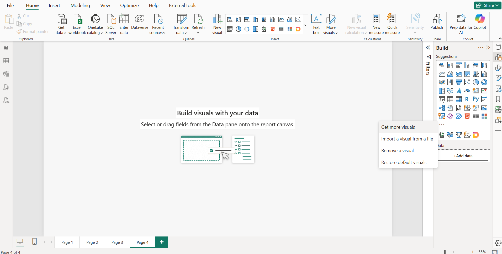

*ภาพ 2-1 เมนู `…` ในช่อง Build: Get more visuals / Import a visual from a file / Remove a visual / Restore default visuals*

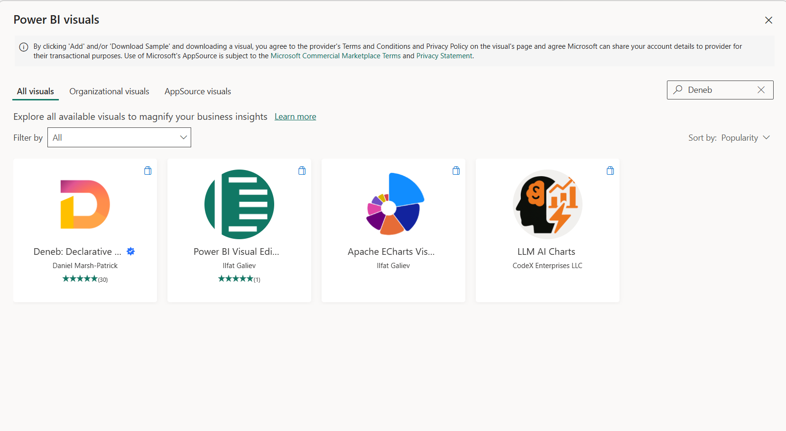

*ภาพ 2-2 หน้าต่าง Power BI visuals ค้นหาคำว่า Deneb เจอการ์ด Deneb: Declarative … ของ Daniel Marsh-Patrick พร้อมเครื่องหมาย Certified*

### 5) JSON ที่เพิ่มหรือแก้เฉพาะ Step

ไม่มี

### 6) คำอธิบายโค้ด

ไม่มี ข้อควรเข้าใจแทนคือ Deneb ที่ติดตั้งจาก AppSource เป็นรุ่นที่ Microsoft รับรอง (บทที่ 1 หัวข้อ 1.1) จึงเป็นรุ่นเดียวที่เล่มนี้ใช้

### 7) ภาพระหว่างทำ

ภาพ 2-1 และ 2-2

### 8) ผลลัพธ์ที่ควรได้

ไอคอน Deneb อยู่ในช่อง Build

### 9) วิธีตรวจสอบผล

คลิกที่ว่างในหน้ารายงานเปล่าแล้วคลิกไอคอน Deneb ต้องมีกรอบ Visual ใหม่ปรากฏ (Step 3 ทำต่อจากตรงนี้) เวอร์ชันของ Deneb ตรวจได้จากตัวเลขเล็กๆ ข้างคำว่า DENEB ในหน้าจอเปล่าของ Visual (Step 3) เล่มนี้ใช้ **2.0.0.0**

### 10) ปัญหาที่อาจพบและวิธีแก้

| อาการ | สาเหตุที่เป็นไปได้ | วิธีแก้ |
| --- | --- | --- |
| ค้นหา Deneb ไม่เจอ | องค์กรปิดสิทธิ์ AppSource หรือไม่มีอินเทอร์เน็ต | ติดต่อผู้ดูแล Power BI ขององค์กรว่าอนุญาต Custom Visual จาก AppSource หรือไม่ |
| เมนู `…` ไม่มีคำสั่ง Get more visuals | เวอร์ชัน Power BI เก่ามาก | อัปเดต Power BI Desktop เป็น 2.157.1354.0 ขึ้นไป หรือใช้ทางลัด Insert > More visuals |
| ได้ Deneb รุ่นต่างจากเล่มนี้ | AppSource เผยแพร่รุ่นใหม่กว่า | หน้าจอส่วนใหญ่ยังเหมือนเดิม แต่ผลการทดสอบ Interaction ของเล่มนี้ยืนยันเฉพาะ 2.0.0.0 (บทที่ 1) |

### 11) แบบฝึกหัดสั้น

หาการ์ดของ Deneb ในหน้าต่าง Power BI visuals แล้วตรวจว่าผู้เผยแพร่คือ Daniel Marsh-Patrick และมีเครื่องหมาย Certified ตามภาพ 2-2 (ตัวเลขดาวและจำนวนรีวิวเปลี่ยนตามเวลา จึงไม่ใช้ตรวจ)

### 12) จุดตรวจผ่านก่อนทำ Step ถัดไป

- [ ] เห็นไอคอน Deneb ในช่อง Build

---

## Step 2 นำเข้าข้อมูล Workshop

### 1) เป้าหมาย

โหลดตาราง `DualLineVariance_Workshop_Data` (12 เดือน) เข้า Power BI

### 2) สิ่งที่ควรเห็นก่อนเริ่ม

รายงานที่ยังไม่มีข้อมูล ช่อง Data ว่างเปล่า

### 3) Fields/Measures ที่ใช้

ไฟล์ `data/DualLineVariance_Workshop_Data.csv` มี 4 คอลัมน์

| คอลัมน์ | ชนิด | ความหมาย |
| --- | --- | --- |
| `Sort_Order` | จำนวนเต็ม | ลำดับเดือน 1 ถึง 12 |
| `Category` | ข้อความ | ชื่อเดือนภาษาไทย (ม.ค. ถึง ธ.ค.) |
| `Actual` | จำนวนเต็ม | ค่าจริง |
| `Reference` | จำนวนเต็ม | ค่าเป้าหมาย |

### 4) ขั้นตอนใน Power BI

1. แท็บ **Home** > **Get data** > **Text/CSV** แล้วเลือกไฟล์ `data/DualLineVariance_Workshop_Data.csv`
2. หน้าต่าง **Preview file data** แสดงตัวอย่าง (ภาพ 2-3) ตรวจ 3 ช่องด้านบน
   - **File origin** ต้องเป็น `65001: Unicode (UTF-8)` มิฉะนั้นชื่อเดือนภาษาไทยจะอ่านไม่ออก
   - **Delimiter** เป็น `Comma`
   - **Data type detection** เป็น `Based on first 200 rows` (ค่าเริ่มต้น)
3. ตรวจว่ามี 12 แถวและหัวคอลัมน์เป็น `Sort_Order`, `Category`, `Actual`, `Reference` แล้วกด **Load**

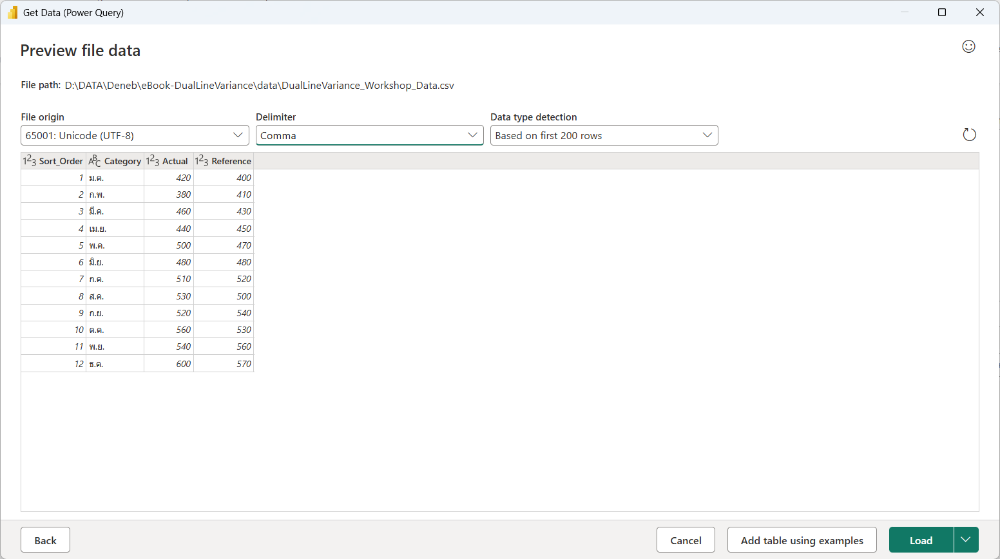

*ภาพ 2-3 Preview file data ของไฟล์ Workshop: UTF-8, Comma, 12 แถว, ชื่อเดือนภาษาไทยอ่านได้ปกติ*

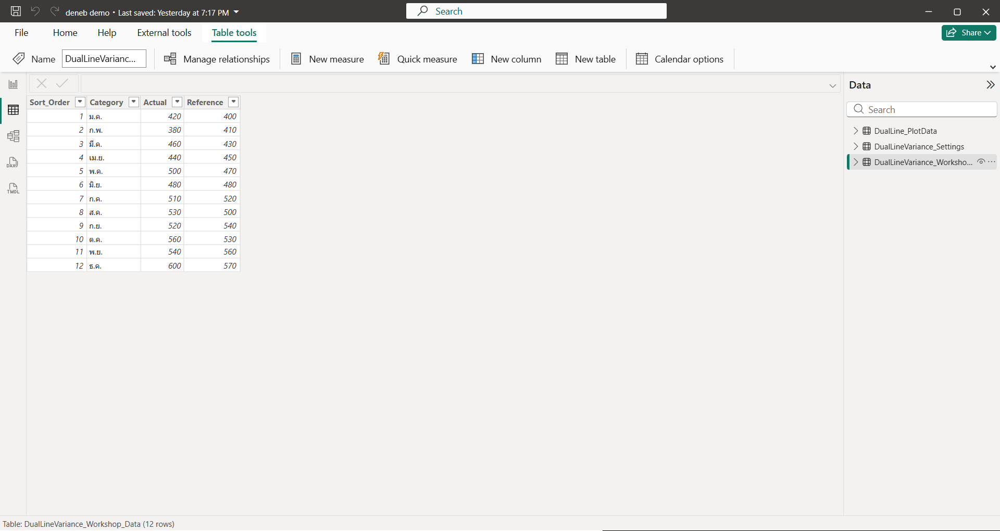

*ภาพ 2-4 มุมมอง Table (แถบซ้าย) ของตาราง `DualLineVariance_Workshop_Data`: 12 แถว 4 คอลัมน์ แถบสถานะล่างซ้ายเขียน "Table: DualLineVariance_Workshop_Data (12 rows)"*

### 5) JSON ที่เพิ่มหรือแก้เฉพาะ Step

ไม่มี

### 6) คำอธิบายโค้ด

ไม่มี ข้อควรเข้าใจคือ `Category` เป็นข้อความ ส่วน `Actual` กับ `Reference` เป็นตัวเลข ชนิดข้อมูลนี้ส่งผลต่อการเลือก `type` ของ Vega-Lite ในบทที่ 3

### 7) ภาพระหว่างทำ

ภาพ 2-3 และ 2-4

### 8) ผลลัพธ์ที่ควรได้

ในช่อง Data มีตาราง `DualLineVariance_Workshop_Data` พร้อม 4 คอลัมน์

### 9) วิธีตรวจสอบผล

เปิดมุมมอง Table (ไอคอนตารางแถบซ้าย) ต้องเห็น 12 แถว แถวแรกคือ ม.ค. ค่า Actual 420 และ Reference 400 แถวสุดท้ายคือ ธ.ค. Actual 600 และ Reference 570 (ตรงกับภาพ 2-3 และภาพ 2-4)

### 10) ปัญหาที่อาจพบและวิธีแก้

| อาการ | สาเหตุที่เป็นไปได้ | วิธีแก้ |
| --- | --- | --- |
| ชื่อเดือนเป็นอักขระแปลก | File origin ไม่ใช่ UTF-8 | เปลี่ยน File origin เป็น `65001: Unicode (UTF-8)` ใน Preview |
| ทุกอย่างอยู่คอลัมน์เดียว | Delimiter ผิด | เลือก `Comma` |
| `Actual` เป็นข้อความ | ชนิดข้อมูลตรวจจับผิด | กด Transform data แล้วเปลี่ยนชนิดเป็น Whole number |

### 11) แบบฝึกหัดสั้น

หาว่าเดือนไหนที่ `Actual` น้อยกว่า `Reference` มากที่สุดในข้อมูลชุดนี้ (ดูค่าจากภาพ 2-3)

### 12) จุดตรวจผ่านก่อนทำ Step ถัดไป

- [ ] มีตารางข้อมูล 12 แถว ชื่อเดือนภาษาไทยอ่านได้

---

## Step 3 วาง Deneb บนหน้ารายงานและผูก field

### 1) เป้าหมาย

วาง Visual Deneb บนหน้ารายงาน ผูก `Category` กับ `Actual` และรู้จักหน้าจอเปล่าของ Deneb

### 2) สิ่งที่ควรเห็นก่อนเริ่ม

หน้ารายงานใหม่ที่ว่างเปล่า มีข้อความ "Build visuals with your data"

### 3) Fields/Measures ที่ใช้

`Category` และ `Actual` จากตาราง `DualLineVariance_Workshop_Data`

### 4) ขั้นตอนใน Power BI

1. เพิ่มหน้าใหม่ (เครื่องหมาย + ข้างแท็บหน้า) คลิกไอคอน Deneb ในช่อง Build จะได้ Visual ที่ยังไม่มีข้อมูล ปรับขนาดตามสะดวก
2. อ่านหน้าจอเปล่าของ Deneb (ภาพ 2-5) ซึ่งบอกขั้นตอนของ Deneb เป็น 3 ตอน ได้แก่ **Add your data** (ต้องมีอย่างน้อยหนึ่งคอลัมน์หรือ measure ในช่อง Values), **Create your visual** (คลิก `…` ที่หัว Visual แล้วเลือก Edit) และ **Experience your visual** (กลับไปดูผลในรายงาน) พร้อมลิงก์เอกสารของ Deneb, Vega และ Vega-Lite ท้ายหน้า ข้อความบรรทัดหัวมีเลขเวอร์ชัน DENEB 2.0.0.0
3. ลาก `Category` และ `Actual` จากช่อง Data ลงในช่อง **Values** ของ Build pane Power BI จะรวมค่า `Actual` (Summarization เป็น Sum) และแสดงชื่อในช่อง Values ว่า `Sum of Actual` ชื่อที่ปรากฏในช่อง Values คือชื่อ field ที่ spec เห็น ตัวอย่าง JSON ในบทนี้ใช้ชื่อ `Actual` จึงให้เปลี่ยนชื่อ: คลิกขวาที่แถบ `Sum of Actual` ในช่อง Values เลือก **Rename for this visual** แล้วพิมพ์ `Actual` (ภาพ 2-8 เมนูนี้ยังมี Remove field, Move, Don't summarize, Sum ที่มีเครื่องหมายถูก และตัวเลือกสรุปค่าอื่นๆ ให้ปล่อยเป็น Sum ตามเดิม) ผลคือช่อง Values แสดง `Category` และ `Actual` ตามภาพ 2-6 การเปลี่ยนชื่อนี้มีผลเฉพาะ Visual นี้ ไม่แก้ชื่อคอลัมน์ในตารางข้อมูล

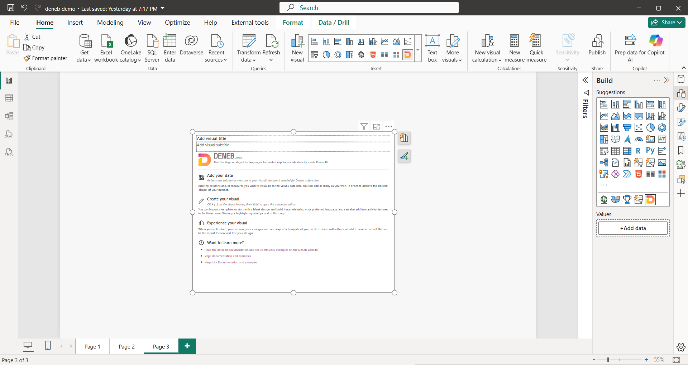

*ภาพ 2-5 หน้าจอเปล่าของ Deneb: Add your data / Create your visual / Experience your visual / Want to learn more?*

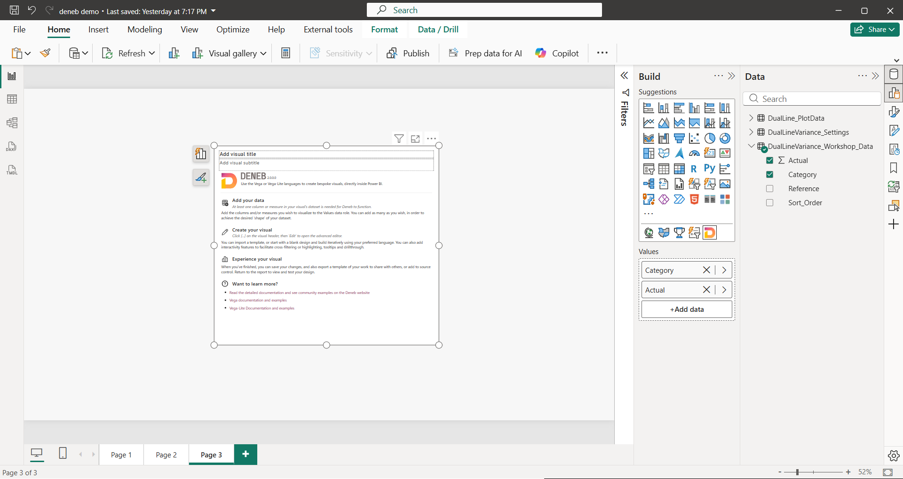

*ภาพ 2-6 หลังผูก field ช่อง Values มี `Category` กับ `Actual` (ติ๊กสองช่องในตาราง `DualLineVariance_Workshop_Data`) แต่หน้าจอของ Visual ยังเป็นข้อความแนะนำเดิม*

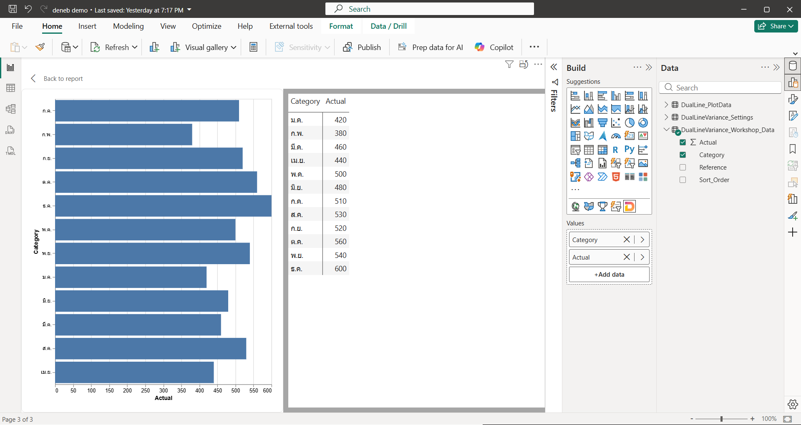

*ภาพ 2-7 เมนู `…` > Show as a table: Power BI แสดงตาราง Category กับ Actual 12 แถวเคียงกับ Visual (ภาพนี้ถ่ายหลังสร้าง spec ใน Step 4 ฝั่งซ้ายจึงเป็นแผนภูมิแท่ง ในขั้นตอนนี้ของคุณฝั่งซ้ายจะยังเป็นหน้าจอเปล่าของ Deneb)*

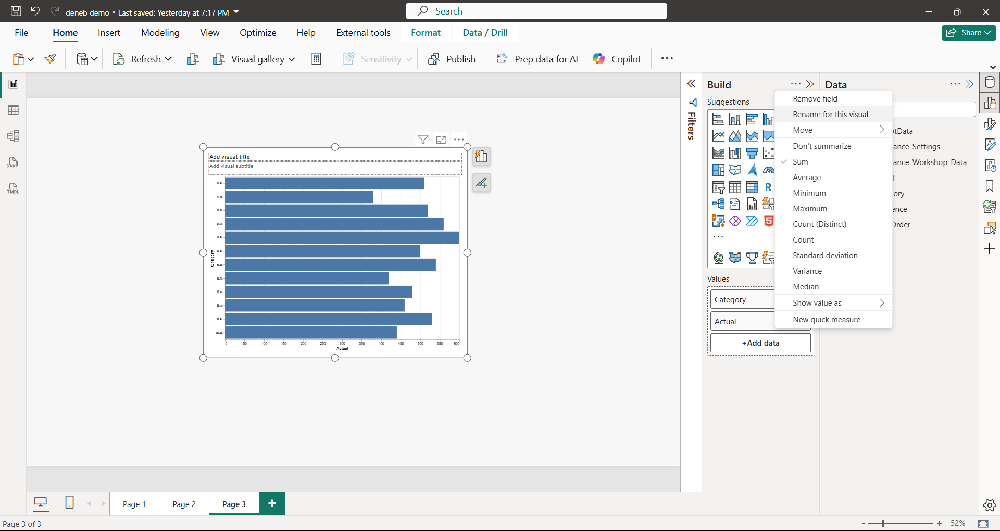

*ภาพ 2-8 คลิกขวาที่แถบ field ในช่อง Values: Remove field / Rename for this visual / Move / Don't summarize / Sum (เลือกอยู่) / Average ... ภาพนี้ถ่ายหลังเปลี่ยนชื่อแล้ว แถบจึงแสดง `Actual`*

### 5) JSON ที่เพิ่มหรือแก้เฉพาะ Step

ไม่มี

### 6) คำอธิบายโค้ด

ไม่มี ข้อควรเข้าใจคือ ช่อง **Values** เป็นแหล่งข้อมูลเดียวของ Deneb ทุก field ที่อยู่ในช่องนี้จะกลายเป็นคอลัมน์ของ `dataset` ใน spec (บทที่ 1 หัวข้อ 1.1) และ field ที่ไม่ได้ใส่ในช่องนี้ spec จะมองไม่เห็น เรื่องนี้จะกลับมาสำคัญมากในบทที่ 4

### 7) ภาพระหว่างทำ

ภาพ 2-5 ถึง 2-8

### 8) ผลลัพธ์ที่ควรได้

ช่อง Values มี `Category` และ `Actual` และ Visual ยังแสดงหน้าจอแนะนำ ยังไม่มีกราฟ เป็นเรื่องปกติเพราะยังไม่ได้สร้าง spec

### 9) วิธีตรวจสอบผล

เปิดเมนู `…` ที่หัว Visual แล้วเลือก **Show as a table** จะเห็นตาราง Category กับ Actual 12 แถวตามภาพ 2-7 (ปิดกลับด้วย Back to report)

### 10) ปัญหาที่อาจพบและวิธีแก้

| อาการ | สาเหตุที่เป็นไปได้ | วิธีแก้ |
| --- | --- | --- |
| Visual ไม่ตอบสนองหลังลาก field | ยังเลือก Visual อื่นอยู่ | คลิกที่กรอบ Deneb ให้ถูกเลือกก่อนลาก field |
| `Actual` ขึ้นเป็น Count | ชนิดข้อมูลเป็นข้อความ | กลับไปแก้ชนิดข้อมูลใน Step 2 |

### 11) แบบฝึกหัดสั้น

ลอง **ถอด** `Category` ออกจากช่อง Values แล้วสังเกต Show as a table ข้อมูลเปลี่ยนไปอย่างไร (สรุปแล้วใส่กลับ)

### 12) จุดตรวจผ่านก่อนทำ Step ถัดไป

- [ ] เห็นหน้าจอเปล่าของ Deneb และช่อง Values มี field สองตัวตามที่ตั้งใจ

---

## Step 4 เปิด Editor และสร้าง spec จาก template

### 1) เป้าหมาย

สร้าง spec Vega-Lite แรกจาก template สำเร็จรูปที่มากับ Deneb (ยังไม่ใช้ไฟล์ spec ของเล่มนี้)

### 2) สิ่งที่ควรเห็นก่อนเริ่ม

Visual Deneb ที่ผูก field ไว้แล้ว ยังแสดงหน้าจอเปล่า

### 3) Fields/Measures ที่ใช้

`Category` และ `Actual` จาก Step 3

### 4) ขั้นตอนใน Power BI

1. ที่หัว Visual คลิก `…` เลือก **Edit** (ภาพ 2-9 เมนูนี้ยังมี Export data, Show as a table, Remove, Spotlight, Format และ New visual calculation)
2. Editor เปิดขึ้นพร้อมหน้าต่าง **Create or import new specification** ในหัวข้อ **Create using…** เลือก **Vega-Lite** จะเห็น template 4 แบบให้เลือก ได้แก่ `[empty]`, `[empty (with Power BI theming)]`, `Simple bar chart` และ `Interactive bar chart` (ภาพ 2-10 แสดง `[empty]` ซึ่งอธิบายว่าเป็น template ขั้นต่ำสุดที่ผูกข้อมูลไว้แล้ว ไม่มีการตกแต่ง)
3. เลือก **Interactive bar chart** Deneb จะแสดงหน้าจับคู่ placeholder (ภาพ 2-11) ตาราง Field / Column, measure or condition / Author's notes ให้เลือก column หรือ measure ของเรามาเติมแต่ละช่อง ในตัวอย่างนี้ `Category` จับกับ **Category** (คำอธิบายบอกว่าคือคอลัมน์ที่จะแสดงบนแกน Y) และ `Measure` จับกับ **Actual** (ในภาพ 2-11 หน้าต่างแคบ คำอธิบายใน Author's notes จึงถูกตัดบางส่วน)
4. กด **Create** Editor เปิดพร้อม spec และกราฟตัวอย่าง (ภาพ 2-12)


*ภาพ 2-9 เมนู `…` ที่หัว Visual: Edit / Export data / Show as a table / Remove / Spotlight / Format / New visual calculation*

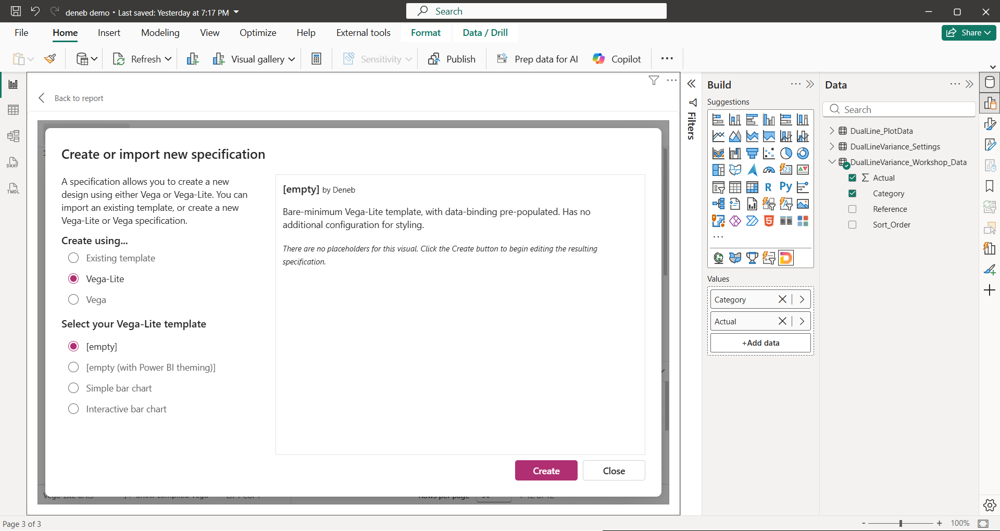

*ภาพ 2-10 Create or import new specification: เลือก Vega-Lite แล้วเลือก template `[empty]`*

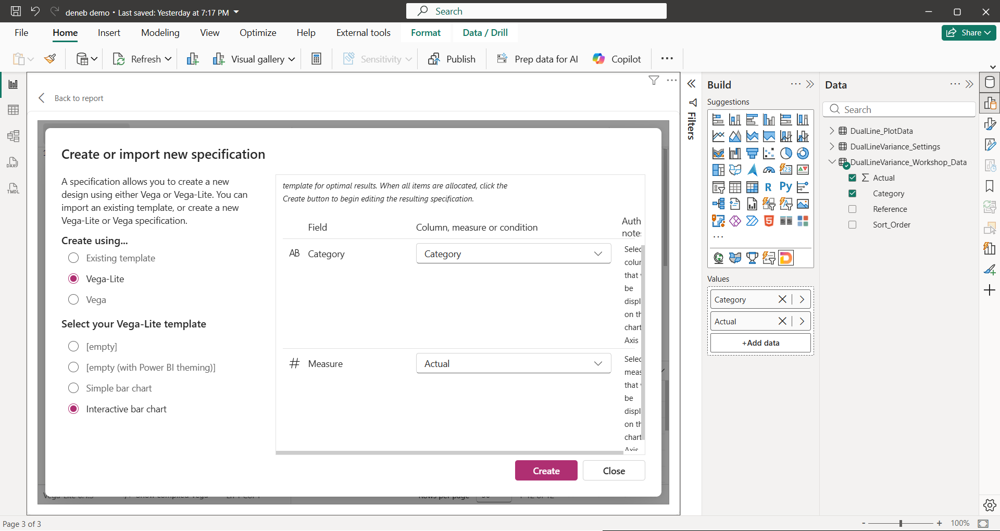

*ภาพ 2-11 เลือก Interactive bar chart แล้ว Deneb ให้จับคู่ placeholder Category และ Measure กับ field ของเรา*

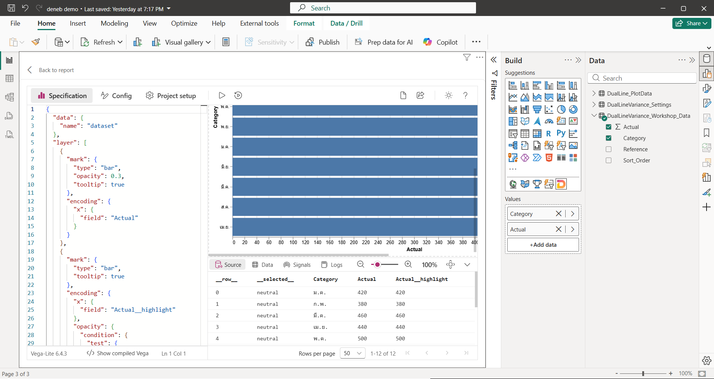

*ภาพ 2-12 Deneb Editor หลังสร้างจาก Interactive bar chart: ซ้ายคือ spec ขวาคือ Preview และตารางข้อมูลของ Debug pane (12 แถว: Category, Actual, Actual__highlight)*

### 5) JSON ที่เพิ่มหรือแก้เฉพาะ Step

Step นี้ไม่ต้องพิมพ์ JSON เอง Deneb สร้างให้ ตัวอย่างย่อที่เรียบเรียงจากส่วนต้นของ spec ในภาพ 2-12 (บรรทัด 1 ถึง 16 ในภาพ ตัดเหลือโครงสำคัญและปิดวงเล็บให้ครบ) ไม่ใช่ข้อความตรงตัวและไม่ใช่ไฟล์เต็มของ template

```json
{
  "data": { "name": "dataset" },
  "layer": [
    {
      "mark": { "type": "bar", "opacity": 0.3, "tooltip": true },
      "encoding": { "x": { "field": "Actual" } }
    }
  ]
}
```

### 6) คำอธิบายโค้ด

- `"data": { "name": "dataset" }` บอก spec ให้อ่านข้อมูลจากช่อง Values (บทที่ 1 หัวข้อ 1.2)
- `layer` คือรายการชั้นกราฟที่วาดซ้อนกัน template นี้มีหลายชั้น ชั้นแรกเป็นแท่งจางสำหรับพื้นหลัง (`"opacity": 0.3`) และมีชั้นถัดไปที่อ้าง `Actual__highlight` ซึ่งเป็นค่า Cross-highlight ที่ Deneb เตรียมให้ (บทที่ 8 จะกล่าวถึง)
- `"field": "Actual"` ชื่อ field ตรงกับชื่อในช่อง Values ตัวอักษรต้องตรงทุกตัว รวมช่องว่าง

รายละเอียดของ `mark`, `encoding`, `layer` และ `field` อยู่ในบทที่ 3

### 7) ภาพระหว่างทำ

ภาพ 2-9 ถึง 2-12

### 8) ผลลัพธ์ที่ควรได้

Editor เปิดอยู่ ฝั่งขวาเป็นแผนภูมิแท่งแนวนอน ชื่อเดือนบนแกน Y ความยาวแท่งตรงกับ `Actual`

### 9) วิธีตรวจสอบผล

ดูตารางข้อมูลใน Debug pane (ภาพ 2-12 ตารางด้านล่างแสดงข้อมูลที่ Deneb ได้รับ) แล้วเลื่อน Preview ให้เห็นทั้ง 12 เดือน (ภาพ 2-12 เห็นบางเดือนเท่านั้น) เดือนที่ Actual สูงสุด (ธ.ค. = 600) ควรมีแท่งยาวที่สุด และเดือนที่ต่ำสุด (ก.พ. = 380) ควรสั้นที่สุด

### 10) ปัญหาที่อาจพบและวิธีแก้

| อาการ | สาเหตุที่เป็นไปได้ | วิธีแก้ |
| --- | --- | --- |
| เมนู `…` ไม่มี Edit | เมนูของ Visual อื่นที่ไม่ใช่ Deneb | ตรวจว่ากรอบที่เลือกเป็น Deneb |
| ไม่เห็นหน้าจับคู่ placeholder | เลือก template `[empty]` ซึ่งไม่มี placeholder (ภาพ 2-10 ระบุไว้) | ย้อนกลับแล้วเลือก Interactive bar chart |
| ช่องเลือกใน placeholder ว่าง | ไม่มี field ในช่อง Values | ปิด Editor กลับไปทำ Step 3 |
| กราฟว่างหลังกด Create | จับคู่ placeholder ผิดชนิด | เทียบชนิดข้อมูลตาม Author's notes (ข้อความ กับ ตัวเลข) แล้วสร้างใหม่ |

### 11) แบบฝึกหัดสั้น

ห้ามทดลองใน Visual นี้ เพราะ Step 5 ใช้ spec ที่สร้างไว้ ให้คัดลอก Visual (Ctrl+C แล้ว Ctrl+V บนหน้ารายงาน) หรือวาง Deneb ตัวใหม่ ผูก `Category` กับ `Actual` เหมือนเดิม แล้วสร้าง spec จาก `Simple bar chart` เทียบกับ Interactive bar chart ว่าต่างกันอย่างไรในหน้าจับคู่และใน spec เสร็จแล้วลบ Visual ที่ใช้ทดลอง

### 12) จุดตรวจผ่านก่อนทำ Step ถัดไป

- [ ] Editor เปิดอยู่และเห็นกราฟแท่งใน Preview
- [ ] บอกได้ว่าบรรทัด `"data": { "name": "dataset" }` ทำหน้าที่อะไร

---

## Step 5 ทัวร์ Deneb Editor

### 1) เป้าหมาย

เรียกชื่อและรู้หน้าที่ของแต่ละส่วนใน Editor ให้ตรงกับหน้าจอจริง เพราะบทที่ 5 ถึง 10 จะอ้างชื่อเหล่านี้ตลอด

### 2) สิ่งที่ควรเห็นก่อนเริ่ม

Editor เปิดค้างจาก Step 4

### 3) Fields/Measures ที่ใช้

ไม่มี field เพิ่มเติม ใช้ `Category` และ `Actual` ที่ผูกไว้ใน Step 3

### 4) ขั้นตอนใน Power BI

สำรวจตามลำดับ (ภาพ 2-12 ถึง 2-20)

1. **แท็บด้านซ้ายบน** มี 3 แท็บ
   - **Specification** เขียน spec Vega-Lite (หรือ Vega)
   - **Config** ค่า config ของ Vega-Lite ที่ใช้ทั้ง spec ในภาพ 2-16 ยังว่างอยู่ (`{}`) เพราะ template ไม่ได้ตั้งค่าอะไรไว้
   - **Project setup** ตั้งค่าของโปรเจกต์ Deneb (ภาพ 2-17) มีช่อง Search settings และหมวด General, Continuous view, Supporting fields: dataset, Semantic model integration, Tooltips, Context menu, Cross-filtering และ Cross-highlighting ท้ายหน้ามีข้อความเตือนว่าตัวเลือก Interactivity อาจต้องตั้งค่าใน spec เพิ่มด้วย หมวดที่เกี่ยวกับ Interactivity บทที่ 8 จะใช้ **หมายเหตุเรื่องชื่อ:** เอกสารของ Deneb บางหน้าเรียกส่วนนี้ว่า Settings แต่หน้าจอจริงในเวอร์ชันที่ใช้เขียนเล่มนี้เขียนว่า **Project setup** เล่มนี้ใช้ชื่อตามหน้าจอ
2. **ปุ่ม Apply และ Auto-apply** ถัดจากแท็บมีปุ่มสามเหลี่ยม (**Apply**) สั่งให้ Preview วาดตาม spec ที่แก้ล่าสุด ทางลัดคือ `Ctrl+Enter` และปุ่มถัดไป (**Auto-apply**) ทำให้ Preview อัปเดตเองทุกครั้งที่แก้ ทางลัดคือ `Ctrl+Shift+Enter` (ทางลัดทั้งสองระบุในเอกสาร [deneb.guide/docs/keyboard](https://deneb.guide/docs/keyboard) และทดสอบแล้วบน Power BI Desktop 2.157.1354.0 + Deneb 2.0.0.0 ว่าทำงานทั้งคู่ เมื่อคลิกในช่อง spec ก่อนกด) ในภาพชุดนี้ Auto-apply ยังไม่ได้เปิด (ปุ่ม Apply เป็นสีเข้ม) ถ้าเปิด Auto-apply ปุ่ม Apply จะเป็นสีจาง
3. **พื้นที่ Preview** ขวาบนแสดงกราฟที่ spec วาด
4. **Debug pane** ขวาล่างมี 4 แท็บ
   - **Source** ตารางข้อมูลที่ Deneb ส่งเข้า spec (คอลัมน์ `__row__` กับ `__selected__` ที่ขึ้นต้นด้วยขีดล่างสองตัวเป็นคอลัมน์ที่ Deneb เติมให้เอง) ข้อมูลชุดนี้คือชุดก่อนที่ Vega จะทำ transform ใดๆ (ตามเอกสาร [Visual Editor ของ Deneb](https://deneb.guide/docs/visual-editor)) แถบล่างมี Rows per page และตัวเลขแถว `1-12 of 12` (ภาพ 2-13)
   - **Data** ตารางของ dataset ที่ Vega view สร้างหลัง transform ทำงานแล้ว (ตามเอกสารเดียวกัน จึงต่างจาก Source ได้เมื่อ spec มี transform) มีตัวเลือก Data set ที่แถบล่าง ในภาพเลือก `dataset` (ภาพ 2-18)
   - **Signals** ตารางตัวแปรของ Vega คอลัมน์ Signal และ Value เช่น `background`, `autosize`, `padding`, `width`, `height`, `denebContainer`, `cursor` (7 รายการ ภาพ 2-19)
   - **Logs** ข้อความบันทึกของ Deneb มีตัวเลือก Log level (ภาพ 2-20 ตั้งเป็น Info และขึ้นว่า No log messages to report)
5. **ปุ่มซูม** ในแถบของ Debug pane มี −/+ และตัวเลข % ปรับขนาดของ Preview (ภาพ 2-13 อยู่ที่ 100%)
6. **แถบสถานะล่างซ้าย** บอกรุ่น Vega-Lite (6.4.3), ปุ่ม **Show compiled Vega** และตำแหน่งเคอร์เซอร์ (Ln/Col)
7. **Show compiled Vega** กดแล้วครึ่งล่างของพื้นที่ spec แสดง **Compiled Vega (read-only)** คือ Vega ที่ได้จากการ compile spec Vega-Lite ของเรา แก้ไม่ได้ มีปุ่ม **Convert my spec to Vega** เมื่อกดจะมีคำเตือนของ Deneb ขึ้นมาว่าจะแทนที่ spec Vega-Lite ด้วย Vega ที่ compile แล้ว และเตือนตัวใหญ่ว่า "THIS CANNOT BE UNDONE" (ภาพ 2-15) ผู้ทดสอบเล่มนี้พบว่ากด Undo ของ Power BI (Ctrl+Z หรือไอคอน Undo ที่แถบบนซ้าย) หลังยืนยันแล้ว spec Vega-Lite กลับมาได้ในการทดสอบครั้งนั้น แต่ Deneb เตือนว่าย้อนกลับไม่ได้ **อย่ากดยืนยันในบทนี้** เพราะเล่มนี้ใช้ Vega-Lite ทั้งเล่ม และถ้าจำเป็นต้องทดลอง ให้ทำใน Visual สำเนาเท่านั้น (ภาพ 2-14)
8. **Back to report** มุมซ้ายบน กดเพื่อปิด Editor กลับไปดูรายงาน

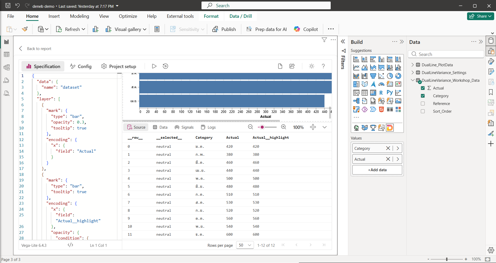

*ภาพ 2-13 Editor ที่มี 3 แท็บด้านบน, Preview ที่ 100%, Debug pane แท็บ Source (12 แถว) และแถบสถานะ*

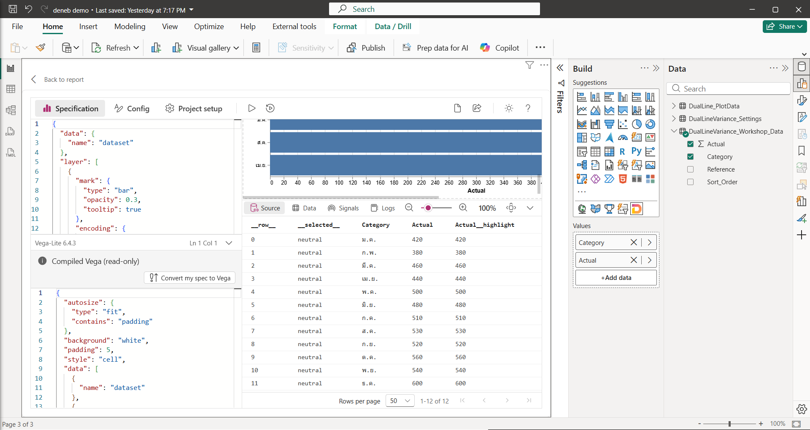

*ภาพ 2-14 กด Show compiled Vega: ครึ่งล่างของพื้นที่ spec แสดง Compiled Vega (read-only) และปุ่ม Convert my spec to Vega*

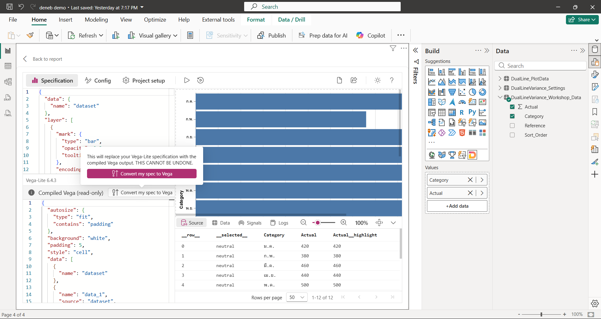

*ภาพ 2-15 กดปุ่ม Convert my spec to Vega แล้ว Deneb ขึ้นคำเตือน "This will replace your Vega-Lite specification with the compiled Vega output. THIS CANNOT BE UNDONE." พร้อมปุ่มยืนยัน ภาพนี้ถ่ายก่อนกดยืนยัน*

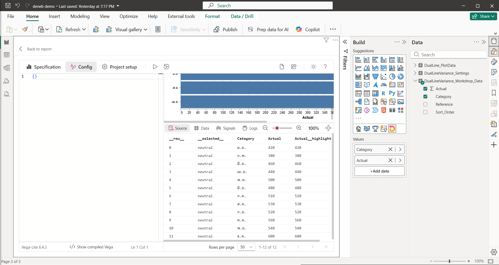

*ภาพ 2-16 แท็บ Config ยังว่าง (`{}`)*

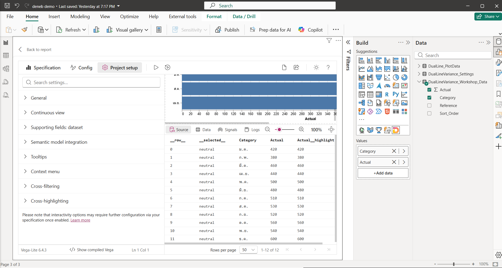

*ภาพ 2-17 แท็บ Project setup: Search settings และหมวด General ถึง Cross-highlighting*

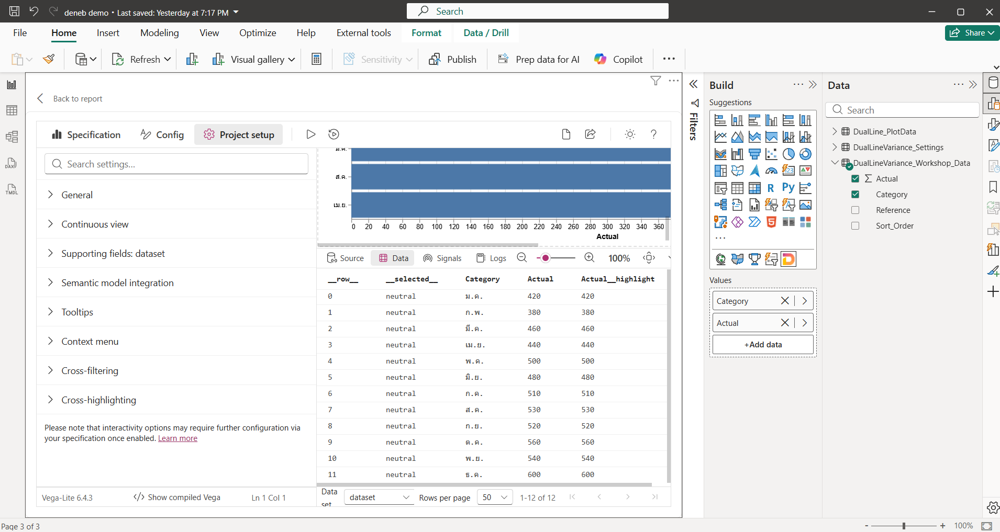

*ภาพ 2-18 Debug pane แท็บ Data เลือก Data set เป็น `dataset`*

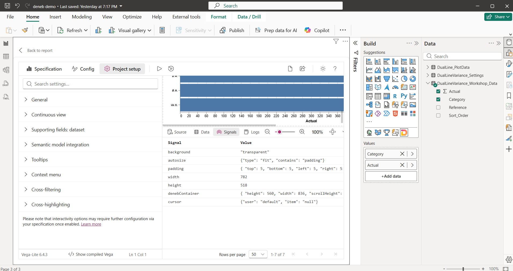

*ภาพ 2-19 Debug pane แท็บ Signals: 7 signal*

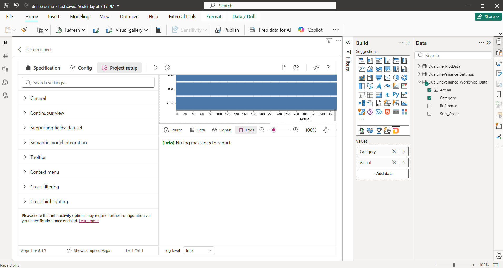

*ภาพ 2-20 Debug pane แท็บ Logs: No log messages to report*

### 5) JSON ที่เพิ่มหรือแก้เฉพาะ Step

ไม่มี

### 6) คำอธิบายโค้ด

จุดที่ควรสังเกตใน Compiled Vega (ภาพ 2-14) คือ spec Vega-Lite ที่เขียนสั้นๆ ถูกขยายเป็น Vega ที่ยาวกว่ามาก เริ่มด้วยค่ากำหนดของ Vega เช่น `autosize`, `background`, `padding` แล้วตามด้วย `data` ที่มี dataset ชื่อ `dataset` (ข้อมูลจาก Power BI) ตรงกับที่บทที่ 1 อธิบายว่า Vega-Lite compile เป็น Vega ก่อนวาดเสมอ

### 7) ภาพระหว่างทำ

ภาพ 2-13 ถึง 2-20

### 8) ผลลัพธ์ที่ควรได้

เรียกส่วนของ Editor ได้ครบตามรายการข้างบน และกลับเข้ารายงานได้

### 9) วิธีตรวจสอบผล

- คลิกแท็บ Config และ Project setup ดูว่าเปิดได้ แล้วกลับไปแท็บ Specification
- กด Show compiled Vega แล้วกดซ้ำเพื่อปิด
- กด Back to report แล้วเปิด Editor อีกครั้งด้วย `…` > Edit spec ที่สร้างไว้ยังอยู่

### 10) ปัญหาที่อาจพบและวิธีแก้

| อาการ | สาเหตุที่เป็นไปได้ | วิธีแก้ |
| --- | --- | --- |
| แก้ spec แล้ว Preview ไม่เปลี่ยน | Auto-apply ปิดอยู่ และยังไม่ได้กด Apply | กด Apply หรือเปิด Auto-apply |
| Preview ขึ้น error | JSON ผิดไวยากรณ์ เช่น ลืมเครื่องหมายจุลภาค | ดูข้อความในแท็บ Logs |
| ไม่เจอชื่อ Settings ตามเอกสารเก่า | หน้าจอจริงเรียก Project setup | ใช้แท็บ Project setup |
| Preview ใหญ่หรือเล็กเกินไป | ตั้งซูมไว้ | ปรับที่แถบซูมของ Debug pane |

### 11) แบบฝึกหัดสั้น

กด Show compiled Vega แล้วเลื่อนดู Compiled Vega หาหัวข้อ `data` แล้วหา dataset ที่ชื่อ `dataset` (ข้อมูลจาก Power BI) จากนั้นปิดกลับ

### 12) จุดตรวจผ่านก่อนทำ Step ถัดไป

- [ ] เรียกชื่อ 3 แท็บ, Apply/Auto-apply, Preview, Debug pane 4 แท็บ และ Show compiled Vega ได้
- [ ] รู้ว่าไม่ควรกด Convert my spec to Vega

---

## สรุปบทที่ 2

- ติดตั้ง Deneb จาก AppSource ผ่านเมนู `…` ของช่อง Build (Get more visuals) หรือ Insert > More visuals
- ข้อมูล Workshop นำเข้าด้วย Text/CSV ต้องเป็น UTF-8 และ Comma
- ช่อง **Values** เป็นแหล่งข้อมูลเดียวของ Deneb และกลายเป็น `dataset` ใน spec
- สร้าง spec จาก template ผ่าน `…` > Edit > Create using Vega-Lite แล้วจับคู่ placeholder
- Editor มี Specification / Config / Project setup, Apply และ Auto-apply, Preview, Debug pane (Source, Data, Signals, Logs) และ Show compiled Vega

## คำถามทบทวน

1. ถ้า field ไม่ได้อยู่ในช่อง Values spec จะเห็น field นั้นหรือไม่
2. หน้าจอ Create ที่ไม่มีหน้าจับคู่ placeholder เกิดจากการเลือก template อะไร
3. แท็บใดของ Editor ที่เอกสารเรียก Settings แต่หน้าจอจริงเรียกอย่างอื่น และใช้ทำอะไรในเล่มนี้
4. ทำไมไม่ควรกด Convert my spec to Vega

<details>
<summary>แนวคำตอบ</summary>

1. ไม่เห็น เพราะ `dataset` มีเฉพาะ field ที่อยู่ในช่อง Values
2. `[empty]` ตามคำอธิบายในภาพ 2-10 ระบุว่าไม่มี placeholder
3. Project setup ใช้ตั้งค่า Interactivity ของ Visual (บทที่ 8)
4. เพราะ Deneb เตือนว่าจะแทนที่ spec Vega-Lite ด้วย Vega และย้อนกลับไม่ได้ (Undo ของ Power BI อาจกู้คืนได้ในบางกรณี แต่ไม่ควรพึ่ง) ขณะที่เล่มนี้ใช้ Vega-Lite ทั้งเล่ม

</details>

## จุดตรวจผ่านก่อนไปบทที่ 3

- [ ] Deneb 2.0.0.0 ติดตั้งแล้วและวางบนหน้ารายงานได้
- [ ] มีตาราง `DualLineVariance_Workshop_Data` 12 แถว
- [ ] เปิด Editor และสร้าง spec จาก template ได้
- [ ] เรียกส่วนต่างๆ ของ Editor ได้ถูกต้อง
