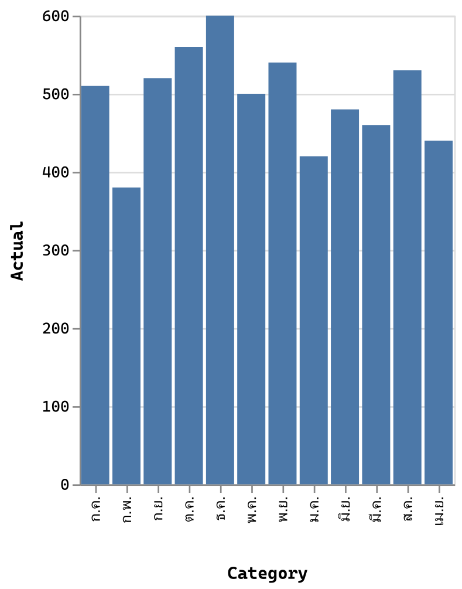
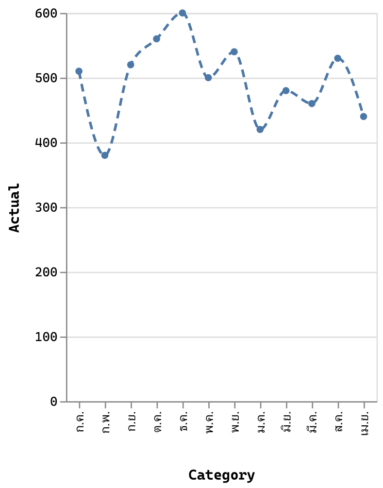
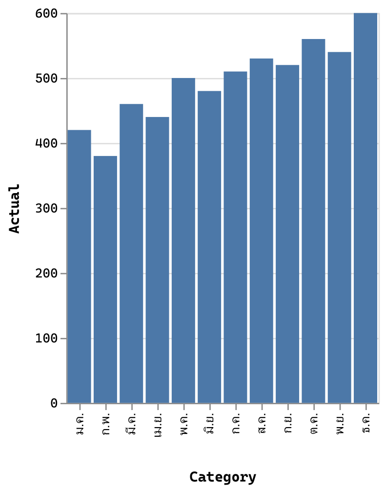
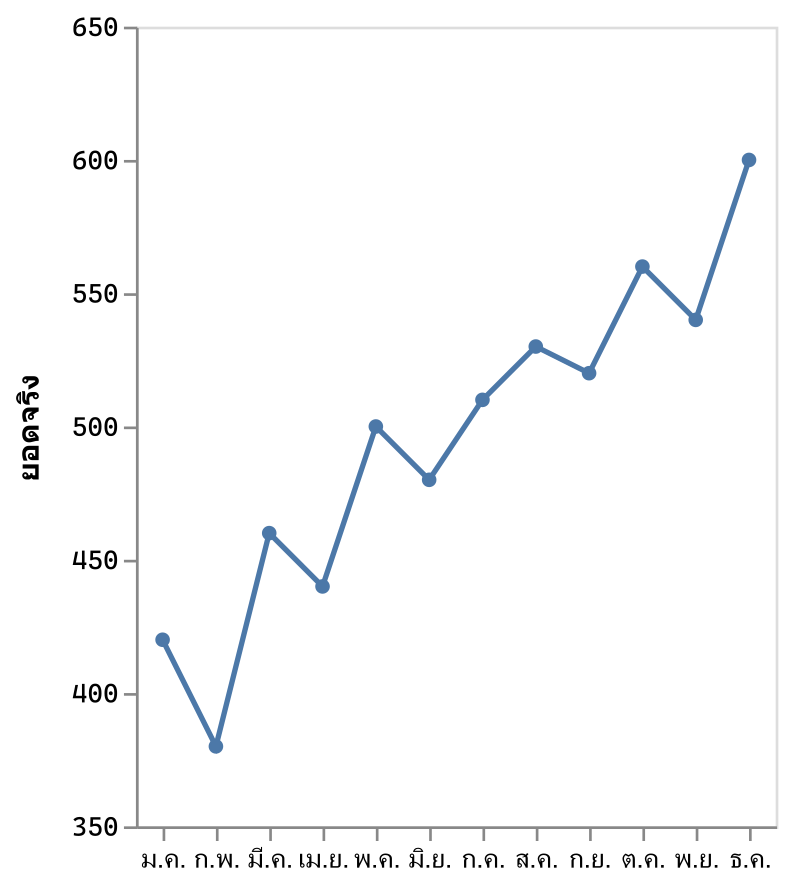
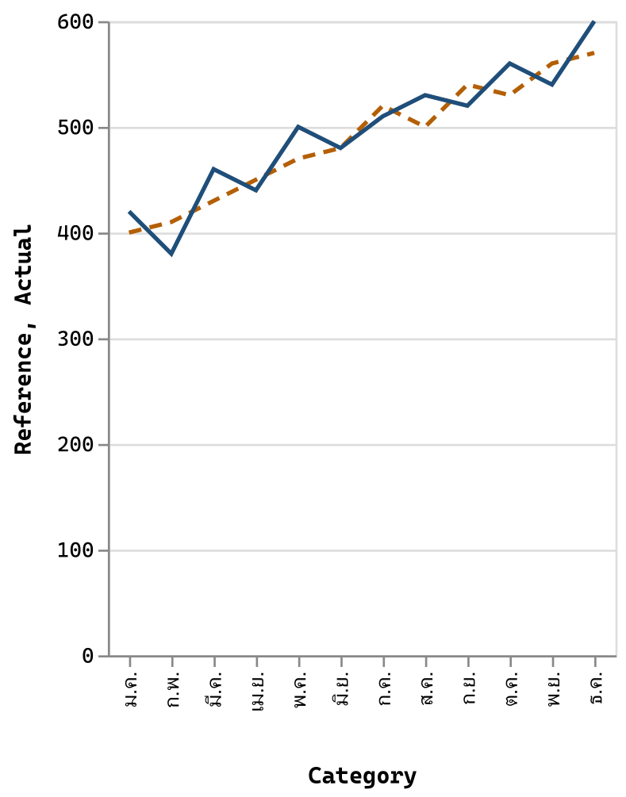
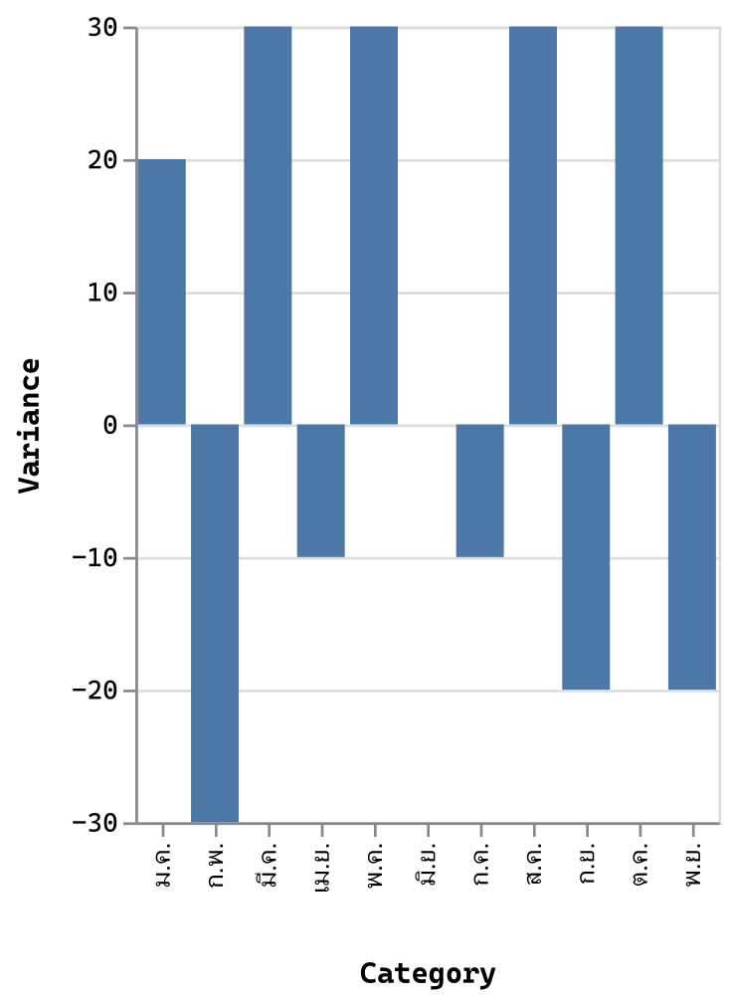
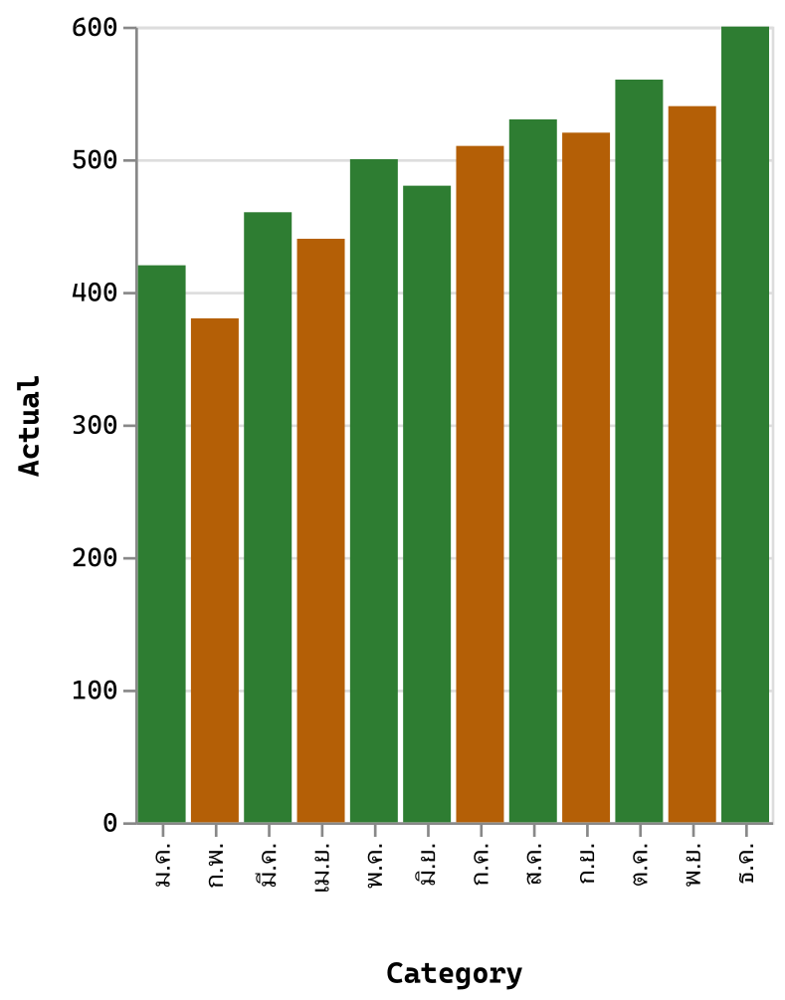

# บทที่ 3 โครงสร้างภาษา Vega-Lite ที่ต้องรู้

## สิ่งที่จะได้จากบทนี้

บทนี้เป็นบทอ้างอิงภาษา ไม่มี Step ที่ต้องทำใน Power BI ตัวอย่างทุกชิ้นสั้นพอจะอ่านจบในหนึ่งนาที และวางลงในแท็บ Specification ของ Deneb Editor เพื่อลองเองได้ เมื่ออ่านจบคุณควร

- อ่านโครงสร้าง spec Vega-Lite ที่สั้นที่สุดออก ว่า `data`, `mark`, `encoding` ทำหน้าที่อะไร
- เลือกชนิดข้อมูล `type` ของ field ได้ถูก และสั่งเรียงลำดับ Category ตามคอลัมน์อื่นได้
- ปรับ `scale` กับ `axis`, ซ้อนหลายกราฟด้วย `layer`, คำนวณคอลัมน์ใหม่ด้วย `transform`, เปลี่ยนสีหรือความเข้มตามเงื่อนไขด้วย `condition`, และเก็บค่าที่ใช้ซ้ำด้วย `params`
- อ่าน spec ที่ Deneb สร้างให้ในบทที่ 2 ออกทีละส่วน
- รู้ว่าส่วนไหนของภาษานี้จะกลับมาใช้ในบทที่ 5 ถึง 8 ของ Dual-Line Variance Chart

> **เรื่องภาพและการทดสอบในบทนี้** กราฟในบทนี้ **ไม่ใช่ภาพหน้าจอ Power BI** เป็นภาพที่ render ด้วย Vega-Lite 6.4.3 (compile เป็น Vega 6.4.0) แบบ headless บนเครื่องผู้เขียน จากข้อมูล Workshop 12 เดือนในไฟล์ `data/DualLineVariance_Workshop_Data.csv` เป็นภาพแสดงว่า spec นั้นวาดอะไร ตัวอย่าง JSON ทุกชิ้นถูก compile และ render ด้วยสคริปต์ `qa/scripts/run-ch03-example-tests.mjs` จนผ่าน (ผลอยู่ท้ายบท) ส่วนการวางลง Deneb Editor จริงผู้เขียนยังไม่ได้ทดสอบชุดนี้ ดูวิธีเตรียมข้อมูลในหัวข้อ 3.1 ท้าย

---

## 3.1 spec หนึ่งชิ้นประกอบด้วยอะไร

**Vega-Lite spec** คือวัตถุ JSON หนึ่งก้อน ที่บรรยายกราฟด้วยคำสั่งกลุ่มเล็กๆ

| คำสั่ง | ตอบคำถามว่า |
| --- | --- |
| `data` | ข้อมูลมาจากไหน |
| `mark` | วาดเป็นรูปอะไร (แท่ง เส้น จุด พื้นที่) |
| `encoding` | ผูก field ของข้อมูลกับคุณสมบัติของรูปอย่างไร (ตำแหน่ง สี ขนาด) |
| `layer` | ซ้อนหลายรูปในกราฟเดียวอย่างไร |
| `transform` | เตรียมข้อมูลก่อนวาดอย่างไร (คำนวณคอลัมน์ กรองแถว) |
| `params` | เก็บค่าที่ใช้ซ้ำหรือรับ selection อย่างไร |

ข้อควรรู้เรื่อง JSON ที่พลาดบ่อย

- ใช้เครื่องหมายคำพูดคู่ `"` เท่านั้น และ **ห้ามมี comment** (`//`) ใน spec
- สมาชิกตัวสุดท้ายของวัตถุหรืออาร์เรย์ **ห้ามมีจุลภาคปิดท้าย**
- ชื่อ field ต้องตรงตัวอักษรทุกตัวรวมตัวพิมพ์เล็กใหญ่ ตามชื่อที่ปรากฏในช่อง Values (บทที่ 2 Step 3)
- spec ที่ Deneb สร้างให้ในบทที่ 2 (ภาพ 2-12) **ไม่มี `$schema`** ที่บรรทัดบนสุด ดูหัวข้อ `$schema` ข้างล่าง

**`$schema`: ระบุเวอร์ชันภาษา แต่ไม่ใส่ใน Deneb** spec Vega-Lite ที่ใช้นอก Deneb (เช่น ไฟล์ทดสอบใน `specs/` ของเล่มนี้) มักขึ้นต้นด้วย `"$schema": "https://vega.github.io/schema/vega-lite/v6.json"` เพื่อบอกว่าเขียนตามภาษาเวอร์ชันไหน ตามเอกสาร Deneb ([Visual Editor](https://deneb.guide/docs/visual-editor), [Templates](https://deneb.guide/docs/templates)) ใน Deneb Editor ให้ละ `$schema` ไว้ เพราะ Deneb ใช้ schema ที่มากับตัว Visual เอง และ URL ภายนอกจะพยายามออกอินเทอร์เน็ตซึ่งถูกบล็อกใน Visual ที่ผ่านการรับรอง (ผู้เขียนอ้างตามเอกสาร ยังไม่ได้ทดสอบว่าใส่แล้วเกิดอะไรบนเครื่องจริง) ตัวอย่างในเล่มนี้จึงไม่ใส่ `$schema` เพราะเขียนสำหรับวางใน Deneb ไม่ได้แปลว่า spec ที่มี `$schema` ผิด

**ข้อมูลที่ spec เห็น** Deneb ส่งข้อมูลจากช่อง Values เข้ามาในตารางชื่อ `dataset` นอกจากคอลัมน์ที่คุณผูก Deneb อาจเติมคอลัมน์พิเศษ ขึ้นกับการตั้งค่าของโปรเจกต์ (ตามเอกสาร [Dataset](https://deneb.guide/docs/dataset) และ [Cross-Filtering](https://deneb.guide/docs/interactivity-selection)) คือ `__row__` (เติมเสมอ), `__selected__` (มีเมื่อเปิด cross-filtering) และ `<ชื่อ measure>__highlight` (มีเฉพาะ measure เมื่อเปิด cross-highlighting และเปิด supporting field `Highlight value` ที่เกี่ยวข้อง) ภาพ 2-12 และ 2-13 เป็นสถานะของโปรเจกต์ตัวอย่างที่ตั้งค่าไว้แล้ว ไม่ใช่กฎว่าทุกโปรเจกต์จะมีครบทุกคอลัมน์ ส่วนที่เกี่ยวกับ interactivity ใช้ในบทที่ 8

**วิธีลองตัวอย่างในบทนี้ (ไม่บังคับ)** ตัวอย่างใช้ field `Category`, `Sort_Order`, `Actual`, `Reference` ของตาราง `DualLineVariance_Workshop_Data` ผูกทั้งสี่ตัวในช่อง Values แล้วเปลี่ยนชื่อที่ขึ้นต้นด้วย `Sum of` ให้เหลือชื่อเดิมด้วย **Rename for this visual** เหมือนบทที่ 2 Step 3 จากนั้นวาง spec ในแท็บ Specification แล้วกด Apply ผู้เขียนยังไม่ได้ยืนยันบน Deneb จริงว่า dataset ของสี่ field นี้ออกมา 12 แถวตามคาด ถ้าผลต่างจากภาพในบท ให้ดูตารางในแท็บ Source ของ Debug pane ก่อน

---

## 3.2 `data`: ต้องมีชื่อ `dataset`

<!-- example: CH03-S02-minimal-bar -->
```json
{
  "data": { "name": "dataset" },
  "mark": "bar",
  "encoding": {
    "x": { "field": "Category", "type": "nominal" },
    "y": { "field": "Actual", "type": "quantitative" }
  }
}
```



*ภาพ 3-1 ผลของ spec ข้างบน (render ด้วย Vega-Lite 6.4.3 จากข้อมูล Workshop ไม่ใช่ภาพหน้าจอ Power BI): แท่งหนึ่งแท่งต่อหนึ่ง Category แกน Y คือ Actual*

อ่านทีละบรรทัด

- `"data": { "name": "dataset" }` บอกให้อ่านข้อมูลจากตารางชื่อ `dataset` ซึ่งคือข้อมูลจากช่อง Values ใน Deneb ถ้าไม่มีบรรทัดนี้ (หรือสะกดชื่อผิด) กราฟจะไม่มีข้อมูล
- `"mark": "bar"` วาดเป็นแท่ง หนึ่งแถวของ `dataset` ต่อหนึ่งแท่ง
- `encoding` ผูก field กับตำแหน่ง: `Category` ไปแกน X, `Actual` ไปแกน Y

เทียบกับ spec ของ template ในบทที่ 2 ซึ่งสลับแกน (Actual อยู่แกน X ทำให้เป็นแท่งแนวนอน)

---

## 3.3 `mark`: รูปที่วาด

`mark` เขียนได้สองแบบ แบบสั้นคือชื่อรูปตรงๆ (`"mark": "bar"`) แบบยาวคือวัตถุที่ใส่ตัวเลือกได้ (`"mark": { "type": "line", ... }`) รูปที่ใช้ในเล่มนี้

| `type` | วาดอะไร | ใช้ในเล่มนี้ |
| --- | --- | --- |
| `bar` | แท่ง | template บทที่ 2 |
| `line` | เส้นต่อจุดตามลำดับ | เส้น Actual/Reference (บท 5) |
| `point` | จุด | จุดข้อมูล (บท 5) |
| `area` | พื้นที่ใต้เส้นหรือระหว่างสองเส้น | พื้นที่ Good/Bad (บท 6) |
| `rule` | เส้นตรงหนึ่งเส้น | เส้น connector (บท 6) |
| `text` | ข้อความ | ป้ายตัวเลข (บท 7) |

<!-- example: CH03-S03-line-options -->
```json
{
  "data": { "name": "dataset" },
  "mark": {
    "type": "line",
    "point": true,
    "interpolate": "monotone",
    "strokeDash": [6, 4]
  },
  "encoding": {
    "x": { "field": "Category", "type": "nominal" },
    "y": { "field": "Actual", "type": "quantitative" }
  }
}
```



*ภาพ 3-2 `line` ที่ใส่ตัวเลือก `point` (จุดบนเส้น), `interpolate: "monotone"` (เส้นโค้ง) และ `strokeDash` (เส้นประ: ขีด 6 ช่องว่าง 4) render ด้วย Vega-Lite 6.4.3 ไม่ใช่ภาพหน้าจอ Power BI*

`interpolate: "monotone"` คือชนิดเส้นที่บทที่ 5 ใช้ และเป็นที่มาของข้อจำกัดเรื่องเส้นโค้งกับขอบพื้นที่สีที่บทที่ 1 เตือนไว้

---

## 3.4 `encoding`, `field` และ `type`

`encoding` แต่ละ **channel** (ช่อง) เช่น `x`, `y`, `color`, `opacity`, `tooltip` รับวัตถุที่บอก field และ `type`

| `type` | ใช้กับข้อมูลแบบ | ตัวอย่างในชุด Workshop |
| --- | --- | --- |
| `quantitative` | ตัวเลขต่อเนื่อง | `Actual`, `Reference` |
| `nominal` | ข้อความที่ไม่มีลำดับในตัว | `Category` |
| `ordinal` | ข้อความหรือตัวเลขที่มีลำดับ | (ไม่ใช้ในเล่มนี้) |
| `temporal` | วันเวลา | (ไม่ใช้ในเล่มนี้ ชุด Workshop ใช้ชื่อเดือนเป็นข้อความ) |

**เรียงลำดับ Category ตามคอลัมน์อื่น** ชื่อเดือนภาษาไทยเป็นข้อความ ถ้าปล่อยให้ Vega-Lite เรียงเองจะเรียงตามตัวอักษร ไม่ใช่ตามลำดับเดือน จึงต้องบอกให้เรียงตาม `Sort_Order`

<!-- example: CH03-S04-sort-by-sort-order -->
```json
{
  "data": { "name": "dataset" },
  "mark": "bar",
  "encoding": {
    "x": {
      "field": "Category",
      "type": "nominal",
      "sort": { "field": "Sort_Order", "op": "min" }
    },
    "y": { "field": "Actual", "type": "quantitative" }
  }
}
```



*ภาพ 3-3 เรียงแกน X ตาม `Sort_Order` (ม.ค. ถึง ธ.ค.) ด้วย `"sort": { "field": "Sort_Order", "op": "min" }` render ด้วย Vega-Lite 6.4.3 ไม่ใช่ภาพหน้าจอ Power BI*

`"op": "min"` บอกว่าถ้า Category เดียวมีหลายแถว ให้ใช้ค่าต่ำสุดของ `Sort_Order` ในการเรียง (ชุด Workshop มีหนึ่งแถวต่อ Category ค่าที่ได้ก็คือลำดับเดือนนั้นเอง) แนวคิดเรียงตาม `Sort_Order` จะกลับมาในบทที่ 5 แต่ spec สุดท้ายของเล่มไม่ใช้ `sort: { field, op }` โดยตรง จะจัดตำแหน่งแกน X ด้วยคอลัมน์ตัวเลข `Plot_Position` และอ่านชื่อเดือนจาก `Category` ตามลำดับ `Sort_Order` ด้วย `labelExpr` (บทที่ 5) ตัวอย่างนี้ใช้สอนแนวคิดเรียงลำดับเท่านั้น

---

## 3.5 `scale` และ `axis`

- **`scale`** คือตัวแปลงจากค่าข้อมูลเป็นตำแหน่งบนกราฟ ตัวเลือกที่ใช้บ่อยคือ `domain` (ช่วงค่าที่แสดง) และ `zero` (บังคับให้แกนเริ่มที่ศูนย์หรือไม่)
- **`axis`** คือหน้าตาของแกน เช่น `title` (ชื่อแกน), `grid` (เส้นตาราง), `labelAngle` (มุมของป้าย)

<!-- example: CH03-S05-scale-axis -->
```json
{
  "data": { "name": "dataset" },
  "mark": { "type": "line", "point": true },
  "encoding": {
    "x": {
      "field": "Category",
      "type": "nominal",
      "sort": { "field": "Sort_Order", "op": "min" },
      "axis": { "title": null, "labelAngle": 0 }
    },
    "y": {
      "field": "Actual",
      "type": "quantitative",
      "scale": { "domain": [350, 650] },
      "axis": { "title": "ยอดจริง", "grid": false }
    }
  }
}
```



*ภาพ 3-4 แกน Y ตั้งช่วง 350 ถึง 650 ด้วย `scale.domain` ปิดเส้นตารางและตั้งชื่อแกน แกน X ปิดชื่อแกน (`"title": null`) และให้ป้ายตั้งตรง (`labelAngle: 0`) render ด้วย Vega-Lite 6.4.3 ไม่ใช่ภาพหน้าจอ Power BI*

ในภาพ 3-2 ถึง 3-4 ก่อนหน้านี้ป้ายชื่อเดือนอาจถูกหมุนเองเมื่อพื้นที่แคบ (พฤติกรรม auto-layout ของ Vega-Lite) การตั้ง `labelAngle: 0` ตามตัวอย่างนี้กันได้ แต่ถ้าป้ายชิดกันเกินไปจะทับกัน ซึ่งบทที่ 5 และ 9 จัดการต่อ

บทที่ 5 ใช้ `scale.domain` เดียวกันนี้กำหนดแกน Y แบบ ±18% ของต้นแบบ และแก้ปัญหาป้ายชื่อเดือนทับกันด้วยตัวเลือกของ `axis`

---

## 3.6 `layer`: ซ้อนหลายกราฟ

`layer` เป็นอาร์เรย์ของชั้นกราฟที่วาดซ้อนกันบนพื้นที่เดียวกัน ค่าที่ใส่นอก `layer` (เช่น `data`, `encoding.x`) ใช้ร่วมกันทุกชั้น ส่วนในแต่ละชั้นใส่ `mark` และ `encoding` เฉพาะชั้นนั้น ชั้นที่อยู่ท้ายอาร์เรย์วาดทับชั้นก่อนหน้า

<!-- example: CH03-S06-two-layers -->
```json
{
  "data": { "name": "dataset" },
  "encoding": {
    "x": {
      "field": "Category",
      "type": "nominal",
      "sort": { "field": "Sort_Order", "op": "min" }
    }
  },
  "layer": [
    {
      "mark": { "type": "line", "strokeDash": [6, 4], "color": "#B45F06" },
      "encoding": { "y": { "field": "Reference", "type": "quantitative" } }
    },
    {
      "mark": { "type": "line", "color": "#1F4E79" },
      "encoding": { "y": { "field": "Actual", "type": "quantitative" } }
    }
  ]
}
```



*ภาพ 3-5 สองชั้น: Reference เป็นเส้นประสีส้ม Actual เป็นเส้นทึบสีน้ำเงินทับด้านบน ใช้แกน X ร่วมกัน render ด้วย Vega-Lite 6.4.3 ไม่ใช่ภาพหน้าจอ Power BI*

นี่คือโครงของกราฟสองเส้นในบทที่ 5 spec ของ template ในบทที่ 2 ก็เป็น `layer` เช่นกัน (บรรทัด 5 ในภาพ 2-12: `"layer": [`)

---

## 3.7 `transform`: เตรียมข้อมูลก่อนวาด

`transform` เป็นอาร์เรย์ของขั้นตอนที่ทำกับข้อมูลตามลำดับก่อนวาด สองอย่างที่ใช้ในเล่มนี้

- **`calculate`** สร้างคอลัมน์ใหม่จากนิพจน์ ในนิพจน์เรียกค่าของแถวปัจจุบันด้วย `datum.<ชื่อ field>`
- **`filter`** เก็บเฉพาะแถวที่นิพจน์เป็นจริง

<!-- example: CH03-S07-calculate-filter -->
```json
{
  "data": { "name": "dataset" },
  "transform": [
    { "calculate": "datum.Actual - datum.Reference", "as": "Variance" },
    { "filter": "datum.Category != 'ธ.ค.'" }
  ],
  "mark": "bar",
  "encoding": {
    "x": {
      "field": "Category",
      "type": "nominal",
      "sort": { "field": "Sort_Order", "op": "min" }
    },
    "y": { "field": "Variance", "type": "quantitative" }
  }
}
```



*ภาพ 3-6 คำนวณ `Variance = Actual - Reference` แล้วกรอง ธ.ค. ออก เหลือ 11 แท่ง ค่าบวกคือ Actual มากกว่า Reference render ด้วย Vega-Lite 6.4.3 ไม่ใช่ภาพหน้าจอ Power BI*

ข้อสังเกต `transform` ทำงาน **ภายใน Visual** กับข้อมูลที่ Deneb ส่งมาเท่านั้น ไม่แก้ตารางใน Power BI และตรรกะที่ซับซ้อนเรื่องจุดตัดของเส้นในเล่มนี้ ไม่ได้ทำใน `transform` แต่เตรียมไว้ในตารางข้อมูลผ่าน Power Query (บทที่ 4)

---

## 3.8 `condition`: เปลี่ยนตามเงื่อนไข

channel หลายชนิด เช่น `color`, `opacity`, `size`, `text` และ `tooltip` ใช้ `condition` เลือกระหว่างค่าได้ (ตัวอย่างนี้เลือกระหว่างค่าคงที่ `value`) ใส่นิพจน์ใน `test` ถ้าจริงใช้ค่าใน `value` ของ condition ถ้าไม่จริงใช้ `value` ที่อยู่นอก

<!-- example: CH03-S08-condition-color -->
```json
{
  "data": { "name": "dataset" },
  "mark": "bar",
  "encoding": {
    "x": {
      "field": "Category",
      "type": "nominal",
      "sort": { "field": "Sort_Order", "op": "min" }
    },
    "y": { "field": "Actual", "type": "quantitative" },
    "color": {
      "condition": {
        "test": "datum.Actual >= datum.Reference",
        "value": "#2E7D32"
      },
      "value": "#B45F06"
    }
  }
}
```



*ภาพ 3-7 แท่งสีเขียวเมื่อ `Actual >= Reference` สีส้มเมื่อต่ำกว่า render ด้วย Vega-Lite 6.4.3 ไม่ใช่ภาพหน้าจอ Power BI*

template ในบทที่ 2 ก็ใช้ `condition` กับ `opacity` (บรรทัด 27 ถึง 29 ในภาพ 2-12: `"opacity": { "condition": { "test": ...`) เพื่อจางแท่งที่ไม่ถูกเลือก ซึ่งเป็นแนวคิดเดียวกับการจาง Cross-highlight ในบทที่ 8

---

## 3.9 `params`: ค่าที่ใช้ซ้ำ และ selection

`params` เป็นอาร์เรย์ของ **parameter** แบบมีชื่อ ใช้ได้สองแบบ

**แบบที่หนึ่ง: ตัวแปรที่ใช้ซ้ำ** ตั้งชื่อ ให้ค่าเริ่มต้น แล้วอ้างชื่อนั้นภายในนิพจน์ได้ และเมื่อ property ต้องการ expression reference เขียนเป็น `{ "expr": "<ชื่อ>" }` ตัวอย่างวางเส้นเป้าหมายแนวนอนที่ 500

<!-- example: CH03-S09-param-variable -->
```json
{
  "data": { "name": "dataset" },
  "params": [{ "name": "target", "value": 500 }],
  "layer": [
    {
      "mark": "bar",
      "encoding": {
        "x": {
          "field": "Category",
          "type": "nominal",
          "sort": { "field": "Sort_Order", "op": "min" }
        },
        "y": { "field": "Actual", "type": "quantitative" }
      }
    },
    {
      "mark": { "type": "rule", "color": "#B45F06", "strokeDash": [6, 4] },
      "encoding": { "y": { "datum": { "expr": "target" }, "type": "quantitative" } }
    }
  ]
}
```


*ภาพ 3-8 ตัวแปร `target = 500` ถูกอ้างในชั้นที่สองด้วย `datum: { expr: "target" }` เกิดเป็นเส้นประแนวนอน render ด้วย Vega-Lite 6.4.3 ไม่ใช่ภาพหน้าจอ Power BI*

บทที่ 5 ใช้ `params` แบบนี้เก็บค่าของแกน Y (`scale.domain`) และแกน X (`labelExpr`)

**แบบที่สอง: selection** parameter ที่มี `select` รับการชี้หรือคลิกของผู้ใช้ แล้ว `condition` อ้างชื่อ parameter นั้นเพื่อเปลี่ยนหน้าตา

<!-- example: CH03-S09-param-selection -->
```json
{
  "data": { "name": "dataset" },
  "params": [
    {
      "name": "hover",
      "select": {
        "type": "point",
        "on": "pointerover",
        "clear": "pointerout",
        "fields": ["Category"]
      }
    }
  ],
  "mark": "bar",
  "encoding": {
    "x": {
      "field": "Category",
      "type": "nominal",
      "sort": { "field": "Sort_Order", "op": "min" }
    },
    "y": { "field": "Actual", "type": "quantitative" },
    "opacity": { "condition": { "param": "hover", "value": 1 }, "value": 0.4 }
  }
}
```

spec นี้ตอบสนองต่อเมาส์ แท่งที่ชี้อยู่ใช้ `opacity` 1 แท่งอื่นใช้ 0.4 แต่ **ตอนยังไม่ได้ชี้อะไรเลย ทุกแท่งจะทึบเต็ม (opacity 1)** เพราะ selection ที่ว่างถูกนับว่าเลือกทุกแถว (ค่าเริ่มต้นของ Vega-Lite) ตามภาพ 3-9 ผู้เขียนตรวจสถานะเริ่มต้นนี้ด้วยสคริปต์ทดสอบ แต่ยังไม่ได้จำลองการชี้เมาส์ พฤติกรรมตอนชี้ให้ทดลองเองใน Editor


*ภาพ 3-9 สถานะเริ่มต้นของ spec selection: ยังไม่มีการชี้ ทุกแท่งทึบเต็ม (`opacity` 1) render ด้วย Vega-Lite 6.4.3 ไม่ได้จำลองการชี้เมาส์ ไม่ใช่ภาพหน้าจอ Power BI*

> **ข้อควรระวังใน Deneb** selection ของ Vega-Lite ข้างบนเป็นการโต้ตอบ **ภายใน Visual** เท่านั้น ไม่ส่งผลไปยัง Visual อื่นในหน้ารายงาน การ Cross-filter และ Cross-highlight กับ Visual อื่นใน Power BI ใช้กลไกของ Deneb เอง (หมวด Cross-filtering และ Cross-highlighting ในแท็บ Project setup ตามภาพ 2-17 และคอลัมน์ `__selected__`) (`__selected__` เป็นของ cross-filtering ส่วน `<measure>__highlight` เป็นของ cross-highlighting) ซึ่งเป็นเรื่องของบทที่ 8

---

## 3.10 อ่าน spec ของ template ในบทที่ 2

ทบทวนสิ่งที่เห็นในภาพ 2-12 ตอนนี้อ่านได้ครบ

- `"data": { "name": "dataset" }` (3.2) ข้อมูลจากช่อง Values
- `"layer": [ ... ]` (3.6) ซ้อนหลายชั้น
- ชั้นแรก `"mark": { "type": "bar", "opacity": 0.3, "tooltip": true }` และ `"x": { "field": "Actual" }` (3.3, 3.4) แท่งจางเป็นพื้นหลัง
- ชั้นที่สอง `"x": { "field": "Actual__highlight" }` และ `"opacity": { "condition": { "test": ... } }` (3.4, 3.8) แท่งที่ใช้ค่า Cross-highlight เปลี่ยนความเข้มตามเงื่อนไข

## ตารางย่อ: ที่ไหนในเล่มนี้ใช้อะไร

| หัวข้อ | ใช้ที่ |
| --- | --- |
| `layer` | บท 5 (สองเส้น), บท 6 (พื้นที่ เส้นขอบ connector), บท 7 (ป้าย) |
| `mark` `line` `point` `area` `rule` `text` | บท 5 ถึง 7 |
| `sort` ตามคอลัมน์อื่น | แนวคิดเรียงตาม `Sort_Order` ในบท 5 (spec สุดท้ายใช้ `Plot_Position` กับ `labelExpr` แทน ไม่ใช้ `sort: { field, op }` โดยตรง) |
| `scale.domain` และ `params` | บท 5 (แกน Y และแกน X) |
| `transform.filter` | บท 5 ถึง 8 (เริ่มที่บท 5 กรองแถวตามชนิดแถว แล้วเพิ่มขึ้นในแต่ละชั้นของกราฟ) |
| `transform.calculate` | บท 7 ถึง 8 (คำนวณค่าสำหรับ tooltip และป้ายตัวเลข) |
| `condition` | บท 6 ถึง 8 (เริ่มที่บท 6 สี Good/Bad และต่อด้วยการจาง Cross-highlight ในบท 8) |
| `params` แบบ selection | เล่มนี้ไม่ใช้ ใช้กลไกของ Deneb ในบท 8 แทน |

---

## สรุปบทที่ 3

- spec คือ JSON หนึ่งก้อน `data` ต้องเป็น `{ "name": "dataset" }` เพื่อรับข้อมูลจาก Values
- `mark` เลือกรูป `encoding` ผูก field กับตำแหน่งและสี โดยต้องระบุ `type` ให้ตรงชนิดข้อมูล
- ใช้ `sort: { field, op }` เรียงข้อความตามคอลัมน์อื่น
- `scale` กับ `axis` ปรับช่วงค่ากับหน้าตาแกน `layer` ซ้อนหลายชั้นโดยใช้แกนร่วมกัน
- `transform` คำนวณและกรองใน Visual `condition` เปลี่ยนตามเงื่อนไข `params` เก็บตัวแปรหรือรับ selection ภายใน Visual
- การโต้ตอบกับ Visual อื่นในรายงานเป็นเรื่องของ Deneb ไม่ใช่ `params` ของ Vega-Lite

## คำถามทบทวน

1. ถ้าลืมบรรทัด `"data": { "name": "dataset" }` กราฟจะเป็นอย่างไร
2. ทำไมต้องใส่ `"sort": { "field": "Sort_Order", "op": "min" }` ให้แกน X ที่เป็นชื่อเดือนภาษาไทย
3. ใน spec ที่มี `layer` สองชั้น ถ้าอยากให้เส้น Reference อยู่ด้านบนเส้น Actual ต้องสลับอะไร
4. ความต่างระหว่าง `transform.filter` กับ Slicer ของ Power BI คืออะไร
5. selection ที่ประกาศใน `params` จะทำให้ Visual อื่นในหน้ารายงานกรองตามหรือไม่

<details>
<summary>แนวคำตอบ</summary>

1. spec ไม่ได้บอกว่าจะอ่านข้อมูลจากไหน จึงไม่มีข้อมูลให้วาด (ชื่อ `dataset` คือชื่อตารางที่ Deneb ส่งข้อมูลจากช่อง Values เข้ามา)
2. ชื่อเดือนเป็นข้อความ ถ้าไม่ระบุจะเรียงตามตัวอักษร ไม่ตรงลำดับเดือน
3. สลับลำดับในอาร์เรย์ `layer` ให้ชั้น Reference อยู่หลังชั้น Actual เพราะชั้นท้ายวาดทับชั้นก่อนหน้า
4. `filter` ตัดแถวเฉพาะภายใน Visual นี้ก่อนวาด ส่วน Slicer เปลี่ยนข้อมูลที่ส่งเข้ามา และมีผลกับ Visual อื่นที่เชื่อมกัน
5. ไม่ เป็นการโต้ตอบภายใน Visual นี้เท่านั้น การส่งไปยัง Visual อื่นใช้ Cross-filtering ของ Deneb (บทที่ 8)

</details>

## ผลทดสอบตัวอย่างของบทนี้

สคริปต์ `qa/scripts/run-ch03-example-tests.mjs` อ่านบล็อก JSON ทั้ง 9 ชิ้นจากไฟล์บทนี้โดยตรง แล้วตรวจกับ Vega-Lite 6.4.3 และ Vega 6.4.0 จริง ผล **65 รายการผ่าน 0 ไม่ผ่าน** ครอบคลุม JSON ถูกต้อง, `data` เป็น `{ "name": "dataset" }` และไม่มี `$schema`, compile ไม่มี warning, render ได้, และค่าที่คาดของแต่ละตัวอย่าง เช่น 12 แท่ง, ลำดับเดือน ม.ค. ถึง ธ.ค., แกน Y 350 ถึง 650, Variance ม.ค. = 20 และ ก.พ. = −30, แท่งเขียว 7 แท่ง ส้ม 5 แท่ง, `target` = 500, และทุกแท่งทึบเต็มก่อนการชี้ เป็นการทดสอบนอก Power BI ไม่ได้ยืนยันบน Deneb Editor จริง

## จุดตรวจผ่านก่อนไปบทที่ 4

- [ ] บอกได้ว่า `data`, `mark`, `encoding`, `layer` ทำหน้าที่อะไร
- [ ] เลือก `type` ของ `Category` และ `Actual` ได้ถูก
- [ ] อ่าน spec ของ template บทที่ 2 ออกทีละส่วน
- [ ] รู้ว่าการโต้ตอบกับ Visual อื่นไม่ได้ทำด้วย `params` ของ Vega-Lite
