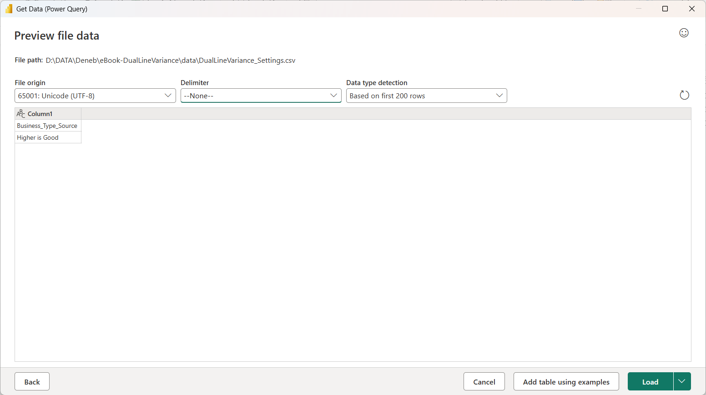
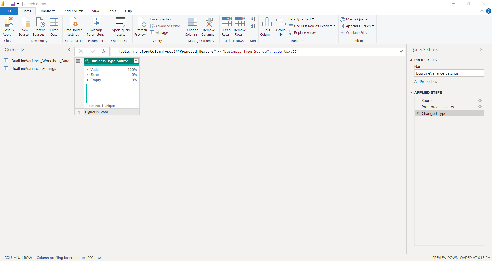
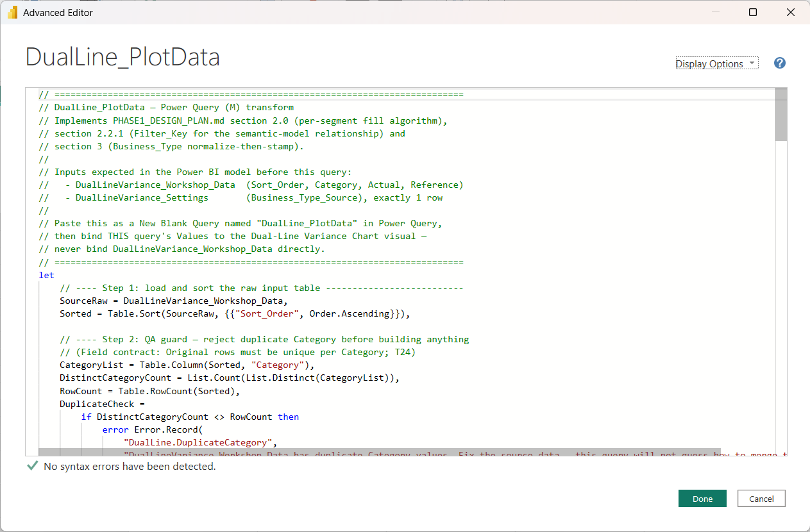
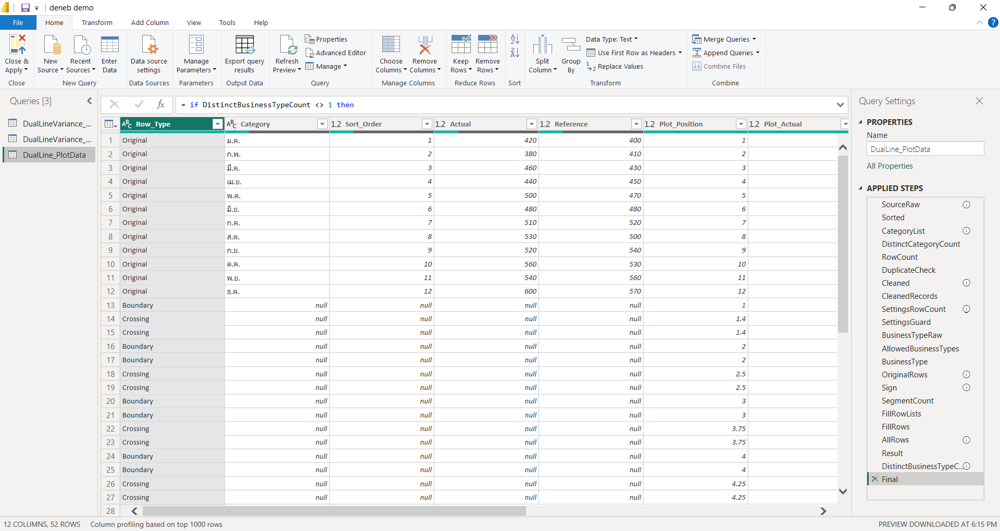
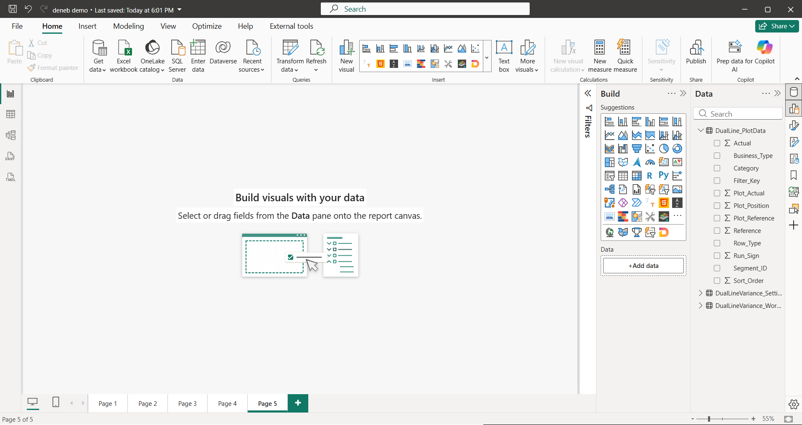
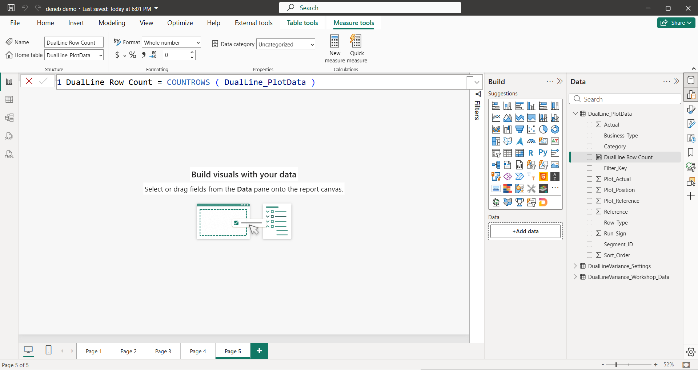
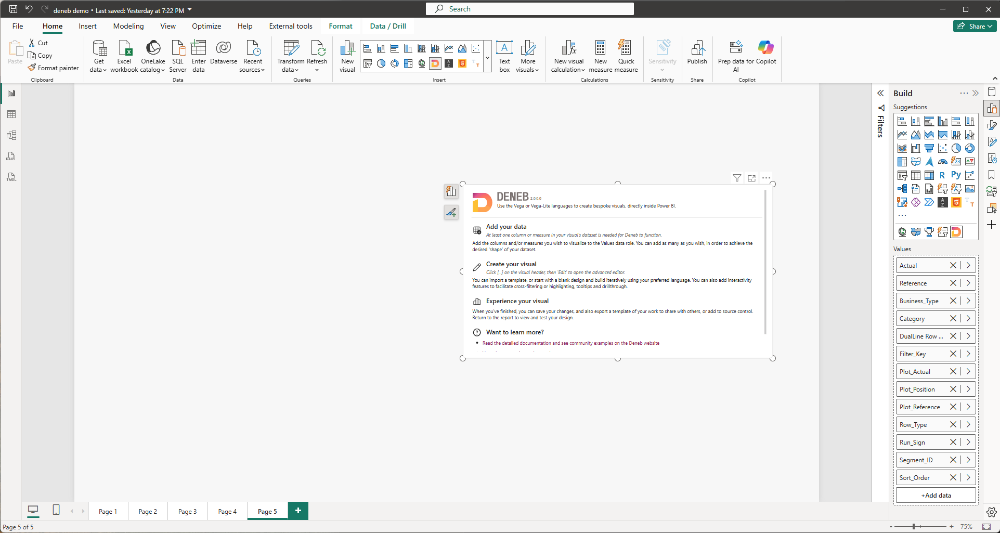
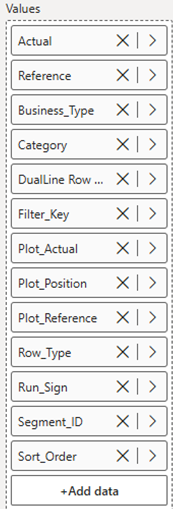
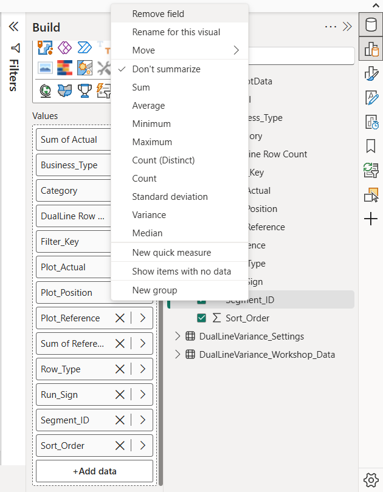
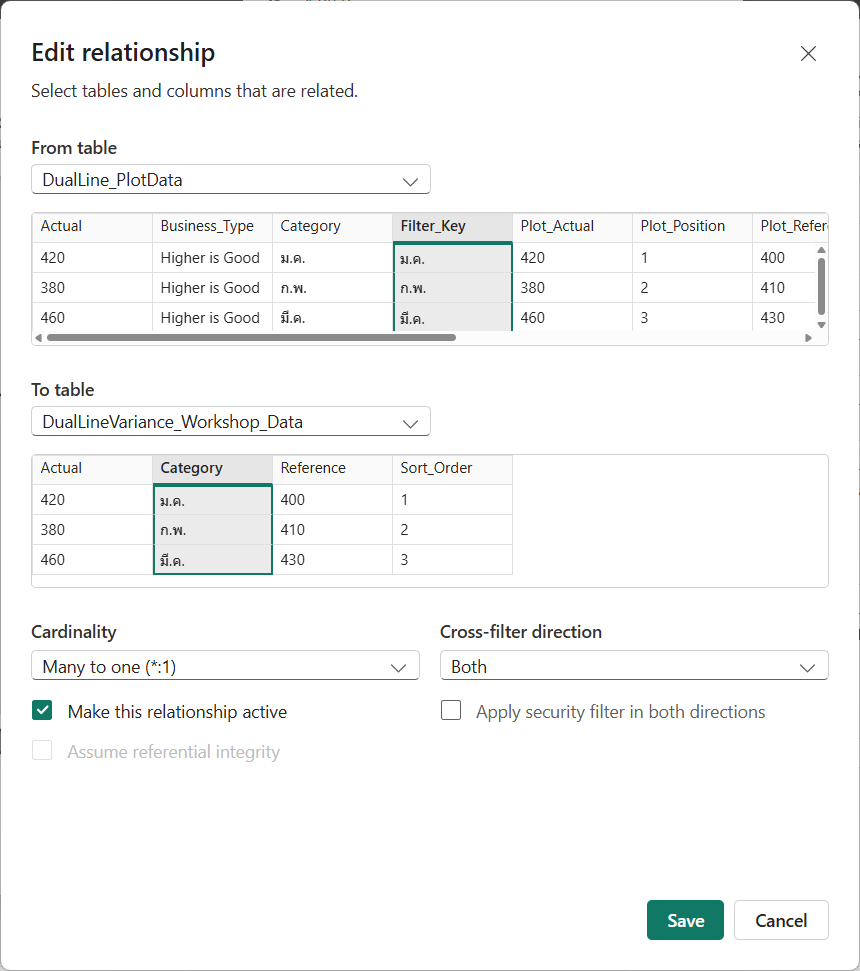

# บทที่ 4 ชุดข้อมูล Workshop

## สิ่งที่จะได้จากบทนี้

บทนี้สร้างข้อมูลที่ Dual-Line Variance Chart ใช้ เมื่อจบคุณจะมีตาราง `DualLine_PlotData` ที่ Power Query สร้างขึ้นจากข้อมูล Workshop 12 เดือน มี measure `DualLine Row Count` มี Relationship `Filter_Key` และวาง Deneb ที่ผูก field ครบไว้แล้ว รอเขียน spec ในบทที่ 5

- อธิบายได้ว่าทำไมกราฟนี้ต้องใช้ตารางที่ Power Query เตรียมไว้ ไม่ใช่ตารางดิบ 12 แถวโดยตรง
- อ่านชนิดแถว `Original`, `Boundary`, `Crossing` และรู้ว่าแต่ละชนิดมีหน้าที่อะไร
- สร้าง query `DualLine_PlotData` และตรวจผลได้ (12 คอลัมน์ 52 แถว)
- รู้ว่าทำไมต้องมี measure `DualLine Row Count` และผูก field เข้า Deneb ได้ถูกวิธี
- สร้าง Relationship `Filter_Key` ที่บทที่ 8 ต้องใช้

**สิ่งที่ต้องมีก่อนเริ่ม** ผ่านบทที่ 2 แล้ว มีตาราง `DualLineVariance_Workshop_Data` (12 แถว) ในรายงาน และไฟล์ `data/DualLineVariance_Settings.csv`, `specs/DualLine_PlotData_PowerQuery.pq` ของเล่ม

> **เรื่องภาพในบทนี้** ทุกภาพ (4-1 ถึง 4-10) เป็นภาพหน้าจอจริงจาก Power BI Desktop 2.157.1354.0 และ Deneb 2.0.0.0 ที่ผู้ใช้จับ 25 ก.ย. 2026 ปิดชื่อบัญชีมุมขวาบนแล้ว (ภาพที่เป็น Power Query, Advanced Editor และ Edit relationship ไม่มีชื่อบัญชีอยู่แล้ว) ภาพ 4-9 ตัดเฉพาะส่วนขวาของหน้าจอเพราะมีหน้าต่างอื่นค้างอยู่ทางซ้าย ตารางที่ใช้ในภาพระบุไว้ในคำบรรยายทุกภาพ

---

## 4.1 ทำไมต้องเตรียมตารางก่อน

ข้อมูลดิบมีหนึ่งแถวต่อหนึ่งเดือน (`Sort_Order`, `Category`, `Actual`, `Reference`) พอสำหรับเส้นและจุด แต่ไม่พอสำหรับ **พื้นที่ระหว่างสองเส้นที่ต้องแบ่งสีตรงจุดที่เส้นตัดกัน** ตัวอย่างจากข้อมูลเดือน ม.ค. ถึง ก.พ. ของเล่มนี้

| เดือน | Actual | Reference | ผลต่าง (Actual − Reference) |
| --- | --- | --- | --- |
| ม.ค. (ตำแหน่ง 1) | 420 | 400 | +20 |
| ก.พ. (ตำแหน่ง 2) | 380 | 410 | −30 |

ผลต่างเปลี่ยนจากบวกเป็นลบ แปลว่าเส้นสองเส้นตัดกันที่ไหนสักแห่งระหว่างสองเดือน จุดตัดไม่ใช่เดือนใดเดือนหนึ่ง จึงไม่มีอยู่ในข้อมูลดิบ วิธีของเล่มนี้คือ **คำนวณจุดตัดล่วงหน้าใน Power Query แล้วเพิ่มเป็นแถวข้อมูล** ให้ spec แค่วาด ไม่ต้องคำนวณเอง (ตามที่บทที่ 1 แจ้งข้อจำกัดข้อ 3 ไว้แล้ว)

ผลคือตารางที่กราฟใช้ไม่ใช่ 12 แถว แต่มีหลายชนิดแถวรวมกันในตารางเดียว

| `Row_Type` | หน้าที่ | ใช้กับ |
| --- | --- | --- |
| `Original` | แถวจริงของแต่ละเดือน (Identity) หนึ่งแถวต่อหนึ่ง Category | เส้น Actual/Reference, จุด, connector, tooltip, ป้ายตัวเลข |
| `Boundary` | ปลายของช่วงระหว่างสองเดือน (ต้นช่วงและท้ายช่วง) | พื้นที่สี |
| `Crossing` | จุดตัดของสองเส้น (มีเฉพาะช่วงที่ผลต่างเปลี่ยนเครื่องหมาย) | พื้นที่สี |

แถว `Boundary` และ `Crossing` เรียกรวมกันว่าแถว Fill (ใช้เฉพาะวาดพื้นที่) และไม่ใช่ข้อมูลของ Category ใด จึงมี `Category`, `Sort_Order`, `Actual`, `Reference` เป็นค่าว่าง (null) ตามที่เห็นในภาพ 4-4

**ตัวอย่าง** ช่วง ม.ค. ถึง ก.พ. ข้างบน ผลต่างเปลี่ยนเครื่องหมาย จึงเป็นกรณีจุดตัด ตำแหน่งจุดตัดคือสัดส่วน `t = d0 ÷ (d0 − d1)` ของช่วง โดย `d0` = ผลต่างของเดือนต้น (+20) และ `d1` = ผลต่างของเดือนท้าย (−30) ได้ `t = 20 ÷ 50 = 0.4` ตำแหน่งจุดตัด `1 + 0.4 × (2 − 1) = 1.4` และค่า `420 + 0.4 × (380 − 420) = 404` ในภาพ 4-4 แถว 14 และ 15 คือแถว `Crossing` ที่ `Plot_Position` = 1.4 ตรงตามนี้

---

## Step 1 นำเข้า Settings และตั้งหัวคอลัมน์

### 1) เป้าหมาย

โหลดตาราง `DualLineVariance_Settings` ที่เก็บว่ากราฟนี้ "ยิ่งมากยิ่งดี" หรือ "ยิ่งน้อยยิ่งดี" (`Business_Type_Source`) เข้า Power BI พร้อมหัวคอลัมน์ที่ถูกต้อง

### 2) สิ่งที่ควรเห็นก่อนเริ่ม

รายงานมีตาราง `DualLineVariance_Workshop_Data` จากบทที่ 2 อยู่แล้ว และยังไม่มีตาราง Settings

### 3) Fields/Measures ที่ใช้

ไฟล์ `data/DualLineVariance_Settings.csv` มีคอลัมน์เดียว หัวคอลัมน์ `Business_Type_Source` และหนึ่งแถวค่า `Higher is Good` (ค่าที่ยอมรับมี `Higher is Good` และ `Lower is Good` เท่านั้น ดูหัวข้อ 4.6)

### 4) ขั้นตอนใน Power BI

1. Home > **Get data** > **Text/CSV** แล้วเลือก `data/DualLineVariance_Settings.csv`
2. ในหน้าต่าง **Preview file data** (ภาพ 4-1) File origin เป็น `65001: Unicode (UTF-8)` อยู่แล้ว ช่อง Delimiter ขึ้น `--None--` เพราะไฟล์นี้มีคอลัมน์เดียว ไม่มีตัวคั่นให้จับ Power Query จึงไม่รู้ว่าแถวแรกคือหัวคอลัมน์ ตารางที่เห็นมีคอลัมน์ `Column1` และ 2 แถว (`Business_Type_Source` กับ `Higher is Good`) ซึ่งเป็นพฤติกรรมปกติ ไม่ต้องเปลี่ยนค่าใดในหน้านี้
3. ถ้าเมนูข้างปุ่ม **Load** (ลูกศรชี้ลง) มีตัวเลือก **Transform Data** ให้เลือกตัวเลือกนี้ ถ้าไม่มี ให้กด Load แล้วเปิด Home > **Transform data** Power Query Editor เปิดขึ้น
4. คลิก query `DualLineVariance_Settings` ในรายการซ้าย แล้วกด Home > **Use First Row as Headers**
5. ตรวจตามภาพ 4-2 Power Query เพิ่มขั้น **Changed Type** ต่อท้ายให้เอง (ตั้งชนิดคอลัมน์เป็นข้อความ) ไม่ต้องทำอะไรเพิ่ม **ยังไม่ต้องกด Close & Apply** ทำ Step 2 ต่อในหน้าต่างเดิม



*ภาพ 4-1 Preview file data ของ `DualLineVariance_Settings.csv`: Delimiter `--None--` ตารางมีคอลัมน์ `Column1` สองแถว (แถวแรกคือ `Business_Type_Source` ยังเป็นข้อมูลอยู่)*



*ภาพ 4-2 Power Query Editor: query `DualLineVariance_Settings` มีหัวคอลัมน์ `Business_Type_Source` และหนึ่งแถว `Higher is Good` Applied steps คือ Source, Promoted Headers, Changed Type ทางซ้ายมี query 2 ตัว*

### 5) JSON ที่เพิ่มหรือแก้เฉพาะ Step

ไม่มี (บทนี้ใช้ Power Query M ไม่ใช่ JSON)

### 6) คำอธิบายโค้ด

ขั้น **Promoted Headers** ที่ Power Query สร้างให้ คือคำสั่ง `Table.PromoteHeaders` ยกแถวแรกขึ้นเป็นชื่อคอลัมน์ ชื่อ `Business_Type_Source` ต้องสะกดตรงตัว เพราะ query ใน Step 2 อ่านค่าผ่านชื่อนี้โดยตรง

### 7) ภาพระหว่างทำ

ภาพ 4-1 และ 4-2

### 8) ผลลัพธ์ที่ควรได้

query `DualLineVariance_Settings` มีหัวคอลัมน์ `Business_Type_Source` และหนึ่งแถว

### 9) วิธีตรวจสอบผล

แถบล่างซ้ายของ Power Query เขียน `1 COLUMN, 1 ROW` และช่อง Queries ซ้ายมี query 2 ตัวตามภาพ 4-2

### 10) ปัญหาที่อาจพบและวิธีแก้

| อาการ | สาเหตุที่เป็นไปได้ | วิธีแก้ |
| --- | --- | --- |
| ตารางมี 2 แถวและคอลัมน์ชื่อ `Column1` | ยังไม่ได้กด Use First Row as Headers | กด Home > Use First Row as Headers |
| หัวคอลัมน์สะกดผิดหรือมีช่องว่างเกิน | ไฟล์ CSV ถูกแก้ | เทียบกับไฟล์ `data/DualLineVariance_Settings.csv` ของเล่ม |
| Step 2 แจ้ง error ว่าตาราง Settings ต้องมี 1 แถว | โหลดไฟล์ผิดหรือมีแถวเกิน | ตรวจว่าตารางมีแถวเดียว |

### 11) แบบฝึกหัดสั้น

ดูแถบ Applied steps ของ `DualLineVariance_Settings` แล้วบอกว่าขั้นไหนถูกสร้างเมื่อกด Use First Row as Headers และขั้นไหน Power Query เพิ่มให้เอง

### 12) จุดตรวจผ่านก่อนทำ Step ถัดไป

- [ ] มี query `DualLineVariance_Settings` ที่มีหัวคอลัมน์ `Business_Type_Source` หนึ่งแถว
- [ ] ยังเปิด Power Query Editor อยู่

---

## Step 2 สร้าง query `DualLine_PlotData`

### 1) เป้าหมาย

สร้างตารางที่กราฟใช้ (12 คอลัมน์ 52 แถว) จากข้อมูล Workshop และ Settings ด้วย query ที่เล่มนี้เตรียมไว้

### 2) สิ่งที่ควรเห็นก่อนเริ่ม

Power Query Editor เปิดอยู่ ซ้ายมี query `DualLineVariance_Workshop_Data` และ `DualLineVariance_Settings`

### 3) Fields/Measures ที่ใช้

query อ่านสองตารางนี้โดยเรียกตามชื่อ ชื่อ query ต้องตรงตัว `DualLineVariance_Workshop_Data` (คอลัมน์ `Sort_Order`, `Category`, `Actual`, `Reference`) และ `DualLineVariance_Settings` (คอลัมน์ `Business_Type_Source`)

### 4) ขั้นตอนใน Power BI

1. ใน Power Query Editor กด Home > **New Source** > **Blank Query**
2. ที่ช่อง **Name** ในแผง Query Settings ทางขวา เปลี่ยนชื่อ query เป็น `DualLine_PlotData` (ตัวพิมพ์ตรงตามนี้)
3. กด Home > **Advanced Editor** เลือกข้อความเดิมทั้งหมดด้วย Ctrl+A แล้ววางเนื้อหาทั้งไฟล์ `specs/DualLine_PlotData_PowerQuery.pq` เลื่อนขึ้นบรรทัดบนสุด ต้องเห็นชื่อ `DualLine_PlotData` ที่หัวหน้าต่างและข้อความ "No syntax errors have been detected." ที่มุมล่าง (ภาพ 4-3) แล้วกด **Done**
4. คลิกเลือก query `DualLine_PlotData` ตรวจตามภาพ 4-4 แถบล่างซ้ายต้องเขียน **12 COLUMNS, 52 ROWS**
5. กด Home > **Close & Apply** รอจนโหลดเสร็จ ในช่อง Data ขยายตาราง `DualLine_PlotData` จะเห็น field 12 ตัว (ภาพ 4-5) ตัวเลข 7 ตัวมีเครื่องหมาย ∑ นำหน้า (`Actual`, `Plot_Actual`, `Plot_Position`, `Plot_Reference`, `Reference`, `Run_Sign`, `Sort_Order`) ส่วนข้อความ 5 ตัวไม่มี (`Business_Type`, `Category`, `Filter_Key`, `Row_Type`, `Segment_ID`)



*ภาพ 4-3 Advanced Editor ของ query `DualLine_PlotData` แสดงส่วนต้นของโค้ด (คอมเมนต์หัวไฟล์ ถึง Step 2) และข้อความ "No syntax errors have been detected."*



*ภาพ 4-4 ผลของ query `DualLine_PlotData` ใน Power Query: 12 คอลัมน์ 52 แถว แถว 1 ถึง 12 เป็น `Original` แถว 13 ลงไปเป็น `Boundary` กับ `Crossing` (Category, Sort_Order, Actual, Reference เป็น null) ทางขวามี Applied steps ตั้งแต่ SourceRaw ถึง Final*



*ภาพ 4-5 หลัง Close & Apply: ตาราง `DualLine_PlotData` ในช่อง Data มี field 12 ตัว ยังไม่มี measure*

### 5) JSON ที่เพิ่มหรือแก้เฉพาะ Step

ไม่มี ตัวโค้ด M ทั้งไฟล์อยู่ที่ [`specs/DualLine_PlotData_PowerQuery.pq`](../specs/DualLine_PlotData_PowerQuery.pq) ไม่ได้วางซ้ำในบท

### 6) คำอธิบายโค้ด

query ทำงานเป็น 8 ขั้น ตามหมายเลข Step ที่เขียนเป็นคอมเมนต์ในไฟล์

| ขั้นในไฟล์ | ทำอะไร |
| --- | --- |
| 1 | อ่าน `DualLineVariance_Workshop_Data` แล้วเรียงตาม `Sort_Order` |
| 2 | ตรวจว่า `Category` ไม่ซ้ำ ถ้าซ้ำ **หยุดพร้อม error** ชื่อ `DualLine.DuplicateCategory` (query ไม่เดาวิธีรวมแถวให้) |
| 3 | เปลี่ยนค่าว่างของ `Actual` และ `Reference` เป็น 0 |
| 4 | อ่าน `Business_Type_Source` จาก Settings (ต้องมีแถวเดียว ถ้าไม่ใช่จะ error `DualLine.SettingsRowCountInvalid`) ตัดช่องว่างหัวท้าย และใช้ค่า `Higher is Good` แทนถ้าค่าไม่อยู่ในรายการที่ยอมรับ |
| 5 | สร้างแถว `Original` ทั้ง 12 แถว โดย `Plot_Position` = `Sort_Order`, `Plot_Actual` = `Actual`, `Plot_Reference` = `Reference` และ `Filter_Key` = `Category` |
| 6 | สร้างแถว Fill ต่อหนึ่งช่วงระหว่างเดือนที่อยู่ติดกัน (ดูกรณี A B C ข้างล่าง) |
| 7 | รวมแถว `Original` กับแถว Fill เป็นตารางเดียว กำหนดชนิดคอลัมน์ทั้ง 12 |
| 8 | ตรวจว่า `Business_Type` มีค่าเดียวทั้งตาราง (ถ้าไม่ใช่ error `DualLine.BusinessTypeInconsistent` ซึ่งไม่ควรเกิด) |

**ขั้น 6: สามกรณีของแต่ละช่วง** ให้ `d0` และ `d1` คือผลต่าง (Actual − Reference) ของเดือนต้นและเดือนท้ายของช่วง

| กรณี | เงื่อนไข | แถวที่ได้ |
| --- | --- | --- |
| A | `d0 = 0` และ `d1 = 0` (สองเส้นทับกันตลอดช่วง) | ไม่มีแถว (ไม่มีพื้นที่ให้ระบาย) |
| B | `d0 × d1 < 0` (สองเส้นตัดกันจริง) | 4 แถว: `Boundary` ต้นช่วง, `Crossing` ×2 (ตำแหน่งเดียวกัน แบ่งเป็นสองส่วน `-a` และ `-b`), `Boundary` ท้ายช่วง |
| C | ที่เหลือ: เครื่องหมายเดียวกัน หรือมีด้านหนึ่งเป็นศูนย์ | 2 แถว: `Boundary` ต้นช่วงและท้ายช่วง |

แถว Fill ทุกแถวมี `Segment_ID` (เลขช่วง เช่น `3` หรือ `3-a` และ `3-b`) `Run_Sign` (เครื่องหมายของช่วงนั้น: 1 ถ้า Actual สูงกว่า, −1 ถ้าต่ำกว่า) และ `Filter_Key` (เท่ากับ `Category` ของเดือนต้นช่วงเสมอ) สองคอลัมน์แรกบอกสี ส่วน `Filter_Key` ใช้ใน Step 5

**นับแถวของข้อมูล Workshop** 12 เดือนมี 11 ช่วง ผู้เขียนนับจากผลของสคริปต์ทดสอบ `qa/scripts/workshop-plotdata.json` (อัลกอริทึมเดียวกับ query) ได้ 9 ช่วงที่เป็นกรณี B (ตัดกัน) และ 2 ช่วงที่เป็นกรณี C (ช่วง พ.ค. ถึง มิ.ย. และ มิ.ย. ถึง ก.ค. เพราะ มิ.ย. ผลต่างเป็นศูนย์) ไม่มีกรณี A รวมแถว Fill = 9 × 4 + 2 × 2 = 40 แถว (`Boundary` 22 และ `Crossing` 18) บวก `Original` 12 = **52 แถว** ตรงกับผลใน Power Query จริงที่ภาพ 4-4 (แถบล่างเขียน 52 ROWS)

### 7) ภาพระหว่างทำ

ภาพ 4-3, 4-4 และ 4-5

### 8) ผลลัพธ์ที่ควรได้

ตาราง `DualLine_PlotData` 12 คอลัมน์ 52 แถวในโมเดล Power BI

### 9) วิธีตรวจสอบผล

- แถบล่างซ้ายของ Power Query เขียน `12 COLUMNS, 52 ROWS`
- แถว 1 ถึง 12 เป็น `Original` เรียงตามเดือน ค่า Actual/Reference ตรงกับ CSV (ม.ค. 420 กับ 400 ธ.ค. 600 กับ 570)
- แถว 13 คือ `Boundary` (`Plot_Position` = 1) แถว 14 และ 15 คือ `Crossing` (`Plot_Position` = 1.4) ตามตัวอย่างในหัวข้อ 4.1

### 10) ปัญหาที่อาจพบและวิธีแก้

| อาการ | สาเหตุที่เป็นไปได้ | วิธีแก้ |
| --- | --- | --- |
| แจ้งว่าไม่รู้จัก `DualLineVariance_Workshop_Data` หรือ `DualLineVariance_Settings` | ชื่อ query ในรายการซ้ายสะกดไม่ตรง | เปลี่ยนชื่อ query ให้ตรงตัวอักษรทุกตัว |
| แจ้ง Expression.Error เรื่องคอลัมน์ `Business_Type_Source` | ยังไม่ได้ทำ Step 1 ข้อ 4 | กลับไปกด Use First Row as Headers |
| ตารางไม่ใช่ 52 แถว | ข้อมูลดิบต่างจากไฟล์ของเล่ม | เทียบ CSV กับ `data/DualLineVariance_Workshop_Data.csv` (จำนวนแถวของ Fill เปลี่ยนตามข้อมูล) |
| เตือนเรื่อง Privacy Levels ตอนกด Done | Power Query ถามเรื่องการรวมแหล่งข้อมูลสองไฟล์ | ผู้เขียนไม่พบข้อความนี้ในการทดสอบเล่มนี้ ถ้าเจอ ให้อ่านข้อความแล้วเลือกตามนโยบายของคุณ (อย่ากดผ่านโดยไม่อ่าน) |

### 11) แบบฝึกหัดสั้น

จากข้อมูลใน CSV ช่วง ก.พ. ถึง มี.ค. (Actual 380 → 460, Reference 410 → 430) เป็นกรณีอะไร และตำแหน่งจุดตัดเท่าไร (ใช้สูตรในหัวข้อ 4.1 แล้วเทียบกับแถวใน Power Query)

### 12) จุดตรวจผ่านก่อนทำ Step ถัดไป

- [ ] มีตาราง `DualLine_PlotData` 52 แถว 12 คอลัมน์ในช่อง Data
- [ ] แยกชนิดแถว `Original`, `Boundary`, `Crossing` ได้

---

## Step 3 สร้าง measure `DualLine Row Count`

### 1) เป้าหมาย

สร้าง measure ที่ไม่มีวันเป็นค่าว่าง เพื่อให้ Power BI ไม่ตัดแถว `Boundary` และ `Crossing` ทิ้ง

### 2) สิ่งที่ควรเห็นก่อนเริ่ม

ตาราง `DualLine_PlotData` ในช่อง Data ยังไม่มี measure (ภาพ 4-5)

### 3) Fields/Measures ที่ใช้

สร้างใหม่: `DualLine Row Count` บนตาราง `DualLine_PlotData` (ไฟล์อ้างอิง `dax/workshop-measures.dax`)

### 4) ขั้นตอนใน Power BI

1. ในช่อง Data คลิกเลือกตาราง `DualLine_PlotData` (ชื่อตาราง ไม่ใช่ field) เพื่อให้ measure ไปอยู่ในตารางนี้
2. Home > **New measure**
3. ในแถบสูตร พิมพ์ (ตัวพิมพ์และช่องว่างตามนี้)

```dax
DualLine Row Count = COUNTROWS ( DualLine_PlotData )
```

4. กด Enter ตามภาพ 4-6 แท็บ Measure tools แสดง Name = `DualLine Row Count`, Home table = `DualLine_PlotData`, Format = Whole number และช่อง Data มี measure ในตารางนี้



*ภาพ 4-6 แถบสูตรของ measure `DualLine Row Count = COUNTROWS ( DualLine_PlotData )` และ measure ที่ปรากฏในช่อง Data ใต้ตาราง `DualLine_PlotData` (ในภาพยังเห็นปุ่ม ✕ และ ✓ ข้างแถบสูตร)*

### 5) JSON ที่เพิ่มหรือแก้เฉพาะ Step

ไม่มี (measure เป็น DAX ตามที่แสดงในข้อ 4)

### 6) คำอธิบายโค้ด

`COUNTROWS ( DualLine_PlotData )` นับแถวของตารางในบริบทที่ Visual นั้นอยู่ ผลไม่เคยเป็นค่าว่าง วิธีที่ Power BI ส่งข้อมูลเข้า Visual คือตัดแถวที่ measure ทุกตัวเป็นค่าว่างทิ้ง แถว `Boundary` กับ `Crossing` มี `Actual` และ `Reference` เป็นค่าว่าง ถ้าไม่มี measure นี้ในช่อง Values เมื่อผูก `Actual` กับ `Reference` แบบ Sum แถวเหล่านี้จะหายทั้งหมด ผลที่ Phase 2 ทดสอบบน Power BI จริงเมื่อ 24 ก.ย. 2026 คือ dataset ของ Deneb เหลือ 12 แถวแทน 52 และพื้นที่สีหายไป เมื่อใส่กลับพร้อม measure นี้ได้ 52 แถวและพื้นที่สีกลับมา (หลักฐาน `qa/evidence/phase2-powerbi/T23-01-*.png` ถึง `T23-03-*.png` และ `review/PHASE1_DESIGN_PLAN.md` หัวข้อ 2.1.1) spec ของเล่มนี้ไม่อ่านค่าของ measure นี้เลย มีไว้ในช่อง Values เพื่อกันแถวหายเท่านั้น

### 7) ภาพระหว่างทำ

ภาพ 4-6

### 8) ผลลัพธ์ที่ควรได้

measure `DualLine Row Count` อยู่ในตาราง `DualLine_PlotData`

### 9) วิธีตรวจสอบผล

ในช่อง Data ต้องเห็น measure `DualLine Row Count` (ไอคอนเครื่องคิดเลข) ใต้ตาราง `DualLine_PlotData` ผลที่วัดจริงคือตรวจตอนผูกเข้า Deneb ใน Step 4 แล้วดูแท็บ Source ใน Debug pane (บทที่ 5 ทำต่อ) ต้องมี 52 แถว

### 10) ปัญหาที่อาจพบและวิธีแก้

| อาการ | สาเหตุที่เป็นไปได้ | วิธีแก้ |
| --- | --- | --- |
| measure ไปอยู่ตารางอื่น | ไม่ได้เลือกตาราง `DualLine_PlotData` ก่อนกด New measure | ในแท็บ Measure tools เปลี่ยน Home table เป็น `DualLine_PlotData` |
| แจ้ง error ที่ชื่อตาราง | สะกดชื่อตารางผิด | ชื่อตาราง `DualLine_PlotData` มีขีดล่างระหว่างคำ |

### 11) แบบฝึกหัดสั้น

ถ้าผูก `Category` กับ `Sum of Actual` อย่างเดียวโดยไม่มี measure นี้ คุณคาดว่าจะเห็นกี่แถวใน dataset และเป็นแถวชนิดใด (เฉลยในหัวข้อคำตอบท้ายบท)

### 12) จุดตรวจผ่านก่อนทำ Step ถัดไป

- [ ] measure `DualLine Row Count` อยู่ในตาราง `DualLine_PlotData`

---

## Step 4 ผูก field เข้า Deneb

### 1) เป้าหมาย

วาง Deneb บนหน้ารายงานและผูก field ทั้ง 13 ตัวของ `DualLine_PlotData` เข้าช่อง Values พร้อมตั้งวิธีสรุปค่าที่ถูกต้อง

### 2) สิ่งที่ควรเห็นก่อนเริ่ม

หน้ารายงานใหม่ที่ว่างเปล่า ตาราง `DualLine_PlotData` มี field 12 ตัวกับ measure 1 ตัว

### 3) Fields/Measures ที่ใช้

ทั้ง 13 ตัวของตาราง `DualLine_PlotData`

| กลุ่ม | field | วิธีสรุปค่าในช่อง Values |
| --- | --- | --- |
| ค่าที่เป็นตัวเลขและใช้กับ Cross-highlight | `Actual`, `Reference` | **Sum** (ค่าเริ่มต้น) แล้ว**เปลี่ยนชื่อแถบ**จาก `Sum of Actual`, `Sum of Reference` เป็น `Actual`, `Reference` |
| ค่าที่ใช้วาด (ตัวเลข) | `Plot_Actual`, `Plot_Position`, `Plot_Reference`, `Run_Sign`, `Sort_Order` | **Don't summarize** |
| ข้อความ | `Category`, `Business_Type`, `Filter_Key`, `Row_Type`, `Segment_ID` | ไม่มีการสรุป (ไม่ต้องตั้ง) |
| measure | `DualLine Row Count` | ไม่ต้องตั้ง |

เหตุผลที่ `Actual` และ `Reference` เป็น Sum: การผูกเป็น measure ทำให้ Deneb สร้างคอลัมน์ `<ชื่อ>__highlight` สำหรับ Cross-highlight ในบทที่ 8 ได้ (ตาม Design Plan และหลักฐาน Phase 2) `<ชื่อ>` คือชื่อของแถบในช่อง Values ดังนั้นแถบต้องชื่อ `Actual` และ `Reference` (ไม่ใช่ `Sum of Actual`) คอลัมน์จึงชื่อ `Actual__highlight` ตามที่ spec อ้าง ส่วนค่าที่ใช้วาดต้องส่งเข้ามาทีละแถวตรงตามตาราง จึงต้องเป็น Don't summarize มิฉะนั้น Power BI จะรวมค่าของแถวที่ `Category` เดียวกันเข้าด้วยกัน

### 4) ขั้นตอนใน Power BI

1. เพิ่มหน้าใหม่ คลิกไอคอน **Deneb** ในช่อง Build เพื่อวาง Visual
2. ให้ Visual Deneb ถูกเลือกอยู่ แล้วติ๊ก field ทั้ง 13 ตัวในช่อง Data (ตาราง `DualLine_PlotData`) Power BI จะใส่เข้าช่อง Values เอง
3. ในช่อง Values คลิกขวาที่แถบ `Sum of Plot_Actual`, `Sum of Plot_Position`, `Sum of Plot_Reference`, `Sum of Run_Sign`, `Sum of Sort_Order` แล้วเลือก **Don't summarize** ทีละตัว แถบจะเปลี่ยนชื่อเป็นชื่อเปล่า (`Plot_Actual` ฯลฯ) ตามภาพ 4-7 และ 4-8
4. ปล่อย `Sum of Actual` และ `Sum of Reference` เป็น Sum ตามเดิม แต่**เปลี่ยนชื่อแถบ**: คลิกขวาที่แถบ `Sum of Actual` เลือก **Rename for this visual** พิมพ์ `Actual` แล้ว Enter จากนั้นทำเช่นเดียวกับ `Sum of Reference` ให้เป็น `Reference` (เหมือนบทที่ 2 ที่ใช้ชื่อเปล่า) ต้องทำ เพราะ spec ของบทที่ 8 อ่านค่า `Actual`, `Reference` และคอลัมน์ `Actual__highlight` ฯลฯ ที่ Deneb ตั้งชื่อตามชื่อแถบ ถ้าปล่อยเป็น `Sum of Actual` Deneb จะสร้างคอลัมน์ชื่อ `Sum of Actual__highlight` ซึ่ง spec หาไม่เจอ และ Cross-highlight ในบทที่ 8 จะไม่จางเลย (พบจริงตอนทดสอบบทที่ 8)
5. ตรวจตามภาพ 4-7 (เต็มหน้าจอ) และ 4-8 (ขยายช่อง Values ถึงปุ่ม +Add data) ต้องเห็นแถบครบ 13 ตัว โดย `Actual` และ `Reference` เปลี่ยนชื่อแล้ว ลำดับในช่อง Values ของคุณอาจต่างจากภาพ ไม่กระทบผล
6. ถ้าจะตรวจการตั้งค่าของแถบใด คลิกขวาที่แถบนั้น จะเห็นเครื่องหมายถูกหน้าตัวเลือกที่ใช้อยู่ ในภาพ 4-9 ตัวเลือก **Don't summarize** มีเครื่องหมายถูก



*ภาพ 4-7 เต็มหน้าจอ (Report view ซูม 75%): Visual Deneb ที่ผูก field จาก `DualLine_PlotData` แล้วยังแสดงหน้าจอเปล่าของ Deneb (ยังไม่มี spec) ทางขวาคือ Build pane ช่อง Values มี 13 แถบ ที่ `Actual` และ `Reference` เปลี่ยนชื่อจาก `Sum of Actual`, `Sum of Reference` แล้ว*



*ภาพ 4-8 ภาพที่ผู้เขียนตัดและขยายจากภาพ 4-7 (ไม่ใช่ภาพหน้าจอใหม่) เฉพาะช่อง Values ครบ 13 แถบจนถึงปุ่ม +Add data: `Actual`, `Reference`, `Business_Type`, `Category`, `DualLine Row …`, `Filter_Key`, `Plot_Actual`, `Plot_Position`, `Plot_Reference`, `Row_Type`, `Run_Sign`, `Segment_ID`, `Sort_Order` ไม่มีแถบ `Sum of …` เหลืออยู่*



*ภาพ 4-9 เมนูคลิกขวาของแถบ field ตัวเลขในช่อง Values: **Don't summarize** มีเครื่องหมายถูก (ภาพนี้ตัดเฉพาะฝั่งขวาของหน้าจอ เมนูบังชื่อแถบที่ถูกคลิก จึงใช้ดูรูปแบบตัวเลือกเท่านั้น ไม่ใช้ยืนยันว่า field ใดถูกตั้งค่า)*

### 5) JSON ที่เพิ่มหรือแก้เฉพาะ Step

ไม่มี ยังไม่มี spec ใน Step นี้ Visual ยังแสดงหน้าจอเปล่าของ Deneb (บทที่ 5 สร้าง spec)

### 6) คำอธิบายโค้ด

ไม่มี ข้อควรเข้าใจคือชื่อในช่อง Values คือชื่อ field ที่ spec เห็น (บทที่ 2 Step 3 และบทที่ 3 หัวข้อ 3.1) spec ของบทที่ 5 ถึง 8 อ้าง `Plot_Position`, `Plot_Actual`, `Plot_Reference`, `Segment_ID`, `Sort_Order`, `Category` ตามชื่อเปล่า จึงต้องตั้ง Don't summarize ให้แถบแสดงชื่อเปล่าตามนี้ และ spec ของบทที่ 8 อ้าง `Actual` กับ `Reference` ด้วย จึงต้องเปลี่ยนชื่อแถบสองตัวนั้นด้วย

### 7) ภาพระหว่างทำ

ภาพ 4-7, 4-8 และ 4-9

### 8) ผลลัพธ์ที่ควรได้

ช่อง Values ของ Deneb มี 13 แถบ แถบ 5 ตัวเป็นชื่อเปล่าตาม Don't summarize และ `Actual` กับ `Reference` เป็น Sum ที่เปลี่ยนชื่อแล้ว

### 9) วิธีตรวจสอบผล

ตามภาพ 4-8 ต้องไม่มีแถบ `Sum of …` เหลืออยู่เลย (ทั้ง `Sum of Plot_…`, `Sum of Run_Sign`, `Sum of Sort_Order` และ `Sum of Actual`/`Sum of Reference`) ถ้ามี แปลว่ายังไม่ได้ตั้ง Don't summarize หรือยังไม่ได้เปลี่ยนชื่อ ตรวจ 52 แถวในบทที่ 5 (แท็บ Source ของ Debug pane) หลังสร้าง spec

### 10) ปัญหาที่อาจพบและวิธีแก้

| อาการ | สาเหตุที่เป็นไปได้ | วิธีแก้ |
| --- | --- | --- |
| แถบเป็น `Sum of Plot_Position` ฯลฯ | ยังไม่ได้ตั้ง Don't summarize | คลิกขวาที่แถบ เลือก Don't summarize |
| แถบเป็น `Sum of Actual` หรือ `Sum of Reference` | ยังไม่ได้เปลี่ยนชื่อ | คลิกขวาที่แถบ เลือก Rename for this visual แล้วพิมพ์ `Actual` หรือ `Reference` (ถ้าข้าม Cross-highlight ในบทที่ 8 จะไม่จาง) |
| ติ๊ก field แล้วไม่เข้าช่อง Values | Visual ที่เลือกอยู่ไม่ใช่ Deneb | คลิกที่ Visual Deneb ให้ถูกเลือกก่อน |
| หน้าต่าง Suggest a visual เปิดค้าง | Power BI เสนอ Visual ให้หลังติ๊ก field | กดกากบาทปิด แล้วคลิกที่ Visual Deneb |
| แถบ Values ไม่ครบ 13 | ติ๊ก field ไม่ครบ | ติ๊กที่ขาด (รวม `DualLine Row Count`) |

### 11) แบบฝึกหัดสั้น

ในกลุ่มตัวเลข 7 ตัวของภาพ 4-8 แถบใดเป็น Sum ที่ต้องเปลี่ยนชื่อ และแถบใดตั้ง Don't summarize ทำไมสองกลุ่มจึงทำต่างกัน (เฉลยท้ายบท ข้อ 4)

### 12) จุดตรวจผ่านก่อนทำ Step ถัดไป

- [ ] ช่อง Values ของ Deneb มี 13 แถบ
- [ ] แถบ 5 ตัวตั้ง Don't summarize แล้ว

---

## Step 5 สร้าง Relationship `Filter_Key`

### 1) เป้าหมาย

เชื่อม `DualLine_PlotData[Filter_Key]` กับ `DualLineVariance_Workshop_Data[Category]` เพื่อให้ Slicer หรือ Visual อื่นที่ใช้ `Category` จากตาราง Workshop ทำงานร่วมกับกราฟนี้ได้ (บทที่ 8)

### 2) สิ่งที่ควรเห็นก่อนเริ่ม

โมเดลมีตาราง `DualLine_PlotData`, `DualLineVariance_Workshop_Data` และ `DualLineVariance_Settings` ยังไม่มี Relationship ระหว่างสองตารางแรก (Power BI อาจสร้างให้เองแล้ว ตรวจใน Model view)

### 3) Fields/Measures ที่ใช้

`DualLine_PlotData[Filter_Key]` (ข้อความ) กับ `DualLineVariance_Workshop_Data[Category]` (ข้อความ)

### 4) ขั้นตอนใน Power BI

1. เปิด **Model view** (ไอคอนที่สามในแถบซ้าย)
2. ลาก `Filter_Key` จากตาราง `DualLine_PlotData` ไปวางบน `Category` ของตาราง `DualLineVariance_Workshop_Data` (ถ้า Power BI สร้าง Relationship ให้เองแล้ว ข้ามไปข้อ 3)
3. ดับเบิลคลิกที่เส้น Relationship เพื่อเปิด **Edit relationship**
4. ตั้งค่าตามภาพ 4-10
   - From table: `DualLine_PlotData` คอลัมน์ `Filter_Key`
   - To table: `DualLineVariance_Workshop_Data` คอลัมน์ `Category`
   - Cardinality: **Many to one (\*:1)**
   - Cross-filter direction: **Both**
   - Make this relationship active: ติ๊ก
5. กด **Save**



*ภาพ 4-10 Edit relationship: จาก `DualLine_PlotData[Filter_Key]` ไปยัง `DualLineVariance_Workshop_Data[Category]` Cardinality Many to one (\*:1) Cross-filter direction Both ติ๊ก Make this relationship active ตัวอย่างแถวของทั้งสองตารางแสดงค่าเดือน ม.ค., ก.พ., มี.ค. ตรงกัน (ภาพนี้ถ่ายก่อนกด Save)*

### 5) JSON ที่เพิ่มหรือแก้เฉพาะ Step

ไม่มี

### 6) คำอธิบายโค้ด

ไม่มี ข้อควรเข้าใจสามข้อ

- **ทำไมใช้ `Filter_Key` ไม่ใช่ `Category`** แถว Fill (`Boundary`, `Crossing`) มี `Category` เป็นค่าว่าง ถ้าเชื่อมด้วย `Category` Relationship จะตัดแถว Fill ทั้งหมดออก พื้นที่สีจะหาย `Filter_Key` ไม่ว่างทุกแถว (แถว Fill ใช้ค่าของเดือนต้นช่วง) ตาม Design Plan หัวข้อ 2.2.1
- **ทำไมต้องเป็น Both** ทิศทางเดียว (Dimension → Fact) กรองจากตาราง Workshop ลงมาที่กราฟนี้ได้ แต่ไม่ส่งการเลือกจากกราฟนี้กลับไปหา Visual อื่น เมื่อต้องการทั้งสองทิศทาง (บทที่ 8) ต้องตั้ง Both ตาม Design Plan หัวข้อ 2.2.1 ข้อ 5 และหลักฐาน Phase 2 T18
- **ผลที่ตามมาของ Both** Power BI อาจแจ้งความกำกวมถ้าโมเดลมีเส้นทางเชื่อมซ้ำ ในโมเดล Workshop ที่มีตารางน้อย ในโมเดลทดสอบของ Phase 2 ไม่พบปัญหานี้ (ตาราง Settings ไม่ได้เชื่อมกับตารางใด) แต่ถ้าคุณเพิ่มตารางเองแล้วเจอ ให้ตรวจเส้นทางเชื่อมก่อน

### 7) ภาพระหว่างทำ

ภาพ 4-10

### 8) ผลลัพธ์ที่ควรได้

มี Relationship หนึ่งเส้นจาก `DualLine_PlotData[Filter_Key]` ไป `DualLineVariance_Workshop_Data[Category]` แบบ Many to one, Both, active

### 9) วิธีตรวจสอบผล

ใน Model view เห็นเส้นเชื่อมระหว่างสองตาราง ดับเบิลคลิกเปิดดูอีกครั้งต้องเห็นค่าตรงกับภาพ 4-10

### 10) ปัญหาที่อาจพบและวิธีแก้

| อาการ | สาเหตุที่เป็นไปได้ | วิธีแก้ |
| --- | --- | --- |
| Power BI สร้างเส้นผิดคอลัมน์ให้เอง | Auto-detect เชื่อมด้วย `Category` กับ `Category` | ดับเบิลคลิกเส้น แล้วเลือกคอลัมน์ `Filter_Key` ที่ตาราง `DualLine_PlotData` |
| Cardinality เป็น One to many หรือ Many to many | เลือกตารางสลับด้าน | ตั้ง From table เป็น `DualLine_PlotData` |
| ปุ่ม Save ใช้ไม่ได้ | เลือกสองคอลัมน์ไม่ครบ | เลือกคอลัมน์ในกรอบตารางทั้งสองข้างก่อน |
| Both ถูกปฏิเสธด้วยข้อความความกำกวม | มีเส้นทางเชื่อมอื่นซ้ำ | ตรวจเส้น Relationship อื่นในโมเดล |

### 11) แบบฝึกหัดสั้น

ถ้าเชื่อมด้วย `Category` ของ `DualLine_PlotData` แทน `Filter_Key` แถวชนิดใดจะไม่ผ่านการกรอง และผลต่อกราฟคืออะไร

### 12) จุดตรวจผ่านก่อนไปบทที่ 5

- [ ] มี Relationship `Filter_Key` แบบ Many to one, Both, active
- [ ] ไม่มีข้อความเตือนความกำกวมของโมเดล

---

## 4.6 อ้างอิง: คอลัมน์ของ `DualLine_PlotData`

| คอลัมน์ | ชนิด | `Original` | `Boundary` | `Crossing` |
| --- | --- | --- | --- | --- |
| `Row_Type` | ข้อความ | `Original` | `Boundary` | `Crossing` |
| `Category` | ข้อความ | ชื่อเดือน | null | null |
| `Sort_Order` | ตัวเลข | ลำดับเดือน | null | null |
| `Actual`, `Reference` | ตัวเลข | ค่าจริงของเดือน (ค่าว่างตอนต้นทาง = 0) | null | null |
| `Plot_Position` | ตัวเลข | = `Sort_Order` | `Sort_Order` ของเดือนต้นหรือท้ายช่วง | ตำแหน่งจุดตัด (เศษส่วน) |
| `Plot_Actual`, `Plot_Reference` | ตัวเลข | = `Actual`, `Reference` | ค่าของเดือนต้นหรือท้ายช่วง | ค่าที่จุดตัด (สองค่าเท่ากัน) |
| `Segment_ID` | ข้อความ | null | เลขช่วง (`i` หรือ `i-a`, `i-b`) | เลขช่วง (`i-a`, `i-b`) |
| `Run_Sign` | ตัวเลข | null | เครื่องหมายของช่วง (1 หรือ −1) | เครื่องหมายของช่วง |
| `Business_Type` | ข้อความ | ค่าเดียวทั้งตาราง | เดียวกัน | เดียวกัน |
| `Filter_Key` | ข้อความ | = `Category` | `Category` ของเดือนต้นช่วง | `Category` ของเดือนต้นช่วง |

`Business_Type` (`Higher is Good` หรือ `Lower is Good`) เป็นคอลัมน์ที่ Power Query ประทับค่าเดียวซ้ำทุกแถวจาก Settings ทำให้กราฟสลับความหมายดี/แย่ได้โดยไม่แก้ spec (บทที่ 6) เลือกทำเป็นคอลัมน์ ไม่ใช่ measure เพราะตารางนี้ควบคุม grain เองอยู่แล้ว

## 4.7 อ้างอิง: กรณีข้อมูลที่ query จัดการให้

| กรณี | พฤติกรรม | ตรวจใน Workshop จริงแล้วหรือไม่ |
| --- | --- | --- |
| `Actual` หรือ `Reference` ต้นทางเป็นค่าว่าง | เปลี่ยนเป็น 0 (ขั้น 3) | ยังไม่ได้ทดสอบบน Power Query จริง (ดูโค้ดขั้น 3) |
| `Category` ซ้ำ | หยุดด้วย error `DualLine.DuplicateCategory` | ยังไม่ได้ทดสอบบน Power Query จริง |
| `Business_Type_Source` ว่างหรือไม่อยู่ในรายการที่ยอมรับ | ใช้ `Higher is Good` แทน | ยังไม่ได้ทดสอบบน Power Query จริง |
| Settings ไม่ใช่ 1 แถว | หยุดด้วย error `DualLine.SettingsRowCountInvalid` | ยังไม่ได้ทดสอบบน Power Query จริง |
| ผลต่างเป็นศูนย์ทั้งสองปลายช่วง (กรณี A) | ไม่มีแถว Fill | ไม่มีในข้อมูล Workshop ชุดนี้ |

ตารางนี้เป็นสัญญาพฤติกรรมตามโค้ด M ไม่ใช่หลักฐาน runtime ของแต่ละกรณี ตรรกะเดียวกันถูกทดสอบเป็นชุดใหญ่ใน Phase 2 ด้วยโค้ด JavaScript ที่เป็นอัลกอริทึมเดียวกัน (`qa/scripts/plotdata-algorithm.mjs`) แต่ตัวโค้ด M นี้ ผู้เขียนยืนยันบน Power Query จริงเฉพาะข้อมูล Workshop 12 เดือน (52 แถว) ตามภาพ 4-4 กรณีอื่นในตารางข้างบนที่ระบุว่ายังไม่ได้ทดสอบ บทที่ 9 จะให้ลองเมื่อทดสอบ Edge Case

## 4.8 อ้างอิง: measure ของ Visual อื่น

ไฟล์ `dax/workshop-measures.dax` ยังมี measure สำหรับ Visual อื่นในหน้ารายงาน (KPI, Clustered chart ที่เป็นต้นทาง Cross-highlight ในบทที่ 8) ได้แก่ `Total Actual`, `Total Reference`, `Variance`, `Variance %` และ `Achievement %` measure เหล่านี้ **ไม่ใช่สิ่งที่ Dual-Line Variance Chart อ่าน** กราฟผูกกับ `DualLine_PlotData` โดยตรง ไม่ต้องสร้างในบทนี้ จะสร้างเมื่อถึงบทที่ 8

---

## สรุปบทที่ 4

- ข้อมูลดิบ 12 แถวไม่พอสำหรับพื้นที่แบ่งสีตรงจุดตัด Power Query จึงเพิ่มแถว `Boundary` และ `Crossing` เป็นตาราง `DualLine_PlotData` (12 คอลัมน์ 52 แถว)
- ทุกช่วงระหว่างเดือนเป็นหนึ่งในสามกรณี: A ไม่มีแถว, B (ตัดกัน) 4 แถว, C 2 แถว
- ต้องมี measure `DualLine Row Count` ในช่อง Values เพื่อไม่ให้ Power BI ตัดแถว Fill ทิ้ง
- ผูก 13 field: `Actual` กับ `Reference` เป็น Sum ตัวเลขที่ใช้วาด 5 ตัวเป็น Don't summarize
- Relationship เชื่อมด้วย `Filter_Key` ไม่ใช่ `Category` เป็น Many to one และ Both

## คำถามทบทวน

1. ทำไมต้องคำนวณจุดตัดไว้ล่วงหน้าใน Power Query แทนคำนวณใน spec
2. ช่วงที่ Actual = Reference ที่ปลายด้านหนึ่งและอีกด้านต่างกัน เป็นกรณีอะไร และได้กี่แถว
3. ถ้าไม่มี measure `DualLine Row Count` ผูก `Actual` กับ `Reference` แบบ Sum dataset ของ Deneb จะมีกี่แถว
4. ทำไมค่าที่ใช้วาดต้องเป็น Don't summarize
5. ทำไมเชื่อม Relationship ด้วย `Filter_Key` แทน `Category`

<details>
<summary>แนวคำตอบ</summary>

1. จุดตัดไม่อยู่ในข้อมูลดิบ ต้องมีแถวข้อมูลจริงให้ spec วาดพื้นที่ได้ตรงจุด และบทที่ 1 แจ้งไว้ว่าต้องเตรียมตอน Refresh
2. กรณี C ได้ 2 แถว (`Boundary` ต้นช่วงและท้ายช่วง) เพราะไม่มีการเปลี่ยนเครื่องหมาย
3. 12 แถว (เหลือแต่ `Original`) ตามผลทดสอบ Phase 2 ที่บันทึกไว้ในหัวข้อ 2.1.1 ของ Design Plan
4. เพื่อให้ Power BI ส่งค่าของทุกแถวตามตาราง ไม่รวมแถวที่ `Category` เดียวกัน และแถบมีชื่อเปล่าที่ spec อ้างได้ (`Actual` กับ `Reference` ที่เป็น Sum ต้องเปลี่ยนชื่อแถบ ไม่ใช่ตั้ง Don't summarize)
5. แถว Fill มี `Category` ว่าง ถ้าเชื่อมด้วย `Category` Relationship จะตัดแถว Fill ทิ้งทั้งหมด

</details>

## จุดตรวจผ่านก่อนไปบทที่ 5

- [ ] มีตาราง `DualLine_PlotData` 52 แถว 12 คอลัมน์
- [ ] มี measure `DualLine Row Count` และ Relationship `Filter_Key` (Both)
- [ ] Deneb ผูก field ครบ 13 ตัวตามภาพ 4-8 และแถบ `Actual`, `Reference` เปลี่ยนชื่อแล้ว
- [ ] รู้ที่มาและหน้าที่ของแถว `Original`, `Boundary` และ `Crossing`
