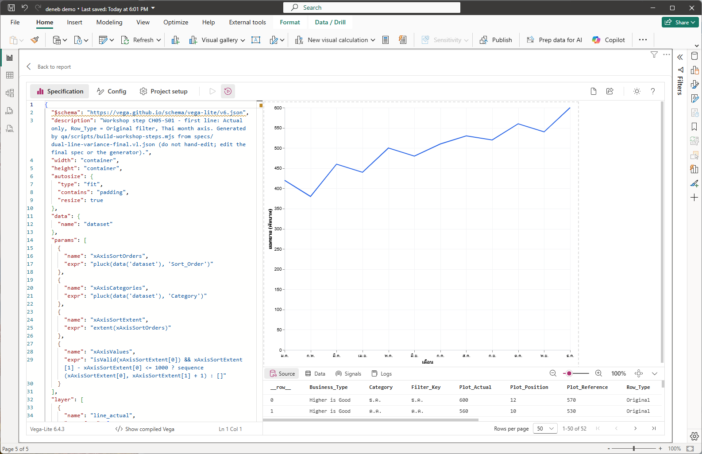
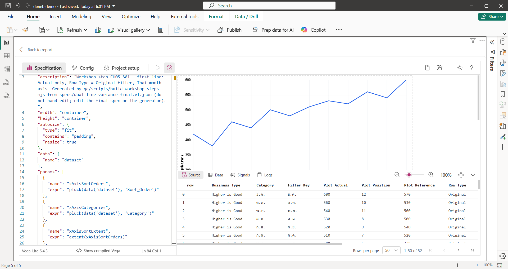
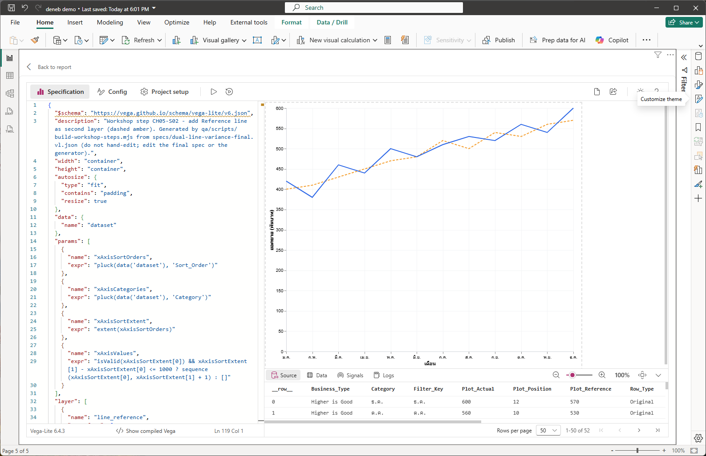
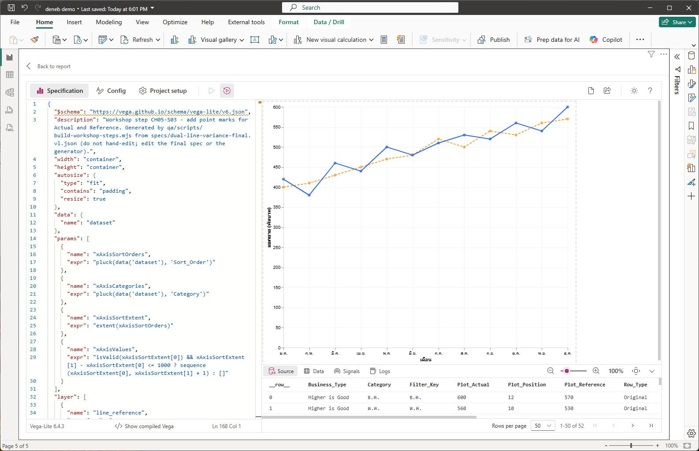
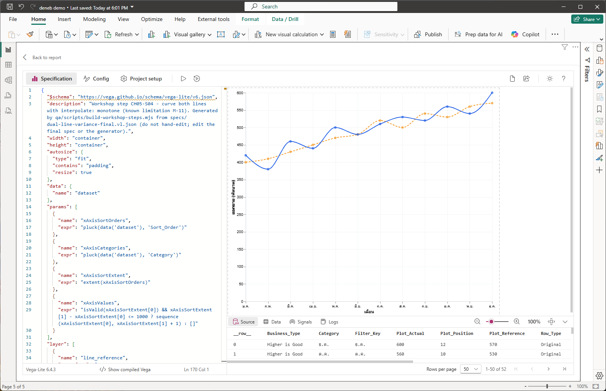
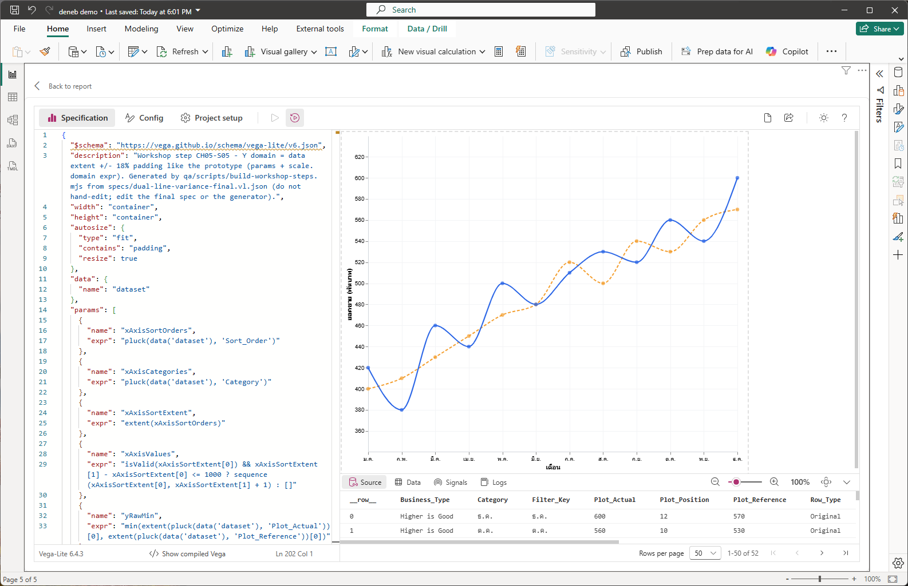
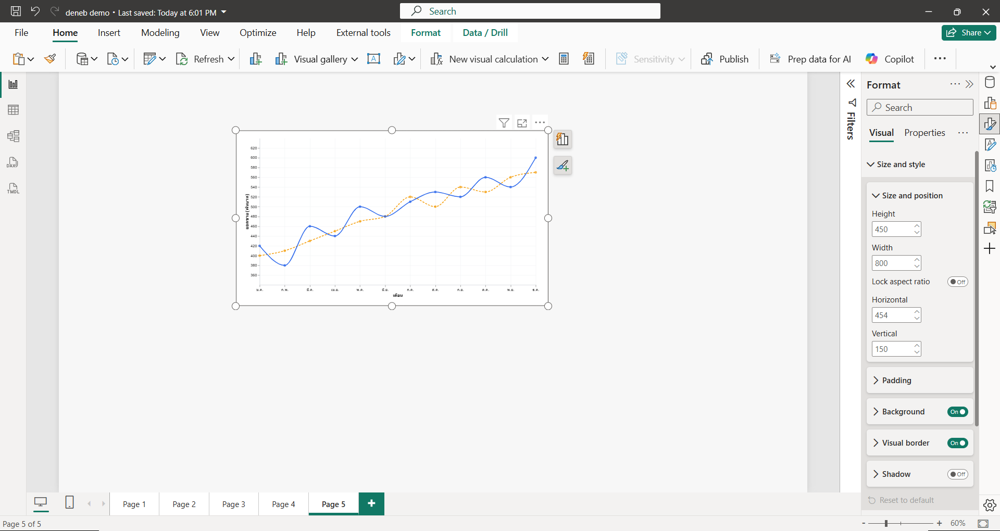

# บทที่ 5 กราฟสองเส้นแรก (Actual vs Reference)

## สิ่งที่จะได้จากบทนี้

บทนี้เขียน spec จริงของ Dual-Line Variance Chart ส่วนแรก คือเส้น Actual, เส้น Reference, จุดข้อมูล, เส้นโค้ง และแกน Y อัตโนมัติ เมื่อจบคุณจะเห็นกราฟสองเส้นในหน้า Deneb Editor ที่ใช้ข้อมูล `DualLine_PlotData` จากบทที่ 4 และเตรียมพร้อมสำหรับพื้นที่ Good/Bad ในบทที่ 6

- วาง spec ใน Deneb Editor และให้กราฟปรับขนาดตาม Visual ได้
- อธิบายได้ว่าทำไมแกน X เป็นตัวเลข (`Plot_Position`) แต่แสดงเป็นชื่อเดือนไทยอ่านจาก `Category`
- ซ้อนสองเส้นด้วย `layer` และเข้าใจว่าชั้นไหนอยู่บนสุด
- เพิ่มจุดข้อมูล ทำเส้นโค้ง และรู้ข้อจำกัดของเส้นโค้งที่จะเห็นชัดในบทที่ 6
- คำนวณช่วงแกน Y อัตโนมัติ ±18% ของข้อมูลด้วย `params` และ `scale.domain`

**สิ่งที่ต้องมีก่อนเริ่ม** ผ่านบทที่ 4 แล้ว คือมี Visual Deneb ที่ผูก field ครบ 13 ตัวจาก `DualLine_PlotData` ตามภาพ 4-8 และไฟล์ทั้ง 5 ใน `specs/steps/` (`CH05-S01-line-actual.vl.json` ถึง `CH05-S05-y-domain.vl.json`)

> **เรื่องภาพและไฟล์ Step ในบทนี้** ภาพ 5-1 ถึง 5-7 เป็นภาพหน้าจอจริงจาก Deneb Editor บน Power BI Desktop 2.157.1354.0 และ Deneb 2.0.0.0 ที่ผู้ใช้จับ 25 ก.ย. 2026 ปิดชื่อบัญชีแล้ว ผูกข้อมูล 12 เดือนของ Workshop (`DualLine_PlotData` 52 แถว) ไฟล์ Step แต่ละไฟล์เป็น spec **เต็ม** ที่วางแทนข้อความเดิมได้ทั้งไฟล์ ไม่ต้องแก้ทีละบรรทัด และแต่ละไฟล์ต่อยอดจากไฟล์ก่อนหน้า บทนี้แสดงเฉพาะส่วนที่เพิ่มหรือเปลี่ยนในแต่ละ Step (ตัดจากไฟล์จริง ตรวจด้วยสคริปต์ `qa/scripts/run-ch05-claims-check.mjs`)
>
> **เส้นหยักสีเหลืองใต้ `$schema`** ไฟล์ Step ทุกไฟล์มีบรรทัด `"$schema": ...` บรรทัดที่ 2 เมื่อวางใน Editor จะเห็นเส้นหยักสีเหลืองใต้บรรทัดนี้ (เห็นในภาพ 5-1) ตามเอกสาร Deneb ไม่ควรใส่ `$schema` ใน Deneb (บทที่ 3 หัวข้อ 3.1) แต่กราฟยังวาดปกติ **ให้ข้ามเส้นเตือนนี้ ไม่ต้องลบบรรทัดนั้น** ผู้เขียนไม่ได้ตรวจข้อความเตือนตอนวางเมาส์บนเส้น

---

## 5.1 ก่อนเริ่ม: วิธีวางแต่ละ Step

ทุก Step ใช้วิธีเดียวกัน

1. ที่หัว Visual คลิก `…` > **Edit** เพื่อเปิด Editor ถ้าเพิ่งวาง Visual ใหม่จะขึ้นหน้าต่าง Create ให้เลือก **Vega-Lite** และ template `[empty]` แล้วกด **Create** (บทที่ 2 Step 4)
2. เปิดไฟล์ Step ด้วยโปรแกรมแก้ข้อความ คัดลอกทั้งไฟล์
3. คลิกในช่อง spec ของแท็บ **Specification** กด Ctrl+A เพื่อเลือกทั้งหมด แล้ววางทับ
4. กด **Apply** (Ctrl+Enter) หรือเปิด Auto-apply (Ctrl+Shift+Enter) ตามบทที่ 2 Step 5
5. ถ้า Preview ถูก Debug pane บังส่วนล่าง (แกน X หายไป) ให้ย่อ Debug pane ด้วยลูกศร ⌄ ที่ปลายแถบ Source/Data/Signals/Logs หรือลากเส้นแบ่งลง (ผู้เขียนไม่ได้ตรวจว่าวิธีไหนใช้ได้ในเครื่องคุณ)

เมื่อจบ Step หนึ่ง ให้วางไฟล์ของ Step ถัดไปทับทั้งหมด

**หมายเหตุเรื่องแบบฝึกหัด** แบบฝึกหัดท้ายแต่ละ Step เป็นการแก้ property ง่ายๆ ที่ผู้เขียนยังไม่ได้บันทึกผลจาก Deneb จริง ผลที่คาดมาจากตัว spec โดยตรง

---

## Step 1 เส้น Actual และแกนที่อ่านชื่อเดือนจาก Category

### 1) เป้าหมาย

วาดเส้น Actual เส้นเดียวจากแถว `Original` ของ `DualLine_PlotData` พร้อมแกน X แสดงชื่อเดือนไทยและแกน Y แสดง "ยอดขาย (พันบาท)"

### 2) สิ่งที่ควรเห็นก่อนเริ่ม

Visual Deneb ที่ผูก field ครบตามบทที่ 4 ยังแสดงหน้าจอเปล่า หรือเป็น spec `[empty]` ที่เพิ่งสร้าง

### 3) Fields/Measures ที่ใช้

`Plot_Position`, `Plot_Actual`, `Row_Type` (กรองแถว), `Category` และ `Sort_Order` (ใช้สร้างป้ายชื่อแกน X)

### 4) ขั้นตอนใน Power BI

1. วางไฟล์ `specs/steps/CH05-S01-line-actual.vl.json` ตามหัวข้อ 5.1
2. ตรวจตามภาพ 5-1 ต้องเห็นเส้นสีน้ำเงินเส้นเดียว 12 จุด ชื่อเดือนไทยบนแกน X ชื่อแกน "เดือน" และชื่อแกน Y "ยอดขาย (พันบาท)"
3. ตรวจจำนวนข้อมูลใน Debug pane แท็บ **Source** ต้องขึ้น `1-50 of 52` ตามภาพ 5-2 (dataset ยังมี 52 แถวรวมแถว Boundary/Crossing แต่เส้นนี้ใช้เฉพาะ 12 แถว `Original`)



*ภาพ 5-1 Step 1: spec `CH05-S01-line-actual` วางแล้ว Preview วาดเส้น Actual สีน้ำเงิน 12 จุด แกน X เป็นชื่อเดือนไทย แกน Y 0 ถึง 600 บรรทัด 2 ของ spec (`$schema`) มีเส้นหยักสีเหลืองใต้ข้อความ*



*ภาพ 5-2 Step 1: Debug pane แท็บ Source ขึ้น `1-50 of 52` (Rows per page 50) ภาพนี้ Preview ถูก Debug pane บังส่วนล่าง เห็นกราฟไม่ครบแกน X ใช้ดูจำนวนแถวเท่านั้น*

### 5) JSON ที่เพิ่มหรือแก้เฉพาะ Step

Step แรก ไฟล์เต็มมี 3 ส่วนที่ต้องรู้ (ตัดจากไฟล์จริง)

ขนาดกราฟตามพื้นที่ Visual

<!-- excerpt: CH05-S01-line-actual top -->
```json
"width": "container",
"height": "container",
"autosize": {
  "type": "fit",
  "contains": "padding",
  "resize": true
}
```

พารามิเตอร์สำหรับแกน X

<!-- excerpt: CH05-S01-line-actual params -->
```json
"params": [
  {
    "name": "xAxisSortOrders",
    "expr": "pluck(data('dataset'), 'Sort_Order')"
  },
  {
    "name": "xAxisCategories",
    "expr": "pluck(data('dataset'), 'Category')"
  },
  {
    "name": "xAxisSortExtent",
    "expr": "extent(xAxisSortOrders)"
  },
  {
    "name": "xAxisValues",
    "expr": "isValid(xAxisSortExtent[0]) && xAxisSortExtent[1] - xAxisSortExtent[0] <= 1000 ? sequence(xAxisSortExtent[0], xAxisSortExtent[1] + 1) : []"
  }
]
```

ชั้นเส้น Actual

<!-- excerpt: CH05-S01-line-actual layer:line_actual -->
```json
"layer": [
  {
    "name": "line_actual",
    "transform": [
      {
        "filter": "datum.Row_Type == 'Original'"
      }
    ],
    "mark": {
      "type": "line",
      "color": "#2563EB",
      "strokeWidth": 2,
      "point": false,
      "tooltip": null
    },
    "encoding": {
      "x": {
        "field": "Plot_Position",
        "type": "quantitative",
        "title": "เดือน",
        "axis": {
          "values": {
            "expr": "xAxisValues"
          },
          "labelExpr": "indexof(xAxisSortOrders, datum.value) >= 0 ? xAxisCategories[indexof(xAxisSortOrders, datum.value)] : ''",
          "labelLimit": {
            "expr": "max(40, width / 3)"
          },
          "labelFlush": false,
          "labelSeparation": 4,
          "labelOverlap": "greedy",
          "labelAngle": 0
        }
      },
      "y": {
        "field": "Plot_Actual",
        "type": "quantitative",
        "title": "ยอดขาย (พันบาท)"
      }
    }
  }
]
```

### 6) คำอธิบายโค้ด

**ขนาด** `"width": "container"` และ `"height": "container"` ให้กราฟกว้างและสูงตามพื้นที่ที่ Visual ให้ `autosize` แบบ `fit` ทำให้แกนและป้ายอยู่ในพื้นที่นั้นทั้งหมด และ `resize: true` วาดใหม่เมื่อขนาดเปลี่ยน (บทที่ 9 ทดสอบหลายขนาด)

**ชั้น `line_actual`** ใช้ `transform.filter` เก็บเฉพาะแถว `Row_Type == 'Original'` (บทที่ 3 หัวข้อ 3.7) เพราะแถว `Boundary` และ `Crossing` ไม่ใช่ข้อมูลของเดือนใด ถ้าไม่กรอง เส้นจะวิ่งผ่านจุดของแถวเหล่านั้นด้วย แกน Y ผูกกับ `Plot_Actual`

**ทำไมแกน X เป็นตัวเลข** แกน X ผูกกับ `Plot_Position` ชนิด `quantitative` ไม่ใช่ `Category` แบบข้อความ เพราะแถว `Crossing` จากบทที่ 4 ต้องวางที่ตำแหน่งเศษส่วน (เช่น 1.4) ซึ่งข้อความบอกตำแหน่งไม่ได้ สิ่งที่แลกมาคือแกนแสดงตัวเลขตำแหน่ง ไม่ใช่ชื่อเดือน จึงต้องสร้างป้ายชื่อเดือนเอง

**สร้างป้ายชื่อเดือนจาก Category** `params` สี่ตัวเรียกข้อมูลด้วย `data('dataset')`

| param | ค่า |
| --- | --- |
| `xAxisSortOrders` | รายการ `Sort_Order` ทุกแถวของ `dataset` (ใช้ `pluck`) |
| `xAxisCategories` | รายการ `Category` ทุกแถว เรียงตรงกับรายการข้างบน |
| `xAxisSortExtent` | ค่าต่ำสุดและสูงสุดของ `Sort_Order` (`extent`) |
| `xAxisValues` | เลขจำนวนเต็มตั้งแต่ต่ำสุดถึงสูงสุด (`sequence`) หรือรายการว่างถ้าช่วงกว้างเกิน 1000 หรือไม่มีข้อมูล |

ต่างจาก `params` ในบทที่ 3 ที่ให้ค่าคงที่ด้วย `value` ตรงนี้ใช้ `expr` คำนวณค่าจากข้อมูลจริง แล้วแกน X ใช้ผลนี้สองที่ `axis.values` ให้ขีดแกนอยู่ที่เลขจำนวนเต็มตาม `xAxisValues` และ `axis.labelExpr` แปลงเลขตำแหน่งเป็นชื่อเดือน โดยหาตำแหน่งของเลขใน `xAxisSortOrders` แล้วดึง `Category` ตัวเดียวกันมาแสดง (ถ้าไม่พบ แสดงข้อความว่าง) ผลคือชื่อเดือนมาจากข้อมูล ไม่ใช่รายชื่อเดือนที่พิมพ์ตายตัวไว้ใน spec

ตัวเลือกอื่นของแกน X เกี่ยวกับป้ายไม่ให้ทับกัน `labelOverlap: "greedy"` ตัดป้ายที่ชนกัน `labelSeparation: 4` เว้นระยะ `labelLimit` จำกัดความกว้างป้ายตามความกว้างกราฟ และ `labelAngle: 0` ให้ป้ายตั้งตรง บทที่ 9 กลับมาทดสอบตอนย่อกราฟให้แคบ

### 7) ภาพระหว่างทำ

ภาพ 5-1 และ 5-2

### 8) ผลลัพธ์ที่ควรได้

เส้นสีน้ำเงินเส้นเดียวผ่านค่า 420, 380, 460, … , 600 ตามลำดับเดือน แกน X ครบ 12 เดือน

### 9) วิธีตรวจสอบผล

- เดือนแรกของเส้นเริ่มที่ประมาณ 420 (ม.ค.) ลงต่ำสุดที่ ก.พ. ประมาณ 380 และจบที่ ธ.ค. ประมาณ 600 ตรงกับ Actual ใน CSV
- Debug pane แท็บ Source ขึ้น `1-50 of 52`

### 10) ปัญหาที่อาจพบและวิธีแก้

| อาการ | สาเหตุที่เป็นไปได้ | วิธีแก้ |
| --- | --- | --- |
| Preview ว่าง ไม่มีเส้น | ยังไม่ผูก field ในช่อง Values หรือ dataset ว่าง | ตรวจช่อง Values ตามภาพ 4-8 และแท็บ Source ของ Debug pane |
| ไม่เห็นชื่อเดือน หรือแกน X ว่าง | ยังไม่ผูก `Category` หรือ `Sort_Order` | ผูกทั้งสอง field ให้ครบ (ชื่อต้องเป็น `Category` และ `Sort_Order` เปล่า ตามบทที่ 4 Step 4) |
| เห็นแกน X ไม่ครบเพราะถูกบัง | Debug pane ใหญ่ | ย่อ Debug pane ตามหัวข้อ 5.1 ข้อ 5 |
| เส้นหยักสีเหลืองใต้ `$schema` | Deneb ไม่ต้องการบรรทัดนี้ | ข้ามได้ กราฟไม่กระทบ |
| ข้อความ error ใน Logs หลังวาง | คัดลอกไฟล์ไม่ครบ หรือวางทับไม่หมด | Ctrl+A ในช่อง spec แล้ววางไฟล์ใหม่ทั้งไฟล์ |

### 11) แบบฝึกหัดสั้น

เปลี่ยน `"strokeWidth": 2` ของเส้น Actual เป็น 4 แล้ว Apply เส้นเปลี่ยนอย่างไร แล้วเปลี่ยนกลับ

### 12) จุดตรวจผ่านก่อนทำ Step ถัดไป

- [ ] เห็นเส้น Actual เส้นเดียวและชื่อเดือนไทยครบ 12 เดือน
- [ ] Debug pane ขึ้น 52 แถว

---

## Step 2 เพิ่มเส้น Reference

### 1) เป้าหมาย

เพิ่มเส้นเป้าหมาย (Reference) เป็นเส้นประสีส้ม ซ้อนอยู่ใต้เส้น Actual

### 2) สิ่งที่ควรเห็นก่อนเริ่ม

กราฟเส้น Actual เส้นเดียวจาก Step 1

### 3) Fields/Measures ที่ใช้

เพิ่ม `Plot_Reference` (เส้นใหม่) นอกนั้นเหมือน Step 1

### 4) ขั้นตอนใน Power BI

1. วางไฟล์ `specs/steps/CH05-S02-line-reference.vl.json` ทับทั้งหมด
2. ตรวจตามภาพ 5-3 ต้องเห็นเส้นประสีส้มเพิ่ม เส้นสองเส้นตัดกันหลายจุด (เช่น ระหว่าง ม.ค. กับ ก.พ.)



*ภาพ 5-3 Step 2: เส้น Actual (ทึบสีน้ำเงิน) และเส้น Reference (ประสีส้ม) แกน Y ยังเป็น 0 ถึง 600 มี tooltip "Customize theme" ค้างที่มุมขวาบนของ Editor จากเมาส์ ไม่เกี่ยวกับกราฟ*

### 5) JSON ที่เพิ่มหรือแก้เฉพาะ Step

ชั้นเส้น Reference ใหม่ (เพิ่มไว้ **ก่อน** ชั้น Actual ในอาร์เรย์ `layer`)

<!-- excerpt: CH05-S02-line-reference layer:line_reference -->
```json
"layer": [
  {
    "name": "line_reference",
    "transform": [
      {
        "filter": "datum.Row_Type == 'Original'"
      }
    ],
    "mark": {
      "type": "line",
      "color": "#F59E0B",
      "strokeWidth": 2,
      "strokeDash": [
        5,
        3
      ],
      "point": false,
      "tooltip": null
    },
    "encoding": {
      "x": {
        "field": "Plot_Position",
        "type": "quantitative"
      },
      "y": {
        "field": "Plot_Reference",
        "type": "quantitative"
      }
    }
  }
]
```

และการตั้งให้ทุกชั้นใช้สเกลร่วมกัน (เพิ่มที่ระดับบนสุดของ spec)

<!-- excerpt: CH05-S02-line-reference top -->
```json
"resolve": {
  "scale": {
    "y": "shared",
    "x": "shared"
  }
}
```

### 6) คำอธิบายโค้ด

- ชั้น `line_reference` เหมือน `line_actual` แต่ผูกแกน Y กับ `Plot_Reference` ใช้สีส้ม `#F59E0B` และเส้นประ `strokeDash: [5, 3]` (ขีด 5 ช่องว่าง 3) `point: false` ยังไม่มีจุด
- **ลำดับใน `layer` คือลำดับการวาด** ชั้นท้ายวาดทับชั้นก่อนหน้า (บทที่ 3 หัวข้อ 3.6) เส้น Reference อยู่ต้นอาร์เรย์ เส้น Actual อยู่ถัดมา จึงเห็นเส้นทึบสีน้ำเงินทับเส้นประเมื่อทับกัน ลำดับนี้ตรงกับ spec สุดท้ายของเล่ม ที่พื้นที่สีบทที่ 6 จะอยู่ล่างสุด
- `resolve.scale` ตั้ง `x` และ `y` เป็น `shared` ให้ทุกชั้นใช้สเกลเดียวกัน จึงเทียบค่าสองเส้นบนแกนเดียวกันได้ตรงๆ (ใน layered view Vega-Lite ใช้ shared scale เป็นค่าปริยายอยู่แล้ว การเขียนไว้ชัดเจนเป็นการประกาศเจตนาและกันความเปลี่ยนแปลงโดยไม่ตั้งใจ ไม่ได้เปิดความสามารถใหม่) (ถ้าแยกสเกล เส้นสองเส้นอาจดูเหมือนตัดกันโดยที่ค่าจริงไม่ได้ตัด)

### 7) ภาพระหว่างทำ

ภาพ 5-3

### 8) ผลลัพธ์ที่ควรได้

เส้นสองเส้นบนแกนเดียวกัน เส้น Reference เริ่มที่ 400 (ม.ค.) และจบที่ 570 (ธ.ค.)

### 9) วิธีตรวจสอบผล

ที่ ม.ค. เส้น Actual (420) อยู่สูงกว่าเส้น Reference (400) เล็กน้อย ที่ ก.พ. เส้น Actual (380) ต่ำกว่า Reference (410) แปลว่าเส้นตัดกันระหว่างสองเดือนนี้ ตรงกับตัวอย่างจุดตัดที่ตำแหน่ง 1.4 ในบทที่ 4

### 10) ปัญหาที่อาจพบและวิธีแก้

| อาการ | สาเหตุที่เป็นไปได้ | วิธีแก้ |
| --- | --- | --- |
| เห็นเส้นเดียว | วางไฟล์ Step 1 ค้าง หรือ Apply ยังไม่ทำงาน | วางไฟล์ Step 2 ทั้งไฟล์แล้ว Apply |
| เส้น Reference ไม่ใช่เส้นประ | สีหรือ `strokeDash` ถูกแก้ | วางไฟล์ใหม่ |
| เส้น Reference อยู่ทับเส้น Actual | ลำดับชั้นสลับกัน | ให้ `line_reference` อยู่ก่อน `line_actual` ในอาร์เรย์ `layer` |

### 11) แบบฝึกหัดสั้น

สลับลำดับสองชั้นในอาร์เรย์ `layer` (ย้ายชั้น `line_reference` ไปหลังชั้น `line_actual`) แล้วดูว่าเส้นไหนอยู่บน แล้วสลับกลับ

### 12) จุดตรวจผ่านก่อนทำ Step ถัดไป

- [ ] เห็นเส้นทึบสีน้ำเงินและเส้นประสีส้ม
- [ ] อธิบายได้ว่าทำไมชั้น Reference อยู่ต้นอาร์เรย์

---

## Step 3 เพิ่มจุดข้อมูล

### 1) เป้าหมาย

เพิ่มจุดบนเส้นทั้งสองที่ทุกเดือน

### 2) สิ่งที่ควรเห็นก่อนเริ่ม

กราฟสองเส้นจาก Step 2

### 3) Fields/Measures ที่ใช้

`Plot_Position`, `Plot_Actual`, `Plot_Reference`, `Row_Type` (กรอง)

### 4) ขั้นตอนใน Power BI

1. วางไฟล์ `specs/steps/CH05-S03-points.vl.json` ทับทั้งหมด
2. ตรวจตามภาพ 5-4 ต้องเห็นจุดทึบบนเส้นทั้งสอง เดือนละสองจุด (น้ำเงินบนเส้น Actual ส้มบนเส้น Reference)



*ภาพ 5-4 Step 3: เพิ่มจุดทึบบนเส้น Actual (น้ำเงิน) และ Reference (ส้ม) ทุกเดือน*

### 5) JSON ที่เพิ่มหรือแก้เฉพาะ Step

สองชั้นจุดใหม่ (เพิ่มต่อท้ายอาร์เรย์ `layer` ต่อจากชั้นเส้น)

<!-- excerpt: CH05-S03-points layer:point_reference,point_actual_hit_target -->
```json
"layer": [
  {
    "name": "point_reference",
    "transform": [
      {
        "filter": "datum.Row_Type == 'Original'"
      }
    ],
    "mark": {
      "type": "point",
      "filled": true,
      "size": 40,
      "color": "#F59E0B",
      "tooltip": null
    },
    "encoding": {
      "x": {
        "field": "Plot_Position",
        "type": "quantitative"
      },
      "y": {
        "field": "Plot_Reference",
        "type": "quantitative"
      }
    }
  },
  {
    "name": "point_actual_hit_target",
    "transform": [
      {
        "filter": "datum.Row_Type == 'Original'"
      }
    ],
    "mark": {
      "type": "point",
      "filled": true,
      "size": 40,
      "color": "#2563EB"
    },
    "encoding": {
      "x": {
        "field": "Plot_Position",
        "type": "quantitative"
      },
      "y": {
        "field": "Plot_Actual",
        "type": "quantitative"
      }
    }
  }
]
```

### 6) คำอธิบายโค้ด

- ใช้ `mark.type` เป็น `point` พร้อม `filled: true` (จุดทึบ) และ `size: 40` สีตรงกับเส้นของแต่ละชุด
- ทั้งสองชั้นกรอง `Row_Type == 'Original'` เหมือนเส้น เพื่อให้มีจุดเฉพาะเดือนจริง ไม่มีจุดที่ตำแหน่งจุดตัด
- ชื่อชั้น `point_actual_hit_target` บอกว่าชั้นนี้ถูกออกแบบให้เป็นเป้าที่ผู้ใช้ชี้หรือคลิก ตามการออกแบบของเล่มนี้ (บทที่ 7 ใช้ทำ tooltip และบทที่ 8 ใช้เป็นจุดคลิกที่ส่ง Cross-filter) ชั้น `point_reference` ตั้ง `tooltip: null` ไม่แสดง tooltip ตอนนี้ยังไม่เห็นความต่างในภาพ

### 7) ภาพระหว่างทำ

ภาพ 5-4

### 8) ผลลัพธ์ที่ควรได้

สองเส้นพร้อมจุด 12 จุดต่อเส้น

### 9) วิธีตรวจสอบผล

นับจุดสีน้ำเงินได้ 12 จุด และจุดสีส้ม 12 จุด (ภาพ 5-4)

### 10) ปัญหาที่อาจพบและวิธีแก้

| อาการ | สาเหตุที่เป็นไปได้ | วิธีแก้ |
| --- | --- | --- |
| ไม่มีจุด | วางไฟล์ Step 2 ค้าง | วางไฟล์ Step 3 ทั้งไฟล์ |
| จุดมากกว่า 12 จุดต่อเส้น | ลบ `filter` ทำให้แถว Boundary/Crossing มีจุดด้วย | ตรวจว่าทุกชั้นมี `filter` ของ `Row_Type` |

### 11) แบบฝึกหัดสั้น

เปลี่ยน `"size": 40` ของจุด Actual เป็น 100 แล้ว Apply จุดเปลี่ยนอย่างไร แล้วเปลี่ยนกลับ

### 12) จุดตรวจผ่านก่อนทำ Step ถัดไป

- [ ] เห็นจุดทั้งสองสีบนเส้นครบ 12 เดือน

---

## Step 4 ทำเส้นเป็นเส้นโค้ง

### 1) เป้าหมาย

เปลี่ยนเส้น Actual และ Reference จากเส้นตรงต่อจุดเป็นเส้นโค้ง (`monotone`)

### 2) สิ่งที่ควรเห็นก่อนเริ่ม

กราฟสองเส้นพร้อมจุดจาก Step 3 เส้นเป็นเส้นตรงเป็นช่วงๆ

### 3) Fields/Measures ที่ใช้

ไม่มี field เพิ่ม

### 4) ขั้นตอนใน Power BI

1. วางไฟล์ `specs/steps/CH05-S04-monotone.vl.json` ทับทั้งหมด
2. ตรวจตามภาพ 5-5 เส้นทั้งสองโค้งมน ส่วนจุดยังอยู่ที่ตำแหน่งเดิม



*ภาพ 5-5 Step 4: เส้น Actual และ Reference เป็นเส้นโค้ง (`interpolate: "monotone"`) จุดข้อมูลอยู่ตำแหน่งเดิม*

### 5) JSON ที่เพิ่มหรือแก้เฉพาะ Step

เพิ่ม `interpolate` ในสองชั้นเส้น (ที่เหลือของชั้นเหมือน Step 3)

<!-- excerpt: CH05-S04-monotone marks:line_actual,line_reference -->
```json
"line_actual": {
  "mark": {
    "type": "line",
    "interpolate": "monotone",
    "color": "#2563EB",
    "strokeWidth": 2,
    "point": false,
    "tooltip": null
  }
},
"line_reference": {
  "mark": {
    "type": "line",
    "interpolate": "monotone",
    "color": "#F59E0B",
    "strokeWidth": 2,
    "strokeDash": [
      5,
      3
    ],
    "point": false,
    "tooltip": null
  }
}
```

### 6) คำอธิบายโค้ด

`"interpolate": "monotone"` ให้ Vega-Lite ลากเส้นโค้งผ่านจุดข้อมูลทุกจุดโดยรักษาทิศทางขึ้นหรือลงภายในแต่ละช่วง จึงไม่สร้างยอดหรือแอ่งใหม่ที่เกินค่าปลายช่วง (บทที่ 3 หัวข้อ 3.3) เพิ่มบรรทัดเดียวในแต่ละชั้น

> **ข้อจำกัดที่รู้ล่วงหน้า (Known limitation)** เส้นโค้งกับพื้นที่สี Good/Bad ที่บทที่ 6 จะเพิ่ม **ไม่เข้ากัน 100%** เส้นโค้งเป็นเส้นโค้ง แต่ขอบของพื้นที่สีเป็นเส้นตรงระหว่างจุด บางช่วงจึงเห็นเส้นโค้งล้ำออกนอกพื้นที่สีเล็กน้อย จุดข้อมูลทุกจุดยังอยู่ตรงตำแหน่งจริง ดังนั้นตำแหน่งที่เส้นโค้งดูเหมือนตัดกันอาจไม่ตรงกับจุดเปลี่ยนสีของพื้นที่ ซึ่งคำนวณจากเส้นตรงระหว่างจุดอย่างแม่นยำ ข้อนี้ผู้ใช้ตัดสินให้คงไว้ (ข้อจำกัดข้อ 1 ในบทที่ 1) Step นี้ยังไม่มีพื้นที่สี จึงยังไม่เห็นความไม่ตรงกันนี้ จะเห็นตั้งแต่บทที่ 6

### 7) ภาพระหว่างทำ

ภาพ 5-5

### 8) ผลลัพธ์ที่ควรได้

เส้นสองเส้นเป็นเส้นโค้งผ่านจุดทุกจุด

### 9) วิธีตรวจสอบผล

เทียบภาพ 5-5 กับภาพ 5-4 จุดอยู่ที่เดิม (เช่น จุดต่ำสุดของเส้น Actual ที่ ก.พ.) แต่เส้นระหว่างจุดเปลี่ยนจากเส้นตรงเป็นเส้นโค้ง

### 10) ปัญหาที่อาจพบและวิธีแก้

| อาการ | สาเหตุที่เป็นไปได้ | วิธีแก้ |
| --- | --- | --- |
| เส้นยังเป็นเส้นตรง | วางไฟล์ Step 3 ค้าง | วางไฟล์ Step 4 ทั้งไฟล์ |
| เส้นโค้งเพียงเส้นเดียว | แก้เพียงชั้นเดียว | ตรวจว่าทั้ง `line_actual` และ `line_reference` มี `interpolate` |

### 11) แบบฝึกหัดสั้น

ลองเปลี่ยน `"monotone"` เป็น `"linear"` ในชั้นเดียว แล้วดูว่าเส้นชั้นนั้นเปลี่ยนอย่างไร แล้วเปลี่ยนกลับ (ค่า `linear` ตามเอกสาร Vega-Lite ผู้เขียนยังไม่ได้ลองใน Deneb)

### 12) จุดตรวจผ่านก่อนทำ Step ถัดไป

- [ ] เส้นทั้งสองเป็นเส้นโค้ง
- [ ] อธิบายข้อจำกัดเรื่องเส้นโค้งกับพื้นที่สีได้

---

## Step 5 แกน Y อัตโนมัติ ±18%

### 1) เป้าหมาย

ให้แกน Y ครอบคลุมช่วงของข้อมูลบวกลบ 18% ของช่วงนั้น แทนการเริ่มที่ 0 เพื่อให้เห็นความต่างระหว่างสองเส้นชัดขึ้น

### 2) สิ่งที่ควรเห็นก่อนเริ่ม

กราฟเส้นโค้งพร้อมจุดจาก Step 4 แกน Y เริ่มที่ 0 ทำให้เส้นทั้งสองอยู่ในครึ่งบนของกราฟ

### 3) Fields/Measures ที่ใช้

`Plot_Actual` และ `Plot_Reference` (หาค่าต่ำสุดและสูงสุด)

### 4) ขั้นตอนใน Power BI

1. วางไฟล์ `specs/steps/CH05-S05-y-domain.vl.json` ทับทั้งหมด
2. ตรวจตามภาพ 5-6 แกน Y ไม่เริ่มที่ 0 แล้ว ตัวเลขแกนเป็น 360 ถึง 620 และเส้นกินพื้นที่กราฟเต็มกว่าเดิม



*ภาพ 5-6 Step 5: แกน Y ปรับตามข้อมูล (เลขบนแกน 360 ถึง 620) เส้นสองเส้นกินพื้นที่กราฟเต็มกว่าภาพ 5-5*

3. กด **Back to report** แล้วตั้งขนาด Visual เป็น 800 × 450 เพื่อดูกราฟในหน้ารายงาน: เลือก Visual แล้วเปิดแผง Format แท็บ **Visual** หมวด **Size and style** ส่วน **Size and position** ใส่ Height = 450 และ Width = 800 (ภาพ 5-7) ตัวเลข 800 × 450 ใช้เป็นขนาดมาตรฐานในภาพประกอบของเล่มนี้ ไม่ใช่ข้อบังคับ



*ภาพ 5-7 Step 5: กราฟในหน้ารายงานหลัง Back to report แผง Format ทางขวาแสดง Height 450 และ Width 800 ในหมวด Size and position (ภาพนี้ถ่ายที่ซูมหน้ารายงาน 60% กราฟจึงดูเล็ก)*

### 5) JSON ที่เพิ่มหรือแก้เฉพาะ Step

`params` ห้าตัวที่เพิ่ม (ต่อท้าย `params` ของ Step 1)

<!-- excerpt: CH05-S05-y-domain params:yRawMin,yRawMax,yPad,yDomainMin,yDomainMax -->
```json
"params": [
  {
    "name": "yRawMin",
    "expr": "min(extent(pluck(data('dataset'), 'Plot_Actual'))[0], extent(pluck(data('dataset'), 'Plot_Reference'))[0])"
  },
  {
    "name": "yRawMax",
    "expr": "max(extent(pluck(data('dataset'), 'Plot_Actual'))[1], extent(pluck(data('dataset'), 'Plot_Reference'))[1])"
  },
  {
    "name": "yPad",
    "expr": "(yRawMax - yRawMin) * 0.18 || abs(yRawMax) * 0.1 || 1"
  },
  {
    "name": "yDomainMin",
    "expr": "isFinite(yRawMin) ? yRawMin - yPad : 0"
  },
  {
    "name": "yDomainMax",
    "expr": "isFinite(yRawMax) ? max(yRawMax + yPad, yDomainMin + 1) : 1"
  }
]
```

และสเกลแกน Y ของชั้น `line_actual`

<!-- excerpt: CH05-S05-y-domain layer:line_actual encoding.y -->
```json
"y": {
  "field": "Plot_Actual",
  "type": "quantitative",
  "title": "ยอดขาย (พันบาท)",
  "scale": {
    "domain": [
      {
        "expr": "yDomainMin"
      },
      {
        "expr": "yDomainMax"
      }
    ],
    "zero": false,
    "nice": false
  }
}
```

### 6) คำอธิบายโค้ด

- `yRawMin` และ `yRawMax` คือค่าต่ำสุดและสูงสุดรวมของ `Plot_Actual` กับ `Plot_Reference`
- `yPad` คือ 18% ของช่วง `(yRawMax − yRawMin) × 0.18` ถ้าช่วงเป็นศูนย์ (ทุกค่าเท่ากัน) ใช้ 10% ของค่าสัมบูรณ์สูงสุดแทน และถ้ายังเป็นศูนย์ใช้ 1 (นิพจน์ `a || b || c` เลือกค่าแรกที่ไม่เป็นศูนย์)
- `yDomainMin = yRawMin − yPad` และ `yDomainMax = yRawMax + yPad` โดยมีค่าสำรองเมื่อไม่มีข้อมูล (ช่วง 0 ถึง 1) และรับประกันให้สูงกว่าค่าต่ำสุดอย่างน้อย 1
- `scale.domain` ใช้ผลนี้ผ่าน `{ "expr": ... }` ในสองตำแหน่งของอาร์เรย์ (ต่างจากบทที่ 3 ที่ใส่ตัวเลขตรงๆ) พร้อม `zero: false` ไม่บังคับให้เริ่มที่ศูนย์ และ `nice: false` ไม่ปัดช่วงให้ลงตัว
- สเกลกำหนดที่ชั้น `line_actual` ชั้นเดียว ชั้นอื่นไม่ต้องกำหนด เพราะ `resolve.scale.y` เป็น `shared` (Step 2)

**คำนวณกับข้อมูล Workshop** ค่าต่ำสุดรวม 380 (Actual เดือน ก.พ.) ค่าสูงสุดรวม 600 (Actual เดือน ธ.ค.) ช่วง 220 → `yPad = 220 × 0.18 = 39.6` → ช่วงแกน Y = 340.4 ถึง 639.6 ตัวเลขที่เห็นบนแกนในภาพ 5-6 (360 ถึง 620) อยู่ภายในช่วงนี้

สูตรนี้ทำตามการคำนวณแกน Y ของ Custom Visual ต้นแบบ (ดูบทที่ 1) ต่างกันตรงที่ต้นแบบมีตัวเลือกให้ผู้ใช้ตั้งค่าต่ำสุดและสูงสุดเองใน Format pane เล่มนี้ไม่ทำส่วนนั้น

### 7) ภาพระหว่างทำ

ภาพ 5-6 และ 5-7

### 8) ผลลัพธ์ที่ควรได้

แกน Y ไม่เริ่มที่ 0 และมีช่วงประมาณ 340 ถึง 640

### 9) วิธีตรวจสอบผล

เทียบภาพ 5-6 กับ 5-5 เส้นเดิม จุดเดิม แต่แกน Y ต่างกัน จุดต่ำสุด (ก.พ. 380) อยู่ใกล้ขอบล่างของกราฟ และจุดสูงสุด (ธ.ค. 600) อยู่ใกล้ขอบบน

### 10) ปัญหาที่อาจพบและวิธีแก้

| อาการ | สาเหตุที่เป็นไปได้ | วิธีแก้ |
| --- | --- | --- |
| แกน Y ยังเริ่มที่ 0 | วางไฟล์ Step 4 ค้าง | วางไฟล์ Step 5 ทั้งไฟล์ |
| Logs มีข้อความเรื่อง expression | วางไฟล์ไม่ครบ ขาด `params` ห้าตัว | วางไฟล์ใหม่ทั้งไฟล์ |
| กราฟเหลือเส้นตรงแนวนอนเส้นเดียว | ข้อมูลทุกแถวมีค่าเท่ากัน | ตรวจข้อมูลใน Debug pane (นี่คือกรณีขอบ บทที่ 9) |

### 11) แบบฝึกหัดสั้น

เปลี่ยน `0.18` ใน `yPad` เป็น `0.05` แล้ว Apply ช่วงแกน Y แคบลงหรือกว้างขึ้น คำนวณช่วงใหม่ด้วยมือ แล้วเปลี่ยนกลับ

### 12) จุดตรวจผ่านก่อนไปบทที่ 6

- [ ] เห็นเส้นโค้งสองเส้นพร้อมจุดและแกน Y ±18%
- [ ] อธิบายได้ว่า `params` แบบ `expr` ต่างจากแบบ `value` อย่างไร

---

## สรุปบทที่ 5

- spec เริ่มจากกราฟเส้น Actual เส้นเดียว แล้วต่อยอดเป็น 5 Step (เส้น Reference, จุด, เส้นโค้ง, แกน Y) แต่ละ Step มีไฟล์เต็มใน `specs/steps/`
- แกน X ใช้ `Plot_Position` ตัวเลข เพราะแถว `Crossing` ต้องอยู่ที่ตำแหน่งเศษส่วน และแสดงชื่อเดือนจาก `Category` ด้วย `params` แบบ `expr` กับ `labelExpr`
- ลำดับในอาร์เรย์ `layer` คือลำดับการวาด ชั้นท้ายอยู่บนสุด
- `interpolate: "monotone"` ทำเส้นโค้ง แต่จะไม่เข้ากับขอบพื้นที่สีเส้นตรงในบทที่ 6 (ข้อจำกัดที่ยอมรับ)
- แกน Y ±18% คำนวณด้วย `params` และ `scale.domain` แบบ `expr`

## คำถามทบทวน

1. ทำไมแกน X ใช้ `Plot_Position` ชนิด `quantitative` แทน `Category`
2. `transform.filter` ที่ `Row_Type == 'Original'` ทำหน้าที่อะไรในชั้นเส้น
3. ถ้าสลับลำดับชั้น `line_reference` กับ `line_actual` ในอาร์เรย์ `layer` จะเห็นอะไรต่าง
4. ข้อมูล Workshop ช่วง 380 ถึง 600 ให้ช่วงแกน Y เท่าไร
5. ข้อจำกัดของเส้นโค้งกับพื้นที่สีคืออะไร

<details>
<summary>แนวคำตอบ</summary>

1. เพราะแถว `Crossing` ต้องวางที่ตำแหน่งเศษส่วน (เช่น 1.4) ซึ่ง `Category` ที่เป็นข้อความบอกไม่ได้ ชื่อเดือนจึงสร้างเองจาก `Category` ผ่าน `labelExpr`
2. เก็บเฉพาะ 12 แถว `Original` ไม่ให้เส้นวิ่งผ่านจุดของแถว `Boundary` และ `Crossing`
3. เส้น Reference ไปอยู่ด้านบนเส้น Actual เพราะชั้นท้ายอาร์เรย์วาดทับ
4. ช่วงต่างกัน 220 → `yPad` = 39.6 → แกน Y = 340.4 ถึง 639.6
5. เส้นโค้งอาจล้ำออกนอกพื้นที่สีเล็กน้อย เพราะขอบพื้นที่สีเป็นเส้นตรงระหว่างจุด จุดข้อมูลยังอยู่ตรงตำแหน่งจริง

</details>

## จุดตรวจผ่านก่อนไปบทที่ 6

- [ ] มี spec ของ Step 5 อยู่ใน Editor และเห็นกราฟสองเส้นโค้งพร้อมจุด
- [ ] เข้าใจว่าชั้นเส้นทั้งสองกรองเฉพาะแถว `Original`
- [ ] รู้ข้อจำกัดเรื่องเส้นโค้งก่อนเห็นพื้นที่สีในบทที่ 6
