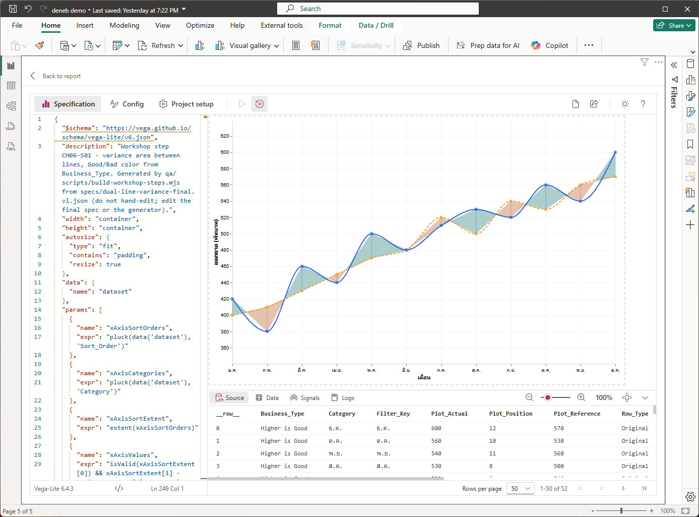
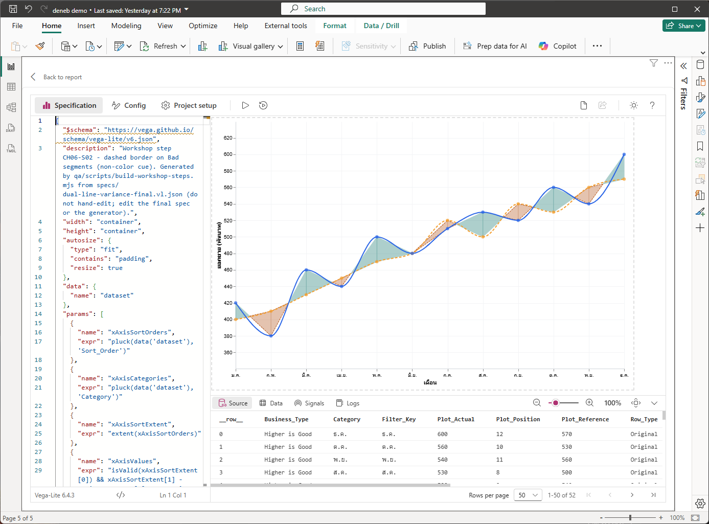
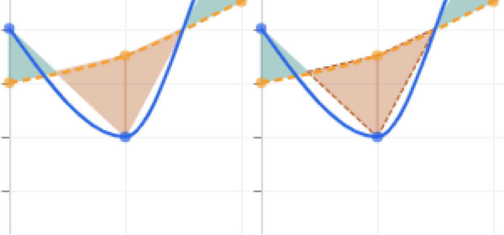
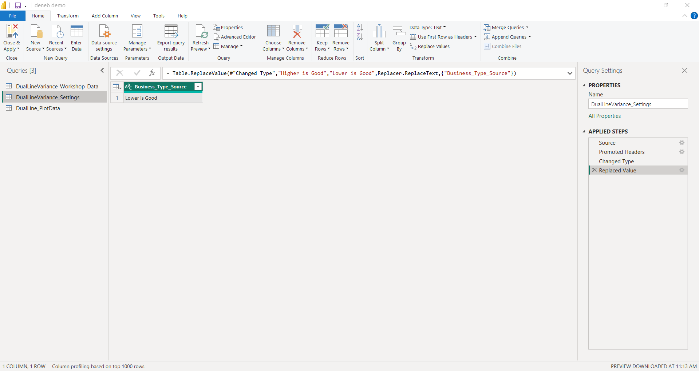
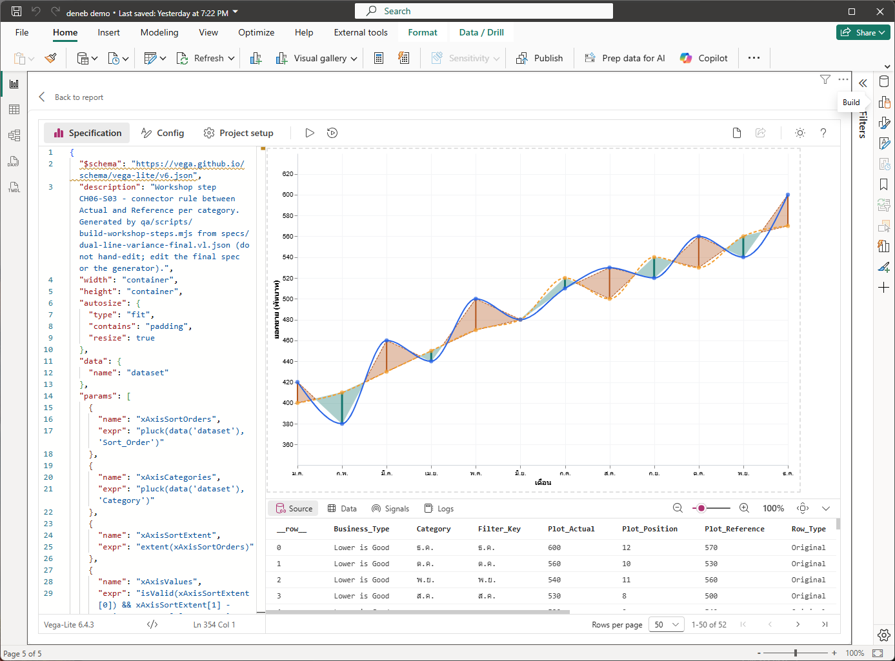

# บทที่ 6 พื้นที่ Variance และ Connector

## สิ่งที่จะได้จากบทนี้

บทนี้เพิ่มสิ่งที่ทำให้กราฟสองเส้นกลายเป็น Dual-Line **Variance** Chart คือพื้นที่สีระหว่างเส้น Actual กับ Reference ที่บอกว่าช่วงไหนดี (Good) ช่วงไหนไม่ดี (Bad) เส้นขอบประที่ช่วยให้แยก Bad ได้โดยไม่ต้องพึ่งสี และเส้นตั้ง (Connector) ที่เชื่อมสองจุดของแต่ละเดือน สีทั้งหมดอ่านทิศทาง "สูงกว่าดี" หรือ "ต่ำกว่าดี" จาก field `Business_Type` เมื่อจบคุณจะเห็นกราฟครบทั้งเส้น จุด พื้นที่ และ Connector และสลับทิศทางได้จากตาราง Settings โดยไม่แก้ spec

- ใช้ `area` mark กับ `y` และ `y2` วาดพื้นที่ระหว่างสองเส้น และแยกเป็นช่วงด้วย `detail`
- ตั้งสี Good/Bad ด้วย `condition` ที่อ่าน `Business_Type` และ `Run_Sign`
- เพิ่มเส้นขอบประให้ช่วง Bad เป็นเครื่องหมายที่ไม่ใช่สี
- เพิ่ม Connector ด้วย `rule` mark ที่ใช้สีและความหนาต่างกันตาม Good/Bad
- สลับ `Business_Type` เป็น `Lower is Good` ที่ Power Query แล้วเห็นสีสลับทั้งกราฟ

**สิ่งที่ต้องมีก่อนเริ่ม** ผ่านบทที่ 5 แล้ว คือมี Visual Deneb ที่ผูก field ครบ 13 ตัวจาก `DualLine_PlotData` (52 แถว) ค่า `Business_Type_Source` ในตาราง Settings เป็น `Higher is Good` และไฟล์ 3 ไฟล์ใน `specs/steps/` (`CH06-S01-variance-area.vl.json`, `CH06-S02-bad-area-border.vl.json`, `CH06-S03-connector-rule.vl.json`)

> **เรื่องภาพและไฟล์ Step ในบทนี้** ภาพ 6-1, 6-2, 6-4, 6-5 และ 6-6 เป็นภาพหน้าจอจริงจาก Power BI Desktop 2.157.1354.0 และ Deneb 2.0.0.0 ที่ผู้ใช้จับ 26 ก.ย. 2026 ปิดชื่อบัญชีแล้ว ผูกข้อมูล 12 เดือนของ Workshop (`DualLine_PlotData` 52 แถว) ส่วน**ภาพ 6-3 เป็นภาพที่ผู้เขียนตัดและขยายจากภาพ 6-1 และ 6-2** ไม่ใช่ภาพหน้าจอใหม่ ไฟล์ Step แต่ละไฟล์เป็น spec **เต็ม** ที่วางทับทั้งไฟล์ได้ และต่อยอดจาก spec ของบทที่ 5 Step 5 (ไฟล์ `CH06-S01` คือ `CH05-S05` บวกชั้นพื้นที่หนึ่งชั้นที่ต้นอาร์เรย์ `layer`) บทนี้แสดงเฉพาะส่วนที่เพิ่ม ตัดจากไฟล์จริง ตรวจด้วยสคริปต์ `qa/scripts/run-ch06-claims-check.mjs`

---

## 6.1 ก่อนเริ่ม: วิธีวางแต่ละ Step และวิธีอ่านสี

**วิธีวาง** ทำเหมือนหัวข้อ 5.1 ทุกข้อ คือเปิด Editor คัดลอกทั้งไฟล์ Step วางทับด้วย Ctrl+A แล้ว **Apply** (Ctrl+Enter) และย่อ Debug pane ถ้าบังแกน X

**Good กับ Bad คืออะไร** ขึ้นกับ `Business_Type` (ค่าเดียวซ้ำทุกแถว ที่ Power Query กำหนดในบทที่ 4)

| `Business_Type` | Good เมื่อ | Bad เมื่อ |
| --- | --- | --- |
| `Higher is Good` (ค่าตั้งต้นของ Workshop) | Actual สูงกว่า Reference | Actual ต่ำกว่าหรือเท่ากับ Reference |
| `Lower is Good` | Actual ต่ำกว่า Reference | Actual สูงกว่าหรือเท่ากับ Reference |

สีที่ใช้ตลอดบท: **Good = เขียวอมน้ำเงิน `#0F766E`** และ **Bad = ส้มน้ำตาล `#B45309`** ค่า Bad รวมกรณีเท่ากัน (ผลต่างเป็นศูนย์) ด้วย เพราะเงื่อนไขเขียนเป็น "ถ้าเป็น Good ให้สีเขียว นอกนั้นสีส้ม"

**ผลต่างของข้อมูล Workshop** คำนวณจาก `DualLineVariance_Workshop_Data.csv` (Actual − Reference)

| เดือน | ม.ค. | ก.พ. | มี.ค. | เม.ย. | พ.ค. | มิ.ย. | ก.ค. | ส.ค. | ก.ย. | ต.ค. | พ.ย. | ธ.ค. |
| --- | --- | --- | --- | --- | --- | --- | --- | --- | --- | --- | --- | --- |
| ผลต่าง | +20 | −30 | +30 | −10 | +30 | 0 | −10 | +30 | −20 | +30 | −20 | +30 |

เมื่อเป็น `Higher is Good` เดือน Good คือ ม.ค. มี.ค. พ.ค. ส.ค. ต.ค. ธ.ค. เดือน Bad คือ ก.พ. เม.ย. ก.ค. ก.ย. พ.ย. และ มิ.ย. เป็นเดือนที่ผลต่างเป็นศูนย์

---

## Step 1 พื้นที่ Variance สี Good/Bad

### 1) เป้าหมาย

วาดพื้นที่ระหว่างเส้น Actual กับเส้น Reference โดยแต่ละช่วงมีสี Good หรือ Bad และเปลี่ยนสีตรงจุดที่เส้นตัดกัน

### 2) สิ่งที่ควรเห็นก่อนเริ่ม

กราฟสองเส้นโค้งพร้อมจุดและแกน Y ±18% จากบทที่ 5 Step 5

### 3) Fields/Measures ที่ใช้

เพิ่ม `Segment_ID` (แยกช่วง), `Run_Sign` และ `Business_Type` (กำหนดสี) นอกนั้นใช้ `Plot_Position`, `Plot_Actual`, `Plot_Reference` และ `Row_Type` เหมือนเดิม ทั้งหมดผูกไว้แล้วตามบทที่ 4

### 4) ขั้นตอนใน Power BI

1. วางไฟล์ `specs/steps/CH06-S01-variance-area.vl.json` ทับทั้งหมดแล้ว Apply
2. ตรวจตามภาพ 6-1 ต้องเห็นพื้นที่สีระหว่างสองเส้นทุกช่วง สีเปลี่ยนตรงจุดที่เส้นตัดกัน (เช่น ระหว่าง ม.ค. กับ ก.พ.)
3. ตรวจแท็บ **Source** ของ Debug pane ยังขึ้น `1-50 of 52` และมีคอลัมน์ `Business_Type` เป็น `Higher is Good`



*ภาพ 6-1 Step 1: spec `CH06-S01` วางแล้ว พื้นที่สีเขียวอมน้ำเงิน (Good) และส้มน้ำตาล (Bad) อยู่ใต้เส้น Actual (ทึบน้ำเงิน) และ Reference (ประส้ม) สีเปลี่ยนกลางช่วงที่เส้นตัดกัน เช่น ม.ค.–ก.พ. เขียวก่อนแล้วส้ม ช่วง พ.ค.–มิ.ย. เป็นสีเขียวทั้งช่วง และ มิ.ย.–ก.ค. เป็นสีส้มทั้งช่วง Debug pane แท็บ Source ขึ้น `1-50 of 52` และคอลัมน์ `Business_Type` เป็น `Higher is Good` ขอบพื้นที่เป็นเส้นตรง ส่วนเส้นข้อมูลเป็นเส้นโค้ง จึงเห็นช่องว่างสีขาวระหว่างพื้นที่กับเส้นโค้งในบางช่วง (ข้อจำกัด M-11 ที่บทที่ 5 แจ้งไว้)*

### 5) JSON ที่เพิ่มหรือแก้เฉพาะ Step

ชั้นพื้นที่ใหม่ (เพิ่มไว้ที่ **ต้น** อาร์เรย์ `layer` ก่อน `line_reference`)

<!-- excerpt: CH06-S01-variance-area layer:variance_area -->
```json
"layer": [
  {
    "name": "variance_area",
    "transform": [
      {
        "filter": "datum.Row_Type == 'Boundary' || datum.Row_Type == 'Crossing'"
      }
    ],
    "mark": {
      "type": "area",
      "opacity": 0.35,
      "tooltip": null
    },
    "encoding": {
      "x": {
        "field": "Plot_Position",
        "type": "quantitative"
      },
      "y": {
        "field": "Plot_Actual",
        "type": "quantitative"
      },
      "y2": {
        "field": "Plot_Reference"
      },
      "detail": {
        "field": "Segment_ID",
        "type": "nominal"
      },
      "color": {
        "condition": {
          "test": "(datum.Business_Type == 'Higher is Good' && datum.Run_Sign > 0) || (datum.Business_Type == 'Lower is Good' && datum.Run_Sign < 0)",
          "value": "#0F766E"
        },
        "value": "#B45309"
      },
      "stroke": {
        "condition": {
          "test": "(datum.Business_Type == 'Higher is Good' && datum.Run_Sign > 0) || (datum.Business_Type == 'Lower is Good' && datum.Run_Sign < 0)",
          "value": "#0F766E"
        },
        "value": "#B45309"
      },
      "strokeWidth": {
        "value": 1
      }
    }
  }
]
```

### 6) คำอธิบายโค้ด

- **แถวที่ใช้** ชั้นนี้กรองเอา `Boundary` และ `Crossing` (แถว Fill จากบทที่ 4) ไม่ใช้แถว `Original` เพราะแถว Fill คือแถวที่มีจุดตัดและมี `Segment_ID` กับ `Run_Sign`
- **`area` กับ `y` และ `y2`** `area` mark วาดพื้นที่ระหว่างสองค่าตามแกน Y ที่ตำแหน่ง X เดียวกัน `y` คือ `Plot_Actual` (ขอบหนึ่ง) และ `y2` คือ `Plot_Reference` (อีกขอบ) จึงได้พื้นที่ระหว่างสองเส้นพอดี `y2` ไม่ต้องระบุ `type` เพราะใช้สเกลเดียวกับ `y`
- **`detail: Segment_ID`** เพิ่ม `Segment_ID` เป็น field สำหรับจัดกลุ่มโดยไม่เข้ารหัสเป็นสีหรือรูปร่าง ข้อมูลชุดนี้จึงได้พื้นที่แยกหนึ่งรูปต่อหนึ่งช่วง และกำหนดสีแยกตามช่วงได้ (ผู้เขียนไม่ได้ทดลองถอด `detail` ออกเพื่อดูผล)
- **สีจาก `condition`** ใช้ `test` (นิพจน์ Vega) แบบเดียวกับบทที่ 3 หัวข้อ 3.8 ถ้าจริงใช้สีเขียวอมน้ำเงิน ถ้าไม่จริงใช้ค่านอกวงเล็บคือสีส้มน้ำตาล เงื่อนไขอ่านสองค่าจากข้อมูล: `Business_Type` (ทิศทางที่ดี) และ `Run_Sign` (1 ถ้าช่วงนั้น Actual สูงกว่า −1 ถ้าต่ำกว่า จากบทที่ 4) `Higher is Good` จะเป็น Good เมื่อ `Run_Sign > 0` และ `Lower is Good` จะเป็น Good เมื่อ `Run_Sign < 0` ค่าสีเดียวกันใส่ที่ `color` (สีพื้นที่) และ `stroke` (สีขอบ)
- **`opacity: 0.35`** ให้พื้นที่โปร่ง เห็นเส้นและตารางใต้พื้นที่
- **`strokeWidth: 1`** เส้นขอบบางของพื้นที่ (เห็นเป็นเส้นตั้งบางที่ปลายแต่ละช่วงในภาพ 6-1 เช่นที่ ก.พ.)
- **ทำไมอยู่ต้นอาร์เรย์** ชั้นแรกถูกวาดก่อน อยู่ล่างสุด เส้นและจุดที่ตามมาจึงอยู่เหนือพื้นที่ (บทที่ 5 Step 2) `tooltip: null` ปิด tooltip ของชั้นนี้ไว้ก่อน บทที่ 7 จะจัดการ tooltip ทั้งหมด

### 7) ภาพระหว่างทำ

ภาพ 6-1

### 8) ผลลัพธ์ที่ควรได้

พื้นที่สีระหว่างสองเส้นตลอด ม.ค. ถึง ธ.ค. ตามตารางในหัวข้อ 6.1: 9 ช่วงที่เส้นตัดกันเปลี่ยนสีกลางช่วง ส่วนช่วง พ.ค.–มิ.ย. (Good) และ มิ.ย.–ก.ค. (Bad) เป็นสีเดียวทั้งช่วง เพราะ มิ.ย. ผลต่างเป็นศูนย์ (สองเส้นแตะกัน ไม่ได้ตัดกัน)

### 9) วิธีตรวจสอบผล

- ม.ค.–ก.พ. เริ่มเขียนแล้วเปลี่ยนเป็นส้มที่ราว 1.4 ตามจุดตัดที่คำนวณในบทที่ 4
- ก.ย.–ต.ค. เริ่มส้มแล้วเปลี่ยนเป็นเขียว
- ทุกที่ที่เส้น Actual อยู่บนเส้น Reference พื้นที่เป็นเขียว และทุกที่ที่อยู่ล่างเป็นส้ม (ตรงกับ `Higher is Good`)

### 10) ปัญหาที่อาจพบและวิธีแก้

| อาการ | สาเหตุที่เป็นไปได้ | วิธีแก้ |
| --- | --- | --- |
| ไม่เห็นพื้นที่สีเลย | แถว Boundary และ Crossing ไม่มาถึง Visual (Source เหลือ 12 แถว) | ตรวจว่ามี measure `DualLine Row Count` ในช่อง Values (บทที่ 4 Step 3) |
| พื้นที่เป็นสีส้มทั้งหมด | ไม่ได้ผูก `Run_Sign` หรือ `Business_Type` หรือชื่อไม่ตรง | ผูกให้ครบและตั้ง `Run_Sign` เป็น Don't summarize (บทที่ 4 Step 4) |
| เห็นช่องว่างสีขาวระหว่างเส้นโค้งกับพื้นที่ | ขอบพื้นที่เป็นเส้นตรง เส้นข้อมูลเป็นเส้นโค้ง | เป็นข้อจำกัด M-11 ที่ยอมรับ (ดูกล่องด้านล่าง) |
| เส้นหยักสีเหลืองใต้ `$schema` | Deneb ไม่ต้องการบรรทัดนี้ | ข้ามได้ ตามบทที่ 5 |

> **ข้อจำกัดที่รู้ล่วงหน้า (Known limitation) ที่เห็นจริงแล้ว** ในภาพ 6-1 เส้นโค้งล้ำออกนอกขอบพื้นที่หรือเว้นช่องว่างจากพื้นที่ เช่นรอบ ก.พ. และรอบ ม.ค.–ก.พ. เพราะขอบพื้นที่เป็นเส้นตรงระหว่างจุด ส่วนเส้นข้อมูลเป็น `monotone` จุดข้อมูลทุกจุดยังตรงตำแหน่งจริง และจุดเปลี่ยนสีคำนวณจากเส้นตรงจึงแม่นยำ ผู้ใช้ตัดสินให้คงไว้ตั้งแต่บทที่ 1 ถ้าต้องการให้เส้นและพื้นที่ตรงกันเป๊ะ (เป็นทางเลือก ไม่ใช่ค่าที่ Workshop แนะนำ) ให้ลบ `"interpolate": "monotone"` ออกจากสองชั้นเส้น (ผู้เขียนไม่ได้ลองใน Deneb จริง แต่ Step ของบทที่ 5 ก่อน Step 4 คือกราฟเส้นตรงที่ตรงกับขอบพื้นที่)

### 11) แบบฝึกหัดสั้น

เปลี่ยน `"opacity": 0.35` เป็น `0.7` แล้ว Apply พื้นที่ทึบขึ้นอย่างไร แล้วเปลี่ยนกลับ

### 12) จุดตรวจผ่านก่อนทำ Step ถัดไป

- [ ] เห็นพื้นที่สีเขียวอมน้ำเงินและส้มน้ำตาลระหว่างสองเส้น และสีเปลี่ยนที่จุดตัด
- [ ] Debug pane ยังขึ้น 52 แถว
- [ ] อธิบายได้ว่า `detail: Segment_ID` และ `condition` ทำอะไร

---

## Step 2 เส้นขอบประที่ช่วง Bad

### 1) เป้าหมาย

ทำให้ช่วง Bad แยกออกได้โดยไม่ต้องอาศัยสี ด้วยเส้นขอบประที่ขอบบนและขอบล่างของพื้นที่ Bad ผู้ที่แยกเขียวกับส้มไม่ออกยังมีเครื่องหมายอีกอย่าง

### 2) สิ่งที่ควรเห็นก่อนเริ่ม

พื้นที่ Good/Bad จาก Step 1

### 3) Fields/Measures ที่ใช้

เหมือน Step 1 (`Row_Type`, `Segment_ID`, `Run_Sign`, `Business_Type`, `Plot_Position`, `Plot_Actual`, `Plot_Reference`)

### 4) ขั้นตอนใน Power BI

1. วางไฟล์ `specs/steps/CH06-S02-bad-area-border.vl.json` ทับทั้งหมดแล้ว Apply
2. ดูภาพ 6-2 ภาพนี้**แทบไม่ต่างจากภาพ 6-1** เมื่อมองทั้งกราฟ
3. ดูภาพ 6-3 (ขยายรอบ ก.พ. เทียบก่อนและหลัง) จะเห็นเส้นประบางสีน้ำตาลตามขอบบนและล่างของพื้นที่ส้ม
4. ถ้าต้องการดูเอง ให้ขยายภาพหน้าจอ หรือใช้ปุ่มซูมของ Preview ที่ Debug pane



*ภาพ 6-2 Step 2: spec `CH06-S02` วางแล้ว ทั้งกราฟดูเหมือนภาพ 6-1 เส้นขอบประของช่วง Bad ที่เพิ่มเข้ามาบางและซ้อนอยู่ใต้เส้น Actual/Reference เกือบหมด ต้องขยายจึงเห็น*



*ภาพ 6-3 ภาพที่ผู้เขียนตัดและขยาย (nearest-neighbor) จากภาพ 6-1 (ซ้าย) และภาพ 6-2 (ขวา) บริเวณรอบ ก.พ. ไม่ใช่ภาพหน้าจอใหม่ ฝั่งขวาเห็นเส้นประบางสีน้ำตาลตามขอบตรงของพื้นที่ส้ม ทั้งขอบบน (ตามเส้น Reference) และขอบล่าง (ตามเส้น Actual แต่เป็นเส้นตรง ไม่ตามเส้นโค้ง) ส่วนพื้นที่เขียวไม่มีเส้นขอบประ*

### 5) JSON ที่เพิ่มหรือแก้เฉพาะ Step

สองชั้นใหม่ วางต่อจาก `variance_area` และก่อน `line_reference` ชั้นแรกวาดขอบตามค่า Actual (อีกชั้น `bad_area_border_reference` เหมือนกันทุกอย่าง ต่างที่ผูก `y` กับ `Plot_Reference`)

<!-- excerpt: CH06-S02-bad-area-border layer:bad_area_border_actual -->
```json
"layer": [
  {
    "name": "bad_area_border_actual",
    "transform": [
      {
        "filter": "(datum.Row_Type == 'Boundary' || datum.Row_Type == 'Crossing') && !((datum.Business_Type == 'Higher is Good' && datum.Run_Sign > 0) || (datum.Business_Type == 'Lower is Good' && datum.Run_Sign < 0))"
      }
    ],
    "mark": {
      "type": "line",
      "color": "#B45309",
      "strokeWidth": 1,
      "strokeDash": [
        3,
        2
      ],
      "point": false,
      "tooltip": null
    },
    "encoding": {
      "x": {
        "field": "Plot_Position",
        "type": "quantitative"
      },
      "y": {
        "field": "Plot_Actual",
        "type": "quantitative"
      },
      "detail": {
        "field": "Segment_ID",
        "type": "nominal"
      }
    }
  }
]
```

### 6) คำอธิบายโค้ด

- **filter** เก็บเฉพาะแถว Fill ที่**ไม่ใช่** Good (เครื่องหมาย `!` นำหน้าเงื่อนไข Good เดียวกับ Step 1) จึงเหลือเฉพาะช่วง Bad ถ้าเปลี่ยน `Business_Type` เป็น `Lower is Good` เงื่อนไขนี้กลับด้านตามไปด้วย
- **`line` mark กับ `detail`** วาดเส้นตามค่า Actual (ชั้นหนึ่ง) และค่า Reference (อีกชั้น) ของแต่ละช่วง Bad `detail: Segment_ID` ทำให้แต่ละช่วงเป็นเส้นแยก ไม่ต่อข้ามช่วง
- **`strokeDash: [3, 2]`** ขีด 3 ช่องว่าง 2 ประละเอียดกว่าเส้น Reference (`[5, 3]`) เพื่อไม่สับสนกัน
- **ทำไมมองยาก** เส้นขอบเดินตามขอบพื้นที่พอดี ซึ่งเป็นตำแหน่งเดียวกับเส้น Actual และ Reference ที่อยู่ชั้นบน เส้นบางประสีน้ำตาลจึงถูกบังเกือบหมด เห็นชัดเฉพาะที่ขอบตรงแยกจากเส้นโค้ง (ภาพ 6-3) ผู้เขียนตั้งใจไม่เพิ่มความหนา เพื่อให้ตรงกับ spec สุดท้ายของเล่ม ถ้าอยากให้เห็นชัดขึ้น ลองเพิ่ม `strokeWidth` (แบบฝึกหัด)

### 7) ภาพระหว่างทำ

ภาพ 6-2 และ 6-3

### 8) ผลลัพธ์ที่ควรได้

พื้นที่ส้มทุกช่วงมีเส้นประบางสีน้ำตาลที่ขอบบนและล่าง พื้นที่เขียวไม่มี

### 9) วิธีตรวจสอบผล

เทียบภาพ 6-1 กับ 6-2 ในบริเวณเดียวกัน (ภาพ 6-3) ต้องเห็นเส้นประเฉพาะรอบพื้นที่ส้ม ถ้าเห็นเส้นประรอบพื้นที่เขียวด้วย แปลว่าเงื่อนไข `filter` ผิด

### 10) ปัญหาที่อาจพบและวิธีแก้

| อาการ | สาเหตุที่เป็นไปได้ | วิธีแก้ |
| --- | --- | --- |
| ดูแล้วภาพไม่ต่างจาก Step 1 | เส้นขอบบางและถูกเส้นหลักบัง | ขยายภาพหรือซูม Preview ตามภาพ 6-3 นี่เป็นพฤติกรรมปกติของ spec นี้ |
| ไม่เห็นเส้นประเลยแม้ขยาย | วางไฟล์ Step 1 ค้าง | วางไฟล์ Step 2 ทั้งไฟล์แล้ว Apply |
| เส้นประต่อข้ามช่วง | ไม่มี `detail` | วางไฟล์ใหม่ |

### 11) แบบฝึกหัดสั้น

เปลี่ยน `"strokeWidth": 1` ของ `bad_area_border_actual` เป็น `3` แล้ว Apply เส้นขอบเด่นขึ้นหรือไม่ แล้วเปลี่ยนกลับ (ผู้เขียนยังไม่ได้ลองผลใน Deneb จริง)

### 12) จุดตรวจผ่านก่อนทำ Step ถัดไป

- [ ] เห็นเส้นประบางรอบพื้นที่ส้มเมื่อขยาย
- [ ] อธิบายได้ว่าทำไมเส้นขอบมองยากที่ขนาดปกติ

---

## Step 3 Connector เชื่อม Actual กับ Reference

### 1) เป้าหมาย

เพิ่มเส้นตั้งที่เชื่อมจุด Actual กับ Reference ของแต่ละเดือน เพื่ออ่านผลต่างของเดือนนั้นได้ตรงๆ โดย Good ใช้สีเขียวอมน้ำเงินเส้นหนา 3 และ Bad ใช้สีส้มน้ำตาลเส้นบาง 2

### 2) สิ่งที่ควรเห็นก่อนเริ่ม

พื้นที่ Good/Bad พร้อมเส้นขอบประจาก Step 2

### 3) Fields/Measures ที่ใช้

`Plot_Position`, `Plot_Actual`, `Plot_Reference`, `Business_Type`, `Row_Type` (กรอง)

### 4) ขั้นตอนใน Power BI

1. วางไฟล์ `specs/steps/CH06-S03-connector-rule.vl.json` ทับทั้งหมดแล้ว Apply
2. ตรวจตามภาพ 6-4 ต้องเห็นเส้นตั้งที่ทุกเดือน ยกเว้น มิ.ย. ที่ผลต่างเป็นศูนย์ (สองจุดซ้อนกัน เส้นยาวศูนย์)


*ภาพ 6-4 Step 3: spec `CH06-S03` วางแล้ว มีเส้นตั้งเชื่อมสองจุดของแต่ละเดือน เขียวอมน้ำเงินหนาที่ ม.ค. มี.ค. พ.ค. ส.ค. ต.ค. ธ.ค. และส้มน้ำตาลบางที่ ก.พ. เม.ย. ก.ค. ก.ย. พ.ย. ที่ มิ.ย. ไม่เห็นเส้นเพราะ Actual เท่ากับ Reference (480)*

### 5) JSON ที่เพิ่มหรือแก้เฉพาะ Step

ชั้น Connector ใหม่ (วางต่อจากชั้นเส้นขอบประ และก่อน `line_reference`)

<!-- excerpt: CH06-S03-connector-rule layer:connector_rule -->
```json
"layer": [
  {
    "name": "connector_rule",
    "transform": [
      {
        "filter": "datum.Row_Type == 'Original'"
      }
    ],
    "mark": {
      "type": "rule",
      "tooltip": null
    },
    "encoding": {
      "x": {
        "field": "Plot_Position",
        "type": "quantitative"
      },
      "y": {
        "field": "Plot_Actual",
        "type": "quantitative"
      },
      "y2": {
        "field": "Plot_Reference"
      },
      "color": {
        "condition": {
          "test": "(datum.Business_Type == 'Higher is Good' && datum.Plot_Actual > datum.Plot_Reference) || (datum.Business_Type == 'Lower is Good' && datum.Plot_Actual < datum.Plot_Reference)",
          "value": "#0F766E"
        },
        "value": "#B45309"
      },
      "strokeWidth": {
        "condition": {
          "test": "(datum.Business_Type == 'Higher is Good' && datum.Plot_Actual > datum.Plot_Reference) || (datum.Business_Type == 'Lower is Good' && datum.Plot_Actual < datum.Plot_Reference)",
          "value": 3
        },
        "value": 2
      }
    }
  }
]
```

### 6) คำอธิบายโค้ด

- **`rule` mark กับ `y` และ `y2`** วาดเส้นตรงที่ตำแหน่ง X หนึ่งจาก `y` ถึง `y2` คือจาก Actual ถึง Reference ของเดือนนั้น
- **แถวที่ใช้** ชั้นนี้ใช้แถว `Original` (12 แถว หนึ่งเส้นต่อเดือน) ต่างจากพื้นที่ที่ใช้แถว Fill
- **สีและความหนา** เงื่อนไขเทียบ `Plot_Actual` กับ `Plot_Reference` ของแถวนั้นตรงๆ (ไม่ใช้ `Run_Sign` เพราะแถว `Original` ไม่มีค่านี้ เป็น null) ตาม `Business_Type` เหมือนพื้นที่ ความหนาที่ต่างกัน (3 กับ 2) เป็นเครื่องหมายที่ไม่ใช่สีอีกอย่างหนึ่ง
- **กรณีเท่ากัน** เงื่อนไข Good ต้องการ "มากกว่า" หรือ "น้อยกว่า" อย่างเข้มงวด เท่ากันจึงตกเป็น Bad (ส้ม บาง) แต่เส้นยาวศูนย์ จึงไม่เห็นอะไรที่ มิ.ย. ตามภาพ 6-4
- **ลำดับชั้น** `connector_rule` อยู่หลังพื้นที่และเส้นขอบ แต่ก่อนเส้นและจุด เส้น Actual, Reference และจุดจึงอยู่เหนือ Connector

### 7) ภาพระหว่างทำ

ภาพ 6-4

### 8) ผลลัพธ์ที่ควรได้

เส้นตั้ง 11 เส้น (12 เดือนลบ มิ.ย.) เขียวหนา 6 เส้น ส้มบาง 5 เส้น ตามตารางผลต่างในหัวข้อ 6.1

### 9) วิธีตรวจสอบผล

ตรวจทีละเดือนเทียบตารางในหัวข้อ 6.1: ที่ ม.ค. Actual 420 สูงกว่า Reference 400 จึงเขียว ที่ ก.พ. 380 ต่ำกว่า 410 จึงส้ม สีของ Connector ต้องตรงกับสีพื้นที่ ณ ตำแหน่งเดือนนั้น (ปลายช่วง)

### 10) ปัญหาที่อาจพบและวิธีแก้

| อาการ | สาเหตุที่เป็นไปได้ | วิธีแก้ |
| --- | --- | --- |
| ไม่เห็นเส้นตั้ง | วางไฟล์ Step 2 ค้าง | วางไฟล์ Step 3 ทั้งไฟล์ |
| Connector ทุกเส้นเป็นสีส้ม | ไม่ได้ผูก `Business_Type` หรือค่าไม่ใช่ `Higher is Good`/`Lower is Good` | ตรวจคอลัมน์ `Business_Type` ในแท็บ Source ของ Debug pane |
| ไม่เห็นเส้นที่ มิ.ย. | Actual เท่ากับ Reference (480) | เป็นผลปกติ ไม่ใช่ข้อผิดพลาด |

### 11) แบบฝึกหัดสั้น

เปลี่ยน `"value": 3` ใน `strokeWidth` (ฝั่ง Good) เป็น `6` แล้ว Apply เส้น Good หนาขึ้นหรือไม่ แล้วเปลี่ยนกลับ (ผู้เขียนยังไม่ได้ลองผลใน Deneb จริง)

### 12) จุดตรวจผ่านก่อนทำ Step ถัดไป

- [ ] เห็นเส้นตั้ง 11 เส้น เขียวหนา 6 ส้มบาง 5
- [ ] อธิบายได้ว่าทำไมไม่เห็น Connector ที่ มิ.ย.

---

## Step 4 สลับเป็น Lower is Good ที่ Power Query

Step นี้**ไม่มีไฟล์ Step ใหม่** ใช้ spec ของ Step 3 เดิม เพื่อพิสูจน์ว่าสีทั้งหมดขึ้นกับ `Business_Type` ไม่ใช่ค่าที่ฝังใน spec

### 1) เป้าหมาย

เปลี่ยนค่าในตาราง Settings เป็น `Lower is Good` แล้วเห็นสี Good/Bad สลับทั้งกราฟโดยไม่แตะ spec จากนั้นคืนค่าเดิม

### 2) สิ่งที่ควรเห็นก่อนเริ่ม

Step 3 วางอยู่ใน Editor เห็นภาพตามภาพ 6-4 และ Settings เป็น `Higher is Good`

### 3) Fields/Measures ที่ใช้

query `DualLineVariance_Settings` (คอลัมน์ `Business_Type_Source`) และ field `Business_Type` ของ `DualLine_PlotData`

### 4) ขั้นตอนใน Power BI

1. กลับหน้ารายงาน แล้วที่ Home เลือก **Transform data** เพื่อเปิด Power Query Editor
2. ในรายการ Queries ทางซ้าย เลือก `DualLineVariance_Settings` ตารางมี 1 แถวเป็น `Higher is Good`
3. คลิกขวาที่หัวคอลัมน์ `Business_Type_Source` เลือก **Replace Values** ค่าที่จะค้นหา `Higher is Good` แทนที่ด้วย `Lower is Good` กด OK จะมี step ชื่อ **Replaced Value** เพิ่มใน Applied Steps ตามภาพ 6-5
4. กด **Close & Apply** รอโหลดเสร็จ
5. เปิด Editor ของ Deneb อีกครั้ง (spec Step 3 ยังอยู่) ดูภาพ 6-6 คอลัมน์ `Business_Type` ในแท็บ Source เปลี่ยนเป็น `Lower is Good` และสีสลับ
6. **คืนค่าเดิม** กลับไป **Transform data** เลือก `DualLineVariance_Settings` คลิก ✕ หน้า step **Replaced Value** ใน Applied Steps เพื่อลบ แล้ว **Close & Apply** ตรวจว่ากราฟกลับเป็นภาพ 6-4 (ถ้าปิด Power Query ไปแล้ว ให้เปิดกลับมาตรวจว่า Applied Steps ของ `DualLineVariance_Settings` เหลือถึง Changed Type)



*ภาพ 6-5 Step 4: Power Query Editor เลือก query `DualLineVariance_Settings` ตารางมี 1 คอลัมน์ 1 แถวคือ `Lower is Good` Applied Steps มี Source, Promoted Headers, Changed Type และ Replaced Value ช่องสูตรแสดง `Table.ReplaceValue(#"Changed Type","Higher is Good","Lower is Good",Replacer.ReplaceText,{"Business_Type_Source"})`*



*ภาพ 6-6 Step 4: spec `CH06-S03` เดิม แต่คอลัมน์ `Business_Type` ในแท็บ Source เป็น `Lower is Good` สีสลับกับภาพ 6-4 ทั้งหมด ช่วงที่ Actual ต่ำกว่า Reference (เช่น ก.พ.) เป็นเขียวอมน้ำเงิน ช่วงที่ Actual สูงกว่า (เช่น ม.ค. มี.ค.) เป็นส้มน้ำตาล Connector ที่ ก.พ. เขียวหนา ที่ ม.ค. ส้มบาง ที่ มิ.ย. ยังไม่เห็นเส้น*

### 5) JSON ที่เพิ่มหรือแก้เฉพาะ Step

ไม่มี spec ไม่เปลี่ยน สิ่งที่เปลี่ยนคือ step ใน Power Query ตามภาพ 6-5

### 6) คำอธิบายโค้ด

query `DualLine_PlotData` อ่านค่าจาก `DualLineVariance_Settings` ตรวจว่าเป็น `Higher is Good` หรือ `Lower is Good` แล้วประทับค่านั้นลงคอลัมน์ `Business_Type` ทุกแถว (บทที่ 4 Step 2 ขั้นที่ 4 ในตารางขั้นตอนของ query) spec อ่านคอลัมน์นี้ในเงื่อนไข `condition` ทุกจุดของบทนี้ เมื่อค่าเปลี่ยน สีจึงสลับโดยไม่แก้ spec ถ้าค่าใน Settings ว่างหรือไม่ตรงสองค่านี้ query ตกไปใช้ `Higher is Good` ตามที่ออกแบบไว้ (อ่านจากโค้ดของ query ผู้เขียนยังไม่ได้ทดสอบกรณีนี้บน Power Query จริง ไปทดสอบในบทที่ 9)

### 7) ภาพระหว่างทำ

ภาพ 6-5 และ 6-6

### 8) ผลลัพธ์ที่ควรได้

หลังเปลี่ยนเป็น `Lower is Good` พื้นที่และ Connector สลับสีทุกช่วงเทียบกับ `Higher is Good` หลังคืนค่า กราฟกลับเป็นเหมือนภาพ 6-4

### 9) วิธีตรวจสอบผล

ที่ ม.ค. Actual (420) สูงกว่า Reference (400) เมื่อ `Lower is Good` ต้องเป็นสีส้ม (Bad) และที่ ก.พ. Actual (380) ต่ำกว่า Reference (410) ต้องเป็นสีเขียวอมน้ำเงิน (Good) ตรงกับภาพ 6-6 เส้นขอบประของ Step 2 ย้ายไปอยู่รอบช่วงที่ Actual สูงกว่าตามเงื่อนไข `filter` ที่กลับด้าน (ภาพ 6-6 ไม่ได้ขยายให้เห็นเส้นประ ผู้เขียนอนุมานจากเงื่อนไข ไม่ได้ตรวจด้วยภาพ)

### 10) ปัญหาที่อาจพบและวิธีแก้

| อาการ | สาเหตุที่เป็นไปได้ | วิธีแก้ |
| --- | --- | --- |
| สีไม่สลับหลัง Close & Apply | ยังไม่ Apply หรือ Deneb ยังไม่ได้โหลดใหม่ | ปิดแล้วเปิด Editor อีกครั้ง ตรวจคอลัมน์ `Business_Type` ในแท็บ Source |
| ข้อความสะกดผิด กราฟยังเป็นสีเดิม | พิมพ์ค่าไม่ตรง (เช่น ตัวพิมพ์เล็ก ช่องว่าง) | ใช้ค่า `Lower is Good` ตรงตัว ค่าอื่นจะตกกลับเป็น `Higher is Good` (อ่านจากโค้ด query ยังไม่ได้ทดสอบ) |
| ลืมคืนค่า บทถัดไปสีสลับ | ไม่ได้ลบ step Replaced Value | ทำข้อ 6 ของหัวข้อ 4 |

### 11) แบบฝึกหัดสั้น

ก่อนคืนค่า ลองดูแท็บ **Data** ของ Debug pane ว่าทุกแถวมี `Business_Type` เป็น `Lower is Good` หรือไม่ (ผู้เขียนยังไม่ได้ตรวจแท็บ Data ของกรณีนี้)

### 12) จุดตรวจผ่านก่อนไปบทที่ 7

- [ ] เห็นสีสลับเมื่อเป็น `Lower is Good`
- [ ] **คืนค่าเป็น `Higher is Good` แล้ว** (ไม่มี step Replaced Value ใน Applied Steps ของ Settings)
- [ ] อธิบายได้ว่าทำไมสีเปลี่ยนโดยไม่แก้ spec

---

## สรุปบทที่ 6

- พื้นที่ระหว่างเส้นใช้ `area` mark กับ `y` และ `y2` บนแถว `Boundary`/`Crossing` แยกรูปด้วย `detail: Segment_ID`
- สี Good/Bad มาจาก `condition` ที่อ่าน `Business_Type` และ `Run_Sign` เมื่อเท่ากันนับเป็น Bad
- เส้นขอบประที่ช่วง Bad และความหนาที่ต่างกันของ Connector เป็นเครื่องหมายที่ไม่ใช่สี เส้นขอบประบางมากและมองยากที่ขนาดปกติ
- Connector ใช้ `rule` mark บนแถว `Original` เปรียบเทียบ `Plot_Actual` กับ `Plot_Reference` ตรงๆ
- สลับ `Lower is Good` ที่ Power Query แล้วสีสลับทั้งกราฟ ไม่ต้องแก้ spec
- ข้อจำกัด M-11 (เส้นโค้งกับขอบพื้นที่ตรง) เห็นจริงในภาพ 6-1 และยอมรับไว้

## คำถามทบทวน

1. ทำไมชั้นพื้นที่ใช้แถว `Boundary` และ `Crossing` แต่ Connector ใช้แถว `Original`
2. `y2` ใน `area` mark ทำหน้าที่อะไร
3. ที่ มิ.ย. ข้อมูล Workshop ทำไมไม่เห็น Connector และพื้นที่เป็นสีอะไร
4. ทำไมต้องมีเครื่องหมายที่ไม่ใช่สี (เส้นขอบประ ความหนา Connector)
5. ถ้าเปลี่ยน `Business_Type` เป็น `Lower is Good` ที่ ก.พ. ควรเป็นสีอะไร เพราะอะไร

<details>
<summary>แนวคำตอบ</summary>

1. พื้นที่ต้องมีจุดตัดและ `Segment_ID`/`Run_Sign` ซึ่งมีเฉพาะแถว Fill ส่วน Connector คือหนึ่งเส้นต่อเดือน ใช้ค่าของเดือนนั้นจึงใช้แถว `Original`
2. เป็นขอบอีกด้านของพื้นที่ (ค่า Reference) โดย `y` เป็นขอบแรก (ค่า Actual) ทำให้พื้นที่อยู่ระหว่างสองเส้น
3. Actual เท่ากับ Reference (480) เส้นยาวศูนย์ ช่วงที่ต่อกัน พ.ค.–มิ.ย. เป็น Good (เขียว) และ มิ.ย.–ก.ค. เป็น Bad (ส้ม) ตามฝั่งที่ผลต่างไม่เป็นศูนย์
4. ผู้ที่แยกสีไม่ได้ยังแยก Good กับ Bad ได้จากรูปแบบเส้น (เส้นขอบประและความหนา) แต่เส้นขอบประของเล่มนี้บางมากจนต้องขยายจึงเห็น
5. เขียวอมน้ำเงิน (Good) เพราะ Actual 380 ต่ำกว่า Reference 410 และ `Lower is Good` ถือว่าต่ำกว่าคือดี

</details>

## จุดตรวจผ่านก่อนไปบทที่ 7

- [ ] Editor มี spec ของ Step 3 และเห็นพื้นที่ Good/Bad พร้อม Connector
- [ ] Settings เป็น `Higher is Good` (คืนค่าหลัง Step 4 แล้ว)
- [ ] รู้ว่า Connector ที่ มิ.ย. ไม่ปรากฏเพราะผลต่างเป็นศูนย์
