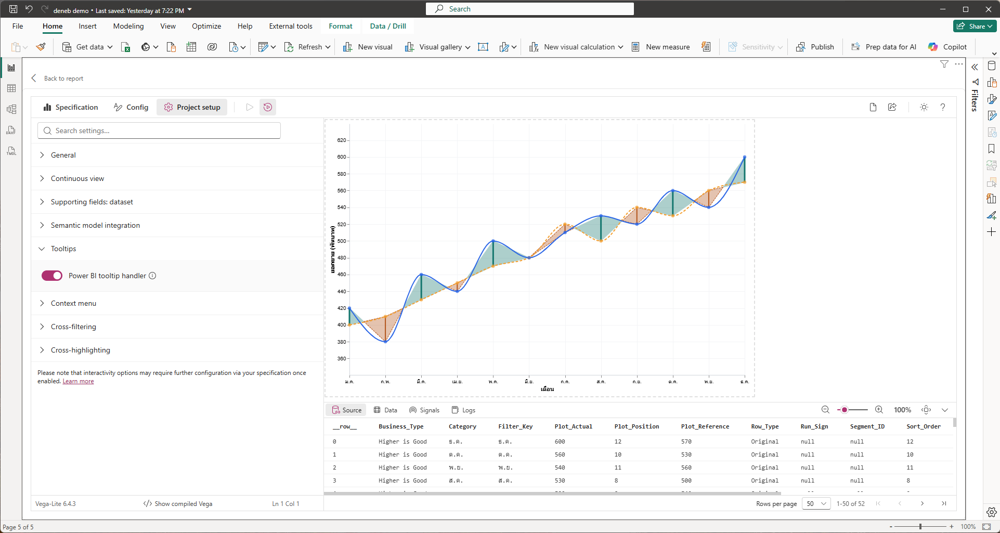
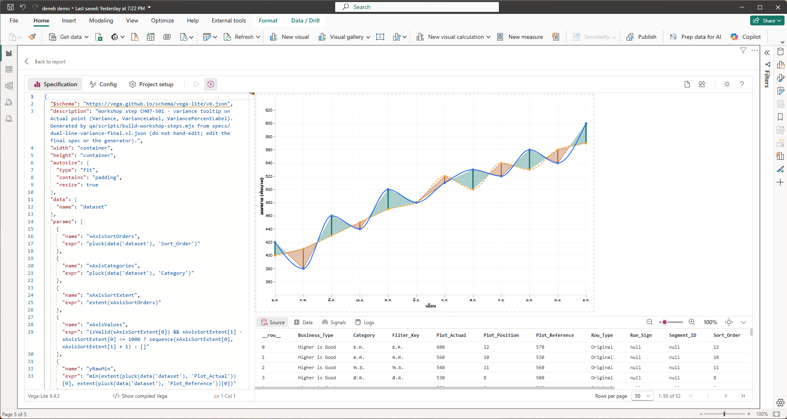
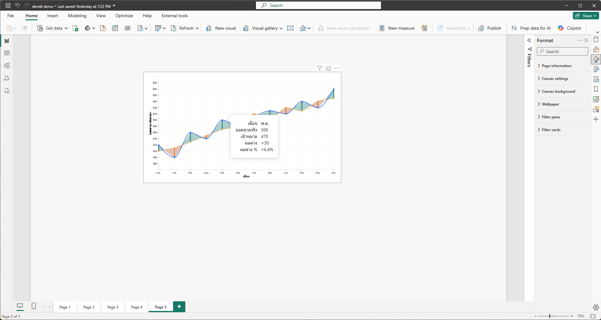
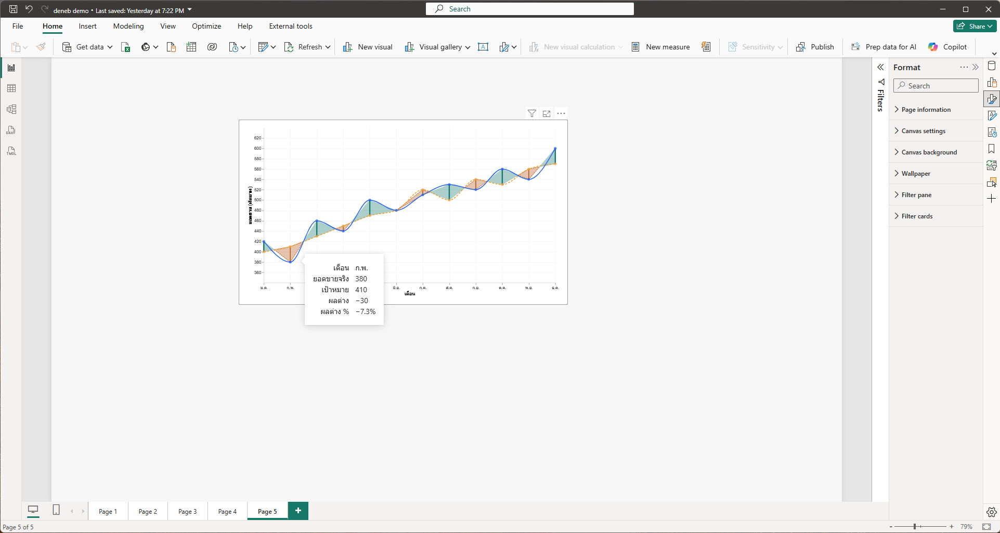
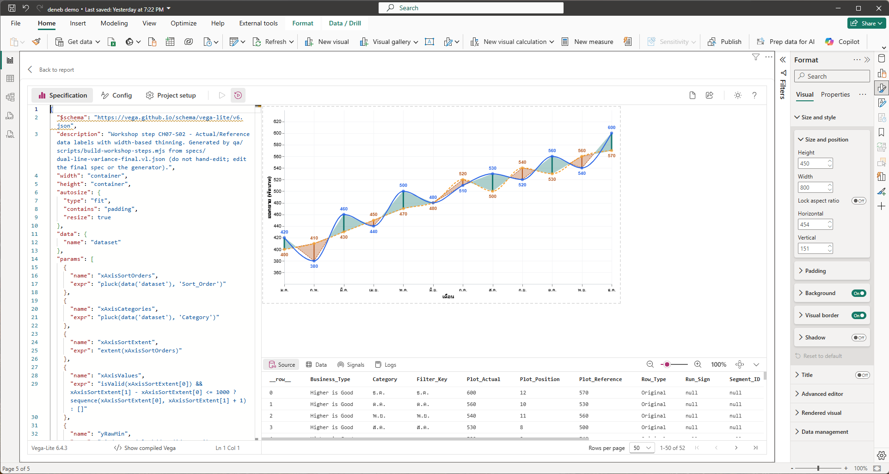
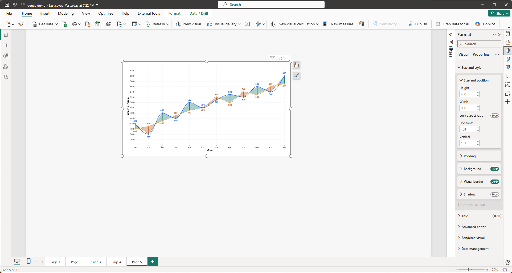
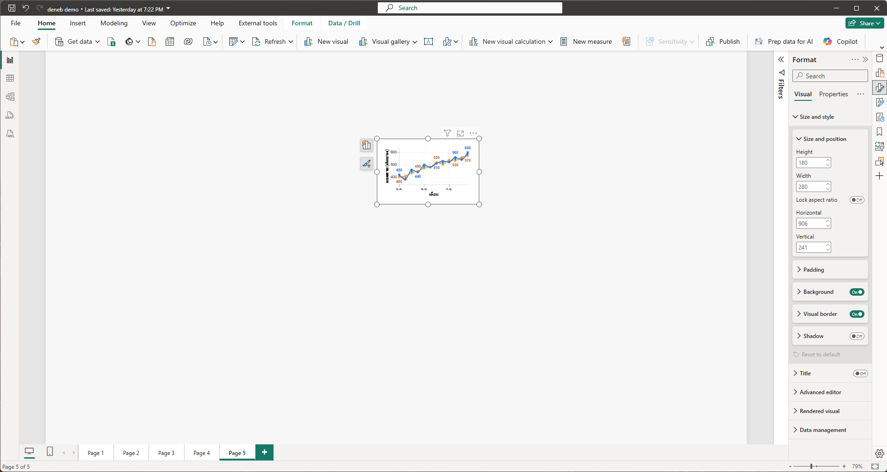
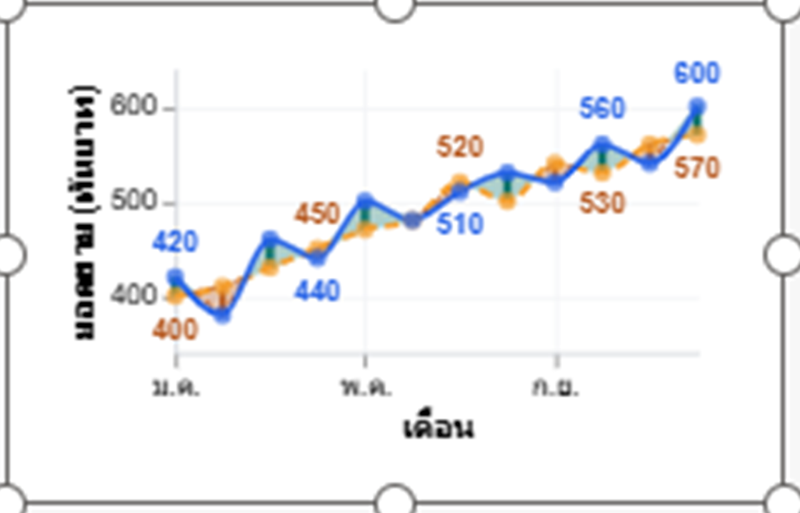

# บทที่ 7 Data Label และ Tooltip

## สิ่งที่จะได้จากบทนี้

บทนี้เพิ่มข้อมูลที่ผู้ใช้อ่านได้ทันทีโดยไม่ต้องเทียบกับแกน คือ Tooltip ที่บอกเดือน ยอดจริง เป้าหมาย ผลต่าง และผลต่างเป็นเปอร์เซ็นต์เมื่อชี้จุด และป้ายตัวเลขของทั้งสองเส้นที่ลดจำนวนป้ายเองเมื่อกราฟแคบ เมื่อจบคุณจะได้กราฟที่ครบทุกองค์ประกอบของ Dual-Line Variance Chart ยกเว้นการโต้ตอบกับ Visual อื่น ซึ่งเป็นเรื่องของบทที่ 8

- คำนวณคอลัมน์ใหม่ (`Variance`, `VarianceLabel`, `VariancePercentLabel`) ด้วย `transform.calculate` แล้วนำไปแสดงใน `tooltip`
- จัดรูปแบบตัวเลขด้วย `format` และป้องกันการหารด้วยศูนย์
- เพิ่มป้ายตัวเลข Actual และ Reference ด้วย `text` mark วางเหนือหรือใต้จุดตามว่าค่าไหนสูงกว่า
- ทำให้ป้ายลดจำนวนตามความกว้างกราฟด้วย `joinaggregate` และตัวแปร `width`
- อธิบายได้ว่าทำไมการลดป้ายนี้ช่วย **ลดการชน** แต่ไม่รับประกันว่าไม่ชนเลย

**สิ่งที่ต้องมีก่อนเริ่ม** ผ่านบทที่ 6 แล้ว คือ Editor มี spec ของบทที่ 6 Step 3 ค่า `Business_Type_Source` ในตาราง Settings เป็น `Higher is Good` (ถ้าเพิ่งทำ Step 4 ของบทที่ 6 ให้คืนค่าก่อน) และไฟล์ 2 ไฟล์ใน `specs/steps/` (`CH07-S01-tooltip.vl.json`, `CH07-S02-data-labels.vl.json`)

> **เรื่องภาพและไฟล์ Step ในบทนี้** ภาพ 7-1 ถึง 7-7 เป็นภาพหน้าจอจริงจาก Power BI Desktop 2.157.1354.0 และ Deneb 2.0.0.0 ที่ผู้ใช้จับ 26 ก.ย. 2026 ปิดชื่อบัญชีแล้ว ผูกข้อมูล 12 เดือนของ Workshop (`DualLine_PlotData` 52 แถว) ส่วน**ภาพ 7-8 เป็นภาพที่ผู้เขียนตัดและขยายจากภาพ 7-7** ไม่ใช่ภาพหน้าจอใหม่ ภาพ 7-3 ถึง 7-4 และ 7-6 ถึง 7-7 ถ่ายใน Report view ที่ซูมหน้าจอ 79% ขนาดที่ Visual เห็นจึงเล็กกว่า 800×450 พิกเซลจริง ค่าจริงอ่านได้จากแผง Format ในภาพ 7-6 และ 7-7 ไฟล์ Step แต่ละไฟล์เป็น spec **เต็ม** ที่วางทับทั้งไฟล์ได้ และต่อยอดจากบทที่ 6 Step 3 (S01 เปลี่ยนเฉพาะชั้น `point_actual_hit_target` และ S02 เพิ่มสองชั้นป้ายตัวเลข) บทนี้แสดงเฉพาะส่วนที่เพิ่มหรือเปลี่ยน ตัดจากไฟล์จริง ตรวจด้วยสคริปต์ `qa/scripts/run-ch07-claims-check.mjs`

---

## 7.1 ก่อนเริ่ม: วิธีวางและวิธีดูผลในหน้ารายงาน

**วิธีวาง** ทำเหมือนหัวข้อ 5.1 คือเปิด Editor คัดลอกทั้งไฟล์ Step วางทับด้วย Ctrl+A แล้ว **Apply** (Ctrl+Enter)

**วิธีดูผลในหน้ารายงาน** บทนี้ต้องดูผลนอก Editor สองอย่าง (Tooltip ต้องชี้เมาส์ ป้ายตัวเลขต้องลองย่อขนาด) ให้กด **Back to report** แล้วเลือก Visual เปิดแผง Format > **Visual** > Size and style > **Size and position** ตั้ง **Height** และ **Width** ตามที่แต่ละ Step ระบุ (ตามภาพ 7-6 และ 7-7) ก่อนไปบทถัดไป **คืนขนาดเป็น Width 800 × Height 450**

---

## Step 1 Tooltip แสดงผลต่าง

### 1) เป้าหมาย

เมื่อชี้เมาส์ที่จุดสีน้ำเงิน (Actual) ของเดือนใด ให้ขึ้นกล่องแสดง เดือน ยอดขายจริง เป้าหมาย ผลต่าง และผลต่าง %

### 2) สิ่งที่ควรเห็นก่อนเริ่ม

กราฟบทที่ 6 Step 3 (พื้นที่ Good/Bad พร้อมเส้นขอบประและ Connector) ชี้เมาส์ที่จุดใดยังไม่มีอะไรขึ้น เพราะทุกชั้นตั้ง `tooltip: null` ไว้ตั้งแต่บทที่ 5

### 3) Fields/Measures ที่ใช้

`Category`, `Plot_Actual`, `Plot_Reference` (แสดงและคำนวณ), `Row_Type` (กรองแถว) ทั้งหมดผูกไว้แล้วตามบทที่ 4

### 4) ขั้นตอนใน Power BI

1. ในแท็บ **Project setup** ของ Editor ขยายหมวด **Tooltips** ตามภาพ 7-1 ผู้เขียนเห็นตัวเลือกเดียวคือ **Power BI tooltip handler** และเปิดอยู่ตอนถ่ายภาพ ไม่ได้เปลี่ยนค่าใดในบทนี้ (ผู้เขียนไม่ได้ทดลองปิดตัวเลือกนี้ จึงไม่ทราบว่าปิดแล้ว tooltip เป็นอย่างไร และไม่ทราบว่าค่านี้เป็นค่าตั้งต้นของ Deneb หรือไม่)
2. วางไฟล์ `specs/steps/CH07-S01-tooltip.vl.json` ทับทั้งหมดแล้ว Apply ตามภาพ 7-2 กราฟต้องหน้าตาเหมือนบทที่ 6 Step 3 ทุกอย่าง เพราะ Tooltip ไม่เห็นใน Preview นิ่งๆ
3. กด **Back to report** ตั้งขนาด Visual เป็น Width 800 × Height 450 แล้วชี้เมาส์ที่จุดสีน้ำเงินของ พ.ค. ต้องขึ้นกล่องตามภาพ 7-3
4. ชี้จุดสีน้ำเงินของ ก.พ. ต้องขึ้นกล่องตามภาพ 7-4 ซึ่งผลต่างติดลบ
5. ชี้จุดสีส้ม (Reference) ผู้ใช้รายงานว่าไม่มี Tooltip ขึ้น (ไม่มีภาพประกอบ ตรงกับที่ spec ตั้ง `tooltip: null` ไว้ที่ชั้นนั้น)



*ภาพ 7-1 Step 1: Editor แท็บ Project setup ขยายหมวด **Tooltips** เห็นตัวเลือก **Power BI tooltip handler** เปิดอยู่ (สวิตช์สีม่วงชิดขวา) หมวดอื่นที่เห็นคือ General, Continuous view, Supporting fields: dataset, Semantic model integration, Context menu, Cross-filtering และ Cross-highlighting (ยังพับอยู่) Preview ยังเป็นกราฟบทที่ 6 Step 3*



*ภาพ 7-2 Step 1: spec `CH07-S01-tooltip` วางแล้ว (บรรทัดที่ 3 `description` เขียน CH07-S01) กราฟเหมือนภาพ 6-4 ทุกอย่างและ Debug pane แท็บ Source ขึ้น `1-50 of 52`*



*ภาพ 7-3 Step 1: หน้ารายงาน ชี้จุดสีน้ำเงินของ พ.ค. กล่อง Tooltip ขึ้น 5 แถว เดือน พ.ค. / ยอดขายจริง 500 / เป้าหมาย 470 / ผลต่าง +30 / ผลต่าง % +6.4% (ภาพซูมหน้าจอ 79%)*



*ภาพ 7-4 Step 1: ชี้จุดสีน้ำเงินของ ก.พ. เดือน ก.พ. / ยอดขายจริง 380 / เป้าหมาย 410 / ผลต่าง −30 / ผลต่าง % −7.3% เครื่องหมายลบ `−` เป็นขีดที่ยาวกว่ายัติภังค์ `-` ธรรมดา*

### 5) JSON ที่เพิ่มหรือแก้เฉพาะ Step

เปลี่ยนเฉพาะชั้น `point_actual_hit_target` (ชั้นอื่นไม่เปลี่ยน) ส่วนที่เพิ่มคือ `calculate` สามตัวใน `transform` และ `tooltip` ใน `encoding`

<!-- excerpt: CH07-S01-tooltip layer:point_actual_hit_target -->
```json
"layer": [
  {
    "name": "point_actual_hit_target",
    "transform": [
      {
        "filter": "datum.Row_Type == 'Original'"
      },
      {
        "calculate": "datum.Plot_Actual - datum.Plot_Reference",
        "as": "Variance"
      },
      {
        "calculate": "format(datum.Variance, '+,.0f')",
        "as": "VarianceLabel"
      },
      {
        "calculate": "datum.Plot_Reference == 0 ? 'N/A (เป้าหมาย = 0)' : format(datum.Variance / datum.Plot_Reference, '+.1%')",
        "as": "VariancePercentLabel"
      }
    ],
    "mark": {
      "type": "point",
      "filled": true,
      "size": 40,
      "color": "#2563EB"
    },
    "encoding": {
      "x": {
        "field": "Plot_Position",
        "type": "quantitative"
      },
      "y": {
        "field": "Plot_Actual",
        "type": "quantitative"
      },
      "tooltip": [
        {
          "field": "Category",
          "type": "nominal",
          "title": "เดือน"
        },
        {
          "field": "Plot_Actual",
          "type": "quantitative",
          "title": "ยอดขายจริง",
          "format": ",.0f"
        },
        {
          "field": "Plot_Reference",
          "type": "quantitative",
          "title": "เป้าหมาย",
          "format": ",.0f"
        },
        {
          "field": "VarianceLabel",
          "type": "nominal",
          "title": "ผลต่าง"
        },
        {
          "field": "VariancePercentLabel",
          "type": "nominal",
          "title": "ผลต่าง %"
        }
      ]
    }
  }
]
```

### 6) คำอธิบายโค้ด

- **`transform.calculate` สร้างคอลัมน์ใหม่** แต่ละรายการคำนวณจากสูตรใน `calculate` แล้วเก็บเป็นชื่อใหม่ใน `as` (บทที่ 3 หัวข้อ 3.7) สามตัวเรียงต่อกัน ตัวหลังอ่านผลของตัวก่อนได้ เช่น `VarianceLabel` อ่าน `Variance`
- **`Variance`** คือ `Plot_Actual − Plot_Reference` (ผลต่างของเดือนนั้น เช่น พ.ค. 500 − 470 = 30)
- **`VarianceLabel`** จัดผลต่างเป็นข้อความด้วย `format(..., '+,.0f')` รูปแบบ `+,.0f` แปลว่าแสดงเครื่องหมาย `+` เมื่อเป็นบวก คั่นหลักพันด้วยจุลภาค และไม่มีทศนิยม (ก.พ. ได้ `−30` เห็นในภาพ 7-4)
- **`VariancePercentLabel`** คือผลต่างหารด้วย Reference จัดรูปแบบ `+.1%` (เครื่องหมาย ทศนิยมหนึ่งตำแหน่ง และ `%`) เช่น พ.ค. 30 ÷ 470 = 6.38% แสดง `+6.4%` และ ก.พ. −30 ÷ 410 = −7.32% แสดง `−7.3%` ตรงกับภาพ 7-3 และ 7-4
- **ป้องกันการหารด้วยศูนย์** ถ้า `Plot_Reference` เป็นศูนย์ สูตรใช้ข้อความ `N/A (เป้าหมาย = 0)` แทน เพื่อไม่ให้ Tooltip ขึ้นค่าที่หารไม่ได้ (ข้อมูล Workshop ไม่มีเดือนที่ Reference เป็นศูนย์ ผู้เขียนจึงไม่ได้เห็นข้อความนี้ในภาพ บทที่ 9 ทดสอบกรณีขอบ)
- **`tooltip` เป็นอาร์เรย์ของ field** แต่ละรายการคือหนึ่งแถวในกล่อง `title` คือป้ายด้านซ้าย `format` (ถ้ามี) จัดตัวเลขก่อนแสดง `Plot_Actual` และ `Plot_Reference` ใช้ `,.0f` (คั่นหลักพัน ไม่มีทศนิยม) ส่วนสองตัวหลังเป็นข้อความที่จัดรูปไว้แล้วจึงไม่ต้องมี `format`
- **ทำไม Tooltip อยู่ที่ชั้น `point_actual_hit_target` ชั้นเดียว** ชื่อชั้นบอกว่าจุดสีน้ำเงินเป็น "เป้า" ที่ผู้ใช้ชี้ ชั้นอื่นทั้งหมดตั้ง `tooltip: null` เพื่อไม่ให้กล่องซ้อนกันหลายกล่องบนพื้นที่เดียวกัน ตามโครงสร้าง spec จึงคาดว่าชี้พื้นที่สี เส้น หรือ Connector จะไม่มี Tooltip (อ่านจาก spec ผู้เขียนไม่ได้ชี้ทุกชั้นเพื่อทดสอบ) ผู้ใช้ทดสอบชี้จุดสีส้มแล้วไม่มี Tooltip
- **Tooltip ขึ้นเป็นกล่องแบบ Power BI** เพราะ Project setup เปิด **Power BI tooltip handler** (ภาพ 7-1) ผู้เขียนไม่ได้ทดสอบว่ากล่องหน้าตาเป็นอย่างไรเมื่อปิดตัวเลือกนี้

### 7) ภาพระหว่างทำ

ภาพ 7-1 ถึง 7-4

### 8) ผลลัพธ์ที่ควรได้

ชี้จุดสีน้ำเงินแล้วมีกล่อง 5 แถวตามภาพ 7-3 และ 7-4 ชี้จุดสีส้มไม่มีกล่อง

ตัวอย่างค่าที่ควรเห็นสำหรับข้อมูล Workshop (คำนวณจาก CSV)

| เดือน | ยอดขายจริง | เป้าหมาย | ผลต่าง | ผลต่าง % |
| --- | --- | --- | --- | --- |
| ม.ค. | 420 | 400 | +20 | +5.0% |
| ก.พ. | 380 | 410 | −30 | −7.3% |
| มี.ค. | 460 | 430 | +30 | +7.0% |
| พ.ค. | 500 | 470 | +30 | +6.4% |
| ธ.ค. | 600 | 570 | +30 | +5.3% |

ค่า พ.ค. และ ก.พ. ยืนยันด้วยภาพ 7-3 และ 7-4 ส่วนเดือนอื่นคำนวณจากสูตร เดือน มิ.ย. ผลต่างเป็นศูนย์ (480 เท่ากับ 480) ผู้เขียนไม่ได้ชี้จุดนี้ จึงไม่ยืนยันว่า `format` แสดงศูนย์อย่างไร

### 9) วิธีตรวจสอบผล

- ชี้จุดสีน้ำเงินของ พ.ค. ต้องได้ 500 / 470 / +30 / +6.4% ตามภาพ 7-3
- ชี้จุดสีน้ำเงินของ ก.พ. ต้องได้ 380 / 410 / −30 / −7.3% ตามภาพ 7-4 ผลต่างติดลบเมื่อ Actual ต่ำกว่า Reference
- ชี้จุดสีส้มไม่มีกล่อง

### 10) ปัญหาที่อาจพบและวิธีแก้

| อาการ | สาเหตุที่เป็นไปได้ | วิธีแก้ |
| --- | --- | --- |
| ชี้จุดแล้วไม่มีกล่อง | เมาส์ไม่ตรงจุด (จุดเล็ก ขนาด 40) หรือยังอยู่ใน Editor | ขยับเมาส์ให้อยู่กลางจุดสีน้ำเงิน และทดสอบในหน้ารายงาน ไม่ใช่ Preview |
| กล่องขึ้นแต่ค่าว่างหรือเป็น `null` | ไม่ได้ผูก field หรือตั้งชื่อไม่ตรง | ตรวจ field ตามภาพ 4-8 (ชื่อ `Plot_Actual` ฯลฯ ต้องเป็นชื่อเปล่า) |
| ขึ้น Tooltip ที่ชี้จุดสีส้มด้วย | วางไฟล์ผิด หรือแก้ `tooltip: null` ของชั้น `point_reference` | วางไฟล์ Step 1 ใหม่ทั้งไฟล์ |
| กล่องขึ้นแต่ต่างจากภาพ | ปิด Power BI tooltip handler | ตรวจตัวเลือกใน Project setup ตามภาพ 7-1 (ผู้เขียนไม่ได้ทดลองปิด) |

### 11) แบบฝึกหัดสั้น

เปลี่ยน `title` ของแถวที่สอง (`Plot_Actual`) จาก `"ยอดขายจริง"` เป็น `"ยอดขาย"` แล้ว Apply และดูในหน้ารายงาน แล้วเปลี่ยนกลับ (ผู้เขียนยังไม่ได้ลองผลใน Deneb จริง)

### 12) จุดตรวจผ่านก่อนทำ Step ถัดไป

- [ ] ชี้จุดสีน้ำเงินแล้วเห็นกล่อง 5 แถว ค่าตรงกับภาพ 7-3 และ 7-4
- [ ] ชี้จุดสีส้มแล้วไม่มีกล่อง
- [ ] อธิบายได้ว่า `calculate` สามตัวทำอะไรและทำไมต้องมีการป้องกันหารด้วยศูนย์

---

## Step 2 ป้ายตัวเลข Actual และ Reference

### 1) เป้าหมาย

แสดงตัวเลขของ Actual (สีน้ำเงิน) และ Reference (สีส้มน้ำตาล) ที่จุดของแต่ละเดือน โดยวางป้ายคนละฝั่งของจุดเพื่อไม่ให้ทับกัน และลดจำนวนป้ายอัตโนมัติเมื่อกราฟแคบจนป้ายจะแน่นเกินไป

### 2) สิ่งที่ควรเห็นก่อนเริ่ม

กราฟพร้อม Tooltip จาก Step 1 ที่ยังไม่มีตัวเลขบนกราฟ

### 3) Fields/Measures ที่ใช้

`Plot_Actual`, `Plot_Reference` (ค่าที่แสดง), `Plot_Position` (ตำแหน่ง X), `Sort_Order` (ลำดับเดือนสำหรับคัดป้าย), `Row_Type` (กรอง)

### 4) ขั้นตอนใน Power BI

1. วางไฟล์ `specs/steps/CH07-S02-data-labels.vl.json` ทับทั้งหมดแล้ว Apply ตามภาพ 7-5 ต้องเห็นตัวเลขบนทุกจุดของกราฟ
2. กด **Back to report** ตั้งขนาด Visual เป็น Width 800 × Height 450 ตามภาพ 7-6 ต้องเห็นป้ายครบทุกเดือน (24 ป้าย)
3. ตั้งขนาดเป็น **Width 280 × Height 180** ตามภาพ 7-7 ป้ายลดลงเหลือเฉพาะบางเดือน (ดูภาพขยายที่ 7-8)
4. **คืนขนาดเป็น Width 800 × Height 450**



*ภาพ 7-5 Step 2: spec `CH07-S02` วางแล้ว (บรรทัดที่ 3 `description` เขียน CH07-S02) ป้ายสีน้ำเงินคือ Actual ป้ายสีส้มน้ำตาลคือ Reference ภาพนี้เปิดแผง Format ค้างไว้ทางขวา ทำให้พื้นที่ Editor แคบกว่าภาพ 7-2 ไม่เกี่ยวกับ spec*



*ภาพ 7-6 Step 2: หน้ารายงาน Height 450 Width 800 (อ่านจากแผง Format ด้านขวา) ป้ายครบทุกเดือน 24 ป้าย ป้าย Actual อยู่เหนือจุดเมื่อ Actual ≥ Reference (เช่น พ.ค. 500 เหนือจุด 470 ใต้จุด) และอยู่ใต้จุดเมื่อต่ำกว่า (เช่น ก.พ. 380 ใต้จุด 410 เหนือจุด) ที่ มิ.ย. Actual เท่ากับ Reference (480) ป้าย Actual อยู่เหนือและป้าย Reference อยู่ใต้*



*ภาพ 7-7 Step 2: Height 180 Width 280 (อ่านจากแผง Format) ป้ายเหลือเฉพาะบางเดือน แกน X แสดงชื่อเดือนเพียง ม.ค. พ.ค. ก.ย. (ภาพนี้เล็ก ดูภาพขยาย 7-8 ประกอบ)*



*ภาพ 7-8 ภาพที่ผู้เขียนตัดและขยายจากภาพ 7-7 ไม่ใช่ภาพหน้าจอใหม่ ป้ายที่เหลือคือ ม.ค. (420 บน, 400 ล่าง) เม.ย. (450 บน Reference, 440 ล่าง Actual) ก.ค. (520 บน Reference, 510 ล่าง Actual) ต.ค. (560 บน Actual, 530 ล่าง Reference) และ ธ.ค. (600 บน Actual, 570 ล่าง Reference) คือเดือนที่ 1, 4, 7, 10 และ 12*

### 5) JSON ที่เพิ่มหรือแก้เฉพาะ Step

สองชั้นใหม่วางต่อท้ายอาร์เรย์ `layer` เพื่อให้อยู่บนสุด ชั้นแรกคือ `label_actual` (ชั้น `label_reference` เหมือนกันทุกอย่าง ต่างที่ผูกค่าและสีตามข้างล่าง)

<!-- excerpt: CH07-S02-data-labels layer:label_actual -->
```json
"layer": [
  {
    "name": "label_actual",
    "transform": [
      {
        "filter": "datum.Row_Type == 'Original'"
      },
      {
        "calculate": "length(format(datum.Plot_Actual, ',.0f'))",
        "as": "lenA"
      },
      {
        "calculate": "length(format(datum.Plot_Reference, ',.0f'))",
        "as": "lenR"
      },
      {
        "calculate": "max(datum.lenA, datum.lenR)",
        "as": "maxLen"
      },
      {
        "joinaggregate": [
          {
            "op": "max",
            "field": "maxLen",
            "as": "globalMaxLen"
          },
          {
            "op": "count",
            "field": "Plot_Actual",
            "as": "n"
          },
          {
            "op": "max",
            "field": "Sort_Order",
            "as": "lastSort"
          }
        ]
      },
      {
        "calculate": "max(1, ceil((datum.globalMaxLen * 10 * 0.62 + 14) / (width / datum.n)))",
        "as": "labelStep"
      },
      {
        "calculate": "(datum.Sort_Order - 1) % datum.labelStep == 0 || datum.Sort_Order == datum.lastSort",
        "as": "showLabel"
      },
      {
        "filter": "datum.showLabel"
      }
    ],
    "mark": {
      "type": "text",
      "dy": {
        "expr": "datum.Plot_Actual >= datum.Plot_Reference ? -12 : 12"
      },
      "fontSize": 10,
      "fontWeight": "bold",
      "color": "#2563EB",
      "tooltip": null
    },
    "encoding": {
      "x": {
        "field": "Plot_Position",
        "type": "quantitative"
      },
      "y": {
        "field": "Plot_Actual",
        "type": "quantitative"
      },
      "text": {
        "field": "Plot_Actual",
        "type": "quantitative",
        "format": ",.0f"
      }
    }
  }
]
```

ส่วนที่ `label_reference` ต่างจากข้างบน (ตัดจากไฟล์จริง)

<!-- excerpt: CH07-S02-data-labels marks:label_reference -->
```json
"label_reference": {
  "mark": {
    "type": "text",
    "dy": {
      "expr": "datum.Plot_Actual >= datum.Plot_Reference ? 12 : -12"
    },
    "fontSize": 10,
    "fontWeight": "bold",
    "color": "#B45309",
    "tooltip": null
  }
}
```

อีกสามจุดที่ต่างคือ `joinaggregate` ของ `count` อ้าง `Plot_Reference` แทน `Plot_Actual` และ `encoding.y` กับ `encoding.text` ผูก `Plot_Reference` แทน `Plot_Actual`

### 6) คำอธิบายโค้ด

**text mark และตำแหน่งป้าย**

- `"type": "text"` วาดตัวอักษรที่ตำแหน่ง (`x`, `y`) ของแต่ละแถว ข้อความที่แสดงมาจาก `encoding.text` ซึ่งผูกกับ `Plot_Actual` (หรือ `Plot_Reference`) และใช้ `format: ",.0f"` เหมือนใน Tooltip
- `dy` เลื่อนป้ายในแนวตั้งเป็นพิกเซล ค่าลบเลื่อนขึ้น ค่าบวกเลื่อนลง `label_actual` ใช้ `Plot_Actual >= Plot_Reference ? -12 : 12` คือ Actual สูงกว่าหรือเท่ากับ Reference ป้ายอยู่เหนือจุด ไม่เช่นนั้นอยู่ใต้จุด ส่วน `label_reference` กลับเครื่องหมาย ป้ายสองอันของเดือนเดียวกันจึงอยู่คนละฝั่งเสมอ ไม่ทับกัน
- สีป้าย Actual คือ `#2563EB` (เหมือนเส้น) ส่วนป้าย Reference คือ `#B45309` (สีส้มน้ำตาล เข้มกว่าเส้น Reference `#F59E0B` เพื่อให้อ่านง่ายบนพื้นขาว และเป็นสีเดียวกับสี Bad ของพื้นที่) `tooltip: null` ไม่ให้ป้ายมี Tooltip ของตัวเอง

**ลดจำนวนป้ายตามความกว้าง** (ที่มาของภาพ 7-7)

ป้ายที่แน่นเกินไปจะทับกัน ชั้นป้ายจึงคำนวณ "ควรแสดงทุกกี่เดือน" (`labelStep`) แล้วเก็บเฉพาะเดือนที่ถึงรอบ ขั้นตอนเรียงตามลำดับใน `transform`

| ขั้น | ทำอะไร |
| --- | --- |
| `filter Original` | ใช้เฉพาะแถวของเดือนจริง (12 แถว) |
| `lenA`, `lenR`, `maxLen` | นับจำนวนตัวอักษรของตัวเลขที่จัดรูปแล้ว (เช่น `600` = 3 ตัว) แล้วเลือกค่าที่ยาวกว่าในแถวนั้น |
| `joinaggregate` | คำนวณค่ารวมทั้งตารางแล้วแนบกลับทุกแถว: `globalMaxLen` (ความยาวมากสุดของทุกป้าย) `n` (จำนวนเดือน) `lastSort` (`Sort_Order` มากสุด) |
| `labelStep` | `max(1, ceil((globalMaxLen × 10 × 0.62 + 14) ÷ (width ÷ n)))` |
| `showLabel` | เดือนที่ `(Sort_Order − 1) % labelStep == 0` หรือเป็นเดือนสุดท้าย |
| `filter showLabel` | เก็บเฉพาะเดือนที่ `showLabel` เป็นจริง |

`joinaggregate` ต่างจาก `aggregate` ตรงที่ไม่ลดจำนวนแถว แต่คำนวณค่ารวมแล้วเพิ่มเป็นคอลัมน์ให้ทุกแถว ทำให้แต่ละเดือนรู้ค่า `n` และ `globalMaxLen` ของทั้งตาราง

**ความหมายของสูตร `labelStep`** ส่วน `globalMaxLen × 10 × 0.62 + 14` คือความกว้างโดยประมาณที่ป้ายหนึ่งป้ายต้องการ (เป็นพิกเซล) `10` คือขนาดตัวอักษร (`fontSize`) `0.62` คือสัดส่วนความกว้างตัวอักษรต่อขนาดตัวอักษรที่ผู้เขียนใช้ประมาณ และ `14` คือระยะเว้นเผื่อ ตัวเลข 0.62 และ 14 เป็นค่าประมาณของผู้เขียนเล่ม ไม่ได้มาจากเอกสารของ Vega-Lite `width ÷ n` คือความกว้างต่อหนึ่งเดือน ถ้าที่ต่อเดือนกว้างพอ `labelStep` เป็น 1 (แสดงทุกเดือน) ถ้าไม่พอ ก็แสดงห่างเป็น 2, 3, 4 เดือน

`width` คือความกว้างของพื้นที่กราฟ (ไม่รวมแกน Y และขอบ) ที่ Vega-Lite ให้ใช้ในนิพจน์ได้ ข้อมูล Workshop มีตัวเลขยาวสุด 3 ตัวอักษร (`globalMaxLen = 3`) และมี 12 เดือน ป้ายหนึ่งป้ายต้องการ 3 × 10 × 0.62 + 14 = 32.6 พิกเซล ได้ตารางนี้

| ความกว้างพื้นที่กราฟ (พิกเซล) | `labelStep` | เดือนที่มีป้าย |
| --- | --- | --- |
| 391.2 ขึ้นไป | 1 | ทุกเดือน |
| 195.6 ถึงน้อยกว่า 391.2 | 2 | 1, 3, 5, 7, 9, 11 และ 12 |
| 130.4 ถึงน้อยกว่า 195.6 | 3 | 1, 4, 7, 10 และ 12 |
| 97.8 ถึงน้อยกว่า 130.4 | 4 | 1, 5, 9 และ 12 |

**ที่เห็นจริง** ที่ Visual 800×450 ได้ `labelStep` = 1 (ภาพ 7-6 ป้ายครบ 24 ป้าย) ที่ Visual 280×180 เห็นเดือน 1, 4, 7, 10 และ 12 (ภาพ 7-7 และ 7-8) ตรงกับ `labelStep` = 3 แปลว่าความกว้างพื้นที่กราฟอยู่ในช่วง 130.4 ถึงน้อยกว่า 195.6 พิกเซล (ผู้เขียนไม่ได้อ่านค่า `width` จาก Signals จึงไม่ทราบตัวเลขที่แน่นอน) ก่อนถ่ายภาพ ผู้เขียนเคยประมาณไว้ว่าจะได้ `labelStep` = 2 ประมาณนั้นผิด เพราะพื้นที่กราฟที่ขนาด Visual 280 พิกเซลแคบกว่าที่คาด (แกน Y ชื่อแกนและขอบกินที่ไปมาก) ค่าที่ถูกคือค่าจากภาพจริง

**ข้อจำกัดที่ต้องรู้ (Group A: ลดการชน ไม่รับประกัน)** วิธีนี้ลดโอกาสที่ป้ายจะทับกันตามความกว้าง แต่**ไม่รับประกัน** ว่าไม่ชนเลย ป้ายอาจซ้อนกับเส้น จุด หรือป้ายเดือนข้างเคียง เช่น เดือนสุดท้ายถูกบวกเข้าไปเสมอ (`Sort_Order == lastSort`) แม้ไม่ตรงรอบ จึงอาจอยู่ใกล้ป้ายก่อนหน้ามากกว่าที่สูตรคิด (ที่ 280×180 เดือน 10 กับ 12 ห่างกัน 2 เดือน ยังไม่ชน) นอกจากนี้สูตรคิดจากความกว้างเท่านั้น ไม่ได้ดูความสูง และไม่ได้เช็กว่าป้าย Actual กับ Reference ของเดือนข้างเคียงชนกันหรือไม่ กรณีอื่น (ตัวเลขยาวกว่า จำนวนเดือนมากกว่า) ไปทดสอบในบทที่ 9 บทนี้ใช้ชื่อเดือนสั้นๆ ของข้อมูล Workshop เท่านั้น **Category ชื่อยาว** (ชื่อที่ยาวจนป้ายแกน X ต้องถูกจำกัดความกว้างหรือตัด) ผู้เขียนไม่ได้ทดสอบในบทนี้ แผนของเล่มไปทดสอบพร้อมกรณี Category จำนวนมากในบทที่ 9 (ป้ายแกน X ของ spec นี้ตั้ง `labelLimit` ไว้แล้วตามบทที่ 5) ส่วนป้ายชื่อเดือนที่แกน X ใช้กลไกแยก (`labelOverlap`, บทที่ 5) ซึ่งเป็นคำสัญญาที่แข็งกว่าคือป้ายชื่อเดือนต้องไม่ทับกัน (ในภาพ 7-7 แกน X เหลือเพียง ม.ค. พ.ค. ก.ย. ไม่ทับกัน)

### 7) ภาพระหว่างทำ

ภาพ 7-5 ถึง 7-8

### 8) ผลลัพธ์ที่ควรได้

- ที่ 800×450: ป้ายครบ 24 ป้ายตามภาพ 7-6
- ที่ 280×180: ป้ายเหลือเดือน 1, 4, 7, 10 และ 12 (เดือนละสองป้าย) ตามภาพ 7-7 และ 7-8

### 9) วิธีตรวจสอบผล

- ที่ 800×450 นับป้ายได้ 12 ป้ายสีน้ำเงิน และ 12 ป้ายสีส้มน้ำตาล ค่าตรง CSV เช่น ม.ค. 420 กับ 400, ธ.ค. 600 กับ 570
- ตรวจตำแหน่ง: ก.พ. (Actual 380 < Reference 410) ป้าย 380 อยู่ใต้จุด ป้าย 410 อยู่เหนือจุด ต.ค. (Actual 560 > Reference 530) กลับกัน
- ที่ 280×180 ป้ายที่เหลือต้องเป็นเดือนที่ 1, 4, 7, 10 และ 12 เท่านั้น
- คืนขนาดเป็น 800×450 แล้วป้ายกลับมาครบ

### 10) ปัญหาที่อาจพบและวิธีแก้

| อาการ | สาเหตุที่เป็นไปได้ | วิธีแก้ |
| --- | --- | --- |
| ไม่มีป้ายเลย | วางไฟล์ Step 1 ค้าง หรือ `Sort_Order` ไม่ได้ผูก | วางไฟล์ Step 2 ทั้งไฟล์ ตรวจ `Sort_Order` ตามภาพ 4-8 |
| ป้ายซ้อนกับเส้นหรือจุด | ข้อจำกัดของวิธีนี้ (Group A) | ยอมรับได้ในกรอบที่บทกำหนด หรือขยาย Visual |
| ที่ขนาดเล็กเห็นป้ายบางเดือนหาย | การลดป้ายทำงานตามที่ออกแบบ | ขยาย Visual เพื่อเห็นป้ายมากขึ้น |
| ลืมคืนขนาด Visual | ตั้ง 280×180 ค้าง | ตั้ง Width 800 × Height 450 ตามหัวข้อ 7.1 |

### 11) แบบฝึกหัดสั้น

เปลี่ยน `"fontSize": 10` ของ `label_actual` เป็น `14` แล้ว Apply ป้ายใหญ่ขึ้นหรือไม่ สูตร `labelStep` ยังอ้าง `10` (ขนาดเดิม) เมื่อย่อ Visual จะเกิดอะไร คิดก่อนลอง แล้วเปลี่ยนกลับ (ผู้เขียนยังไม่ได้ลองผลใน Deneb จริง)

### 12) จุดตรวจผ่านก่อนไปบทที่ 8

- [ ] ที่ 800×450 เห็นป้ายครบ 24 ป้าย
- [ ] ที่ 280×180 ป้ายลดลงเหลือเดือน 1, 4, 7, 10 และ 12
- [ ] **คืน Visual เป็น 800×450 แล้ว**
- [ ] อธิบายได้ว่า `labelStep` คำนวณจากอะไรและทำไมไม่รับประกันว่าป้ายไม่ชน

---

## สรุปบทที่ 7

- Tooltip ทำได้ด้วย `transform.calculate` สร้างค่าที่ต้องแสดง แล้วใส่ใน `encoding.tooltip` เป็นอาร์เรย์ของ field พร้อม `title` และ `format`
- Tooltip ผูกไว้ที่ชั้นจุด Actual ชั้นเดียว ชั้นอื่นตั้ง `tooltip: null`
- ผลต่างเปอร์เซ็นต์ป้องกันการหารด้วยศูนย์ด้วยข้อความ `N/A (เป้าหมาย = 0)`
- ป้ายตัวเลขใช้ `text` mark วาง Actual และ Reference คนละฝั่งของจุดด้วย `dy`
- จำนวนป้ายลดตามความกว้างด้วย `joinaggregate` และตัวแปร `width` (ที่ 800×450 ครบ ที่ 280×180 เหลือเดือน 1, 4, 7, 10, 12)
- การลดป้ายช่วยลดการชนแต่ไม่รับประกัน ต่างจากป้ายชื่อเดือนที่แกน X ซึ่งต้องไม่ทับกัน
- Category ชื่อยาวยังไม่ทดสอบในบทนี้ ไปทดสอบในบทที่ 9

## คำถามทบทวน

1. ทำไม Tooltip ผูกไว้ที่ชั้น `point_actual_hit_target` ชั้นเดียว
2. `VarianceLabel` และ `VariancePercentLabel` ของ ก.พ. ได้ค่าอะไร และคำนวณอย่างไร
3. ป้าย Actual กับ Reference ของเดือนเดียวกันอยู่คนละฝั่งของจุดได้อย่างไร
4. `joinaggregate` ต่างจาก `aggregate` อย่างไร และ `labelStep` ใช้ค่ารวมอะไรบ้างจากมัน
5. ที่ความกว้างพื้นที่กราฟ 150 พิกเซล `labelStep` เป็นเท่าไร และเดือนไหนมีป้าย

<details>
<summary>แนวคำตอบ</summary>

1. เพื่อไม่ให้กล่อง Tooltip ซ้อนกันหลายกล่องบนพื้นที่เดียวกัน ให้จุด Actual เป็นเป้าที่ผู้ใช้ชี้
2. `VarianceLabel` = `−30` (380 − 410 จัดรูปแบบ `+,.0f`) และ `VariancePercentLabel` = `−7.3%` (−30 ÷ 410 = −7.32% จัดรูปแบบ `+.1%`)
3. `dy` ของสองชั้นใช้เงื่อนไขเดียวกันแต่กลับเครื่องหมาย ชั้น Actual เลื่อนขึ้น (−12) เมื่อ Actual ≥ Reference และชั้น Reference เลื่อนลง (+12) ในกรณีเดียวกัน
4. `aggregate` ลดแถวให้เหลือหนึ่งแถวต่อกลุ่ม ส่วน `joinaggregate` คำนวณค่ารวมแล้วแนบกลับเป็นคอลัมน์ให้ทุกแถวโดยไม่ลดแถว `labelStep` ใช้ `globalMaxLen` (ความยาวป้ายมากสุด) และ `n` (จำนวนเดือน) รวมถึง `lastSort` สำหรับเดือนสุดท้าย
5. (3 × 10 × 0.62 + 14) ÷ (150 ÷ 12) = 32.6 ÷ 12.5 = 2.6 ปัดขึ้นเป็น 3 ป้ายอยู่เดือน 1, 4, 7, 10 และ 12

</details>

## จุดตรวจผ่านก่อนไปบทที่ 8

- [ ] Editor มี spec ของ Step 2 (`CH07-S02`) และ Visual กลับเป็น 800×450
- [ ] Tooltip ขึ้นเมื่อชี้จุดสีน้ำเงิน และป้ายตัวเลขแสดงครบที่ 800×450
- [ ] รู้ว่าการลดป้ายเป็นการลดการชน ไม่ใช่การรับประกัน
