# บทที่ 8 Cross-filtering และ Cross-highlighting

## สิ่งที่จะได้จากบทนี้

บทนี้ทำให้ Dual-Line Variance Chart คุยกับ Visual อื่นในหน้ารายงานได้สองทาง ทางแรกคือ **ส่งออก**: คลิกจุดในกราฟแล้ว Visual อื่นเลือกเดือนเดียวกัน (Cross-filtering) ทางที่สองคือ **รับเข้า**: เลือกแท่งใน Visual อื่นแล้วกราฟนี้เน้นเดือนที่เลือกและจางเดือนอื่น (Cross-highlighting) รวมถึงตั้ง Edit interactions และเมนูคลิกขวา

- เตรียม Clustered column chart เป็น Visual ต้นทางและปลายทางสำหรับทดสอบ
- เปิด Cross-filtering ใน Project setup และอธิบายได้ว่าทำไมคลิกพื้นที่สีจึงเลือกเดือนต้นช่วง
- เปิด Cross-highlighting และ Supporting fields แล้วตรวจว่า Deneb ส่งคอลัมน์ `Actual__highlight` และ `Actual__highlightStatus` มาถูกต้อง
- ใช้ spec `CH08-S01` ทำให้จุด (0.5) ป้ายตัวเลข (0.3) และ Connector (0.2) ของเดือนที่ไม่ได้เลือกจางลง
- ตั้ง Edit interactions เป็น Highlight, Filter, None และเห็นความต่างของทั้งสาม
- ตรวจ Context menu (คลิกขวา) ของ Deneb

**สิ่งที่ต้องมีก่อนเริ่ม** ผ่านบทที่ 7 แล้ว Editor มี spec ของบทที่ 7 Step 2 (`CH07-S02`) Visual Deneb ขนาด 800×450 ตาราง Settings เป็น `Higher is Good` และมี Relationship `Filter_Key` จากบทที่ 4 Step 5 นอกจากนี้ **ช่อง Values ของ Deneb ต้องมีแถบชื่อ `Actual` และ `Reference`** (เปลี่ยนชื่อจาก `Sum of Actual`, `Sum of Reference` ตามบทที่ 4 Step 4 ข้อ 4) ถ้ายังเป็น `Sum of ...` ให้เปลี่ยนก่อน มิฉะนั้น Step 3 จะไม่เห็นผลเลย (ดูหัวข้อ 8.1) และมีไฟล์ `specs/steps/CH08-S01-cross-highlight-opacity.vl.json`

> **เรื่องภาพและไฟล์ Step ในบทนี้** ภาพ 8-1 ถึง 8-17 เป็นภาพหน้าจอจริงจาก Power BI Desktop 2.157.1354.0 และ Deneb 2.0.0.0 ที่ผู้ใช้จับ 26 ก.ย. 2026 ปิดชื่อบัญชีแล้ว ผูกข้อมูล 12 เดือนของ Workshop (`DualLine_PlotData` 52 แถว) ทำบน Page 5 ของ `deneb demo.pbix` ที่ซูมหน้าจอ 73% ถึง 75% ขนาดที่ Visual เห็นจึงเล็กกว่าค่าจริง (บทก่อนใช้ 79%) ไม่มีผลต่อผลลัพธ์ บทนี้มี spec ใหม่ไฟล์เดียว (`CH08-S01`) ซึ่งเท่ากับ spec สุดท้ายของเล่ม ใช้ใน Step 3 เท่านั้น Step อื่นตั้งค่าใน Power BI และ Deneb โดยไม่แก้ spec บทนี้แสดงเฉพาะส่วนของ spec ที่เพิ่ม ตัดจากไฟล์จริง ตรวจด้วยสคริปต์ `qa/scripts/run-ch08-claims-check.mjs`
>
> **ภาพถ่ายก่อนเปลี่ยน opacity ของพื้นที่สี** ผู้เขียนปรับ `opacity` ของพื้นที่ Good/Bad เป็น **0.15** ทั้งเล่ม (26 ก.ย. 2026) ภาพที่ถ่ายก่อนหน้านี้แสดงพื้นที่สีเข้มกว่าที่ spec ปัจจุบันวาด (ถ่ายด้วย 0.35 และบางภาพระหว่างทดลอง 0.25) ตำแหน่ง สี และรูปร่างไม่ต่างกัน ผู้เขียนจะถ่ายภาพที่เห็นพื้นที่สีใหม่ทั้งหมดก่อนเผยแพร่ นอกจากนี้ภาพ 8-12 และ 8-13 ถ่ายก่อนที่ผู้ใช้ให้แยกระดับความจาง (ทุกอย่างจาง 0.5 ปัจจุบัน จุด 0.5 ป้าย 0.3 Connector 0.2) จะรวมถ่ายใหม่ในรอบเดียวกัน

---

## 8.1 ก่อนเริ่ม: ทำความเข้าใจกลไกและชื่อ field

**สองทิศทาง คนละกลไก** การตั้งค่าอยู่ในแท็บ **Project setup** ของ Editor คนละหมวด

| ทิศทาง | ตั้งที่ไหน | ผลที่ได้ |
| --- | --- | --- |
| ส่งออก (คลิกจุดใน Deneb แล้ว Visual อื่นเปลี่ยน) | หมวด **Cross-filtering** | Deneb ส่งแถวที่คลิกออกไปเป็นการเลือก |
| รับเข้า (เลือกแท่งใน Visual อื่นแล้ว Deneb เปลี่ยน) | หมวด **Cross-highlighting** และ **Supporting fields: dataset** | Deneb ได้คอลัมน์ `__highlight` และ `__highlightStatus` ให้ spec อ่าน |

ท้ายหน้า Project setup มีข้อความเตือนว่าตัวเลือก Interactivity **อาจต้องตั้งค่าเพิ่มใน spec** ตัวเลือกใน Project setup แค่ทำให้ข้อมูลมาถึง spec ยังไม่ได้ทำให้กราฟเปลี่ยนหน้าตา (ภาพ 8-10 จะแสดงตรงนี้)

**ฝั่ง Power BI** ผลของทิศทางรับเข้าขึ้นกับ **Edit interactions** ของ Visual ต้นทาง ต้องตั้งให้ชี้มาที่ Deneb เป็น **Highlight** (Step 3) ใช้ Clustered column chart หรือ Clustered bar chart เป็นต้นทาง **ห้ามใช้ Slicer** ทดสอบ Highlight เพราะ Slicer มีเฉพาะ Filter และ None

**ชื่อ field ต้องตรงกับที่ spec อ้าง** Deneb ตั้งชื่อคอลัมน์ highlight ตามชื่อแถบในช่อง Values ถ้าแถบชื่อ `Actual` จะได้ `Actual__highlight` และ `Actual__highlightStatus` แต่ถ้าปล่อยเป็น `Sum of Actual` จะได้ `Sum of Actual__highlight` ซึ่ง spec `CH08-S01` หาไม่เจอ เงื่อนไขทุกข้อใน spec ตรวจ `isDefined(...)` ก่อน เมื่อไม่พบ field เงื่อนไขเป็นเท็จ และกราฟไม่จางเลย โดยไม่มีข้อความผิดพลาด (ผู้เขียนพบเรื่องนี้จริงตอนทดสอบบทนี้ ดูบทที่ 4 Step 4)

---

## Step 1 เตรียม Clustered column chart

### 1) เป้าหมาย

สร้าง Visual ที่ใช้ทดสอบทั้งสองทิศทาง: แสดงยอดขายจริงรายเดือนเป็นแท่ง เรียงตามลำดับเดือน

### 2) สิ่งที่ควรเห็นก่อนเริ่ม

หน้า Page 5 มี Visual Deneb เพียงตัวเดียว

### 3) Fields/Measures ที่ใช้

ตาราง `DualLineVariance_Workshop_Data` (ตารางดิบ 12 แถวจากบทที่ 2 ไม่ใช่ `DualLine_PlotData`) ใช้ `Category`, `Actual` และ `Sort_Order`

### 4) ขั้นตอนใน Power BI

1. ในช่อง Data ขยายตาราง `DualLineVariance_Workshop_Data` แล้วเลือกคอลัมน์ `Category`
2. ที่ ribbon แท็บ **Column tools** เลือก **Sort by column** แล้วเลือก `Sort_Order` ตามภาพ 8-1 (ภาษาไทยเรียงตามตัวอักษรไม่ได้ลำดับเดือน จึงต้องใช้ `Sort_Order` เป็นตัวเรียง) เมนูแสดง Category, Actual, Reference และ Sort_Order
3. กลับ Report view วาง **Clustered column chart** ใหม่ข้าง Deneb ไม่ให้ซ้อนกัน แล้วใน Build pane ลาก `Category` ไปช่อง **X-axis** และ `Actual` ไปช่อง **Y-axis** (แสดงเป็น `Sum of Actual`) ตามภาพ 8-2
4. ตรวจว่าเห็น 12 แท่งเรียง ม.ค. ถึง ธ.ค. ค่า 420, 380, 460, 440, 500, 480, 510, 530, 520, 560, 540, 600

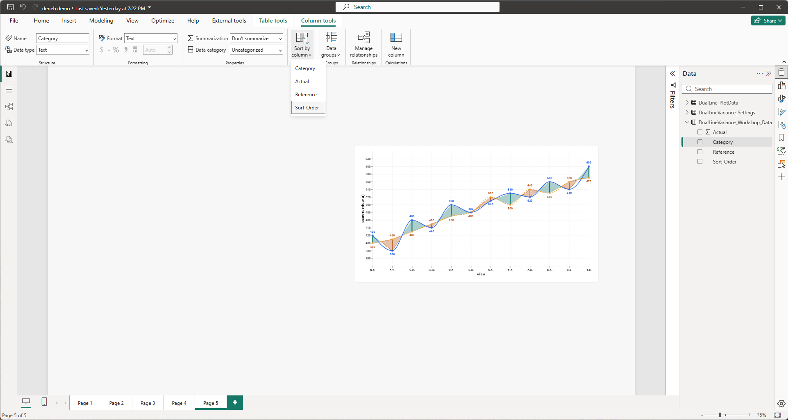

*ภาพ 8-1 Step 1: เลือกคอลัมน์ `Category` ของตาราง `DualLineVariance_Workshop_Data` (Column tools) เมนู **Sort by column** เปิดอยู่ มีตัวเลือก Category, Actual, Reference, Sort_Order โดย Sort_Order มีกรอบเน้น ผลของการเรียงเห็นในภาพ 8-2 (ภาพนี้ไม่เห็นเครื่องหมายถูกชัด) ภาพเป็นหน้า Report view ที่ซูม 75% Visual Deneb เห็นทางขวา*

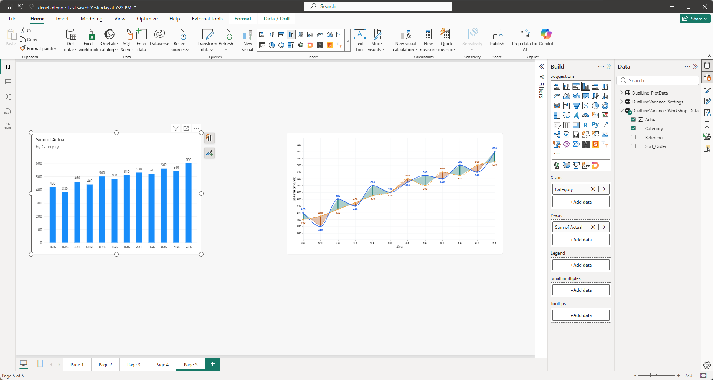

*ภาพ 8-2 Step 1: Clustered column chart (ชื่อ "Sum of Actual by Category") อยู่ซ้าย Visual Deneb อยู่ขวา Build pane ของ column chart: X-axis = `Category` และ Y-axis = `Sum of Actual` แท่งเรียง ม.ค. ถึง ธ.ค. ค่า 420 ถึง 600 ตามข้อมูล*

### 5) JSON ที่เพิ่มหรือแก้เฉพาะ Step

ไม่มี Step นี้ไม่แตะ spec

### 6) คำอธิบายโค้ด

ไม่มี ข้อควรเข้าใจคือ Visual นี้ใช้ตาราง `DualLineVariance_Workshop_Data` (ตารางดิบ) ส่วน Deneb ใช้ `DualLine_PlotData` (ตารางที่ Power Query สร้าง) สองตารางเชื่อมกันด้วย Relationship ที่สร้างในบทที่ 4 Step 5: `DualLine_PlotData[Filter_Key]` ไป `DualLineVariance_Workshop_Data[Category]` แบบหลายต่อหนึ่ง ทิศทางกรอง Both นี่คือสิ่งที่ทำให้การเลือกในฝั่งหนึ่งไปถึงอีกฝั่ง

### 7) ภาพระหว่างทำ

ภาพ 8-1 และ 8-2

### 8) ผลลัพธ์ที่ควรได้

หน้า Page 5 มี column chart 12 แท่งเรียงตามเดือน และ Deneb Visual

### 9) วิธีตรวจสอบผล

แท่งเรียง ม.ค. ก.พ. มี.ค. ... ธ.ค. ไม่ใช่เรียงตัวอักษร และค่าของแท่งตรงกับ Actual ใน CSV

### 10) ปัญหาที่อาจพบและวิธีแก้

| อาการ | สาเหตุที่เป็นไปได้ | วิธีแก้ |
| --- | --- | --- |
| แท่งเรียงไม่ตรงเดือน | ยังไม่ได้ตั้ง Sort by column | ตั้ง `Category` เรียงตาม `Sort_Order` ตามภาพ 8-1 |
| ใช้ตารางผิด (`DualLine_PlotData`) | ลาก field จากตารางที่ผิด | ใช้ `Category` และ `Actual` ของ `DualLineVariance_Workshop_Data` |
| คลิกแท่งแล้วเปิดหน้า "Show data point as a table" | ยังไม่ทราบสาเหตุ (พบระหว่างทดสอบ) | ลบ column chart แล้วสร้างใหม่ |

### 11) แบบฝึกหัดสั้น

เปลี่ยนแท่งให้แสดง `Reference` แทน `Actual` (สลับ field ใน Y-axis) แล้วสลับกลับ (ผู้เขียนยังไม่ได้ลองผล)

### 12) จุดตรวจผ่านก่อนทำ Step ถัดไป

- [ ] เห็น 12 แท่งเรียงตามเดือน
- [ ] Column chart อยู่ข้าง Deneb และไม่ซ้อนกัน

---

## Step 2 Cross-filtering: คลิกใน Deneb แล้ว column chart ตามเลือก

### 1) เป้าหมาย

เปิด Cross-filtering แล้วคลิกจุดหรือพื้นที่สีในกราฟ Deneb ให้ column chart เลือกเดือนที่คลิก

### 2) สิ่งที่ควรเห็นก่อนเริ่ม

Deneb แสดงกราฟจาก spec `CH07-S02` ยังไม่มีการเลือก คอลัมน์ `__selected__` ในแท็บ Source ของ Debug pane เป็น `neutral`

### 3) Fields/Measures ที่ใช้

`Category`, `Filter_Key` และ Relationship `Filter_Key` ไป `Category` (บทที่ 4 Step 5)

### 4) ขั้นตอนใน Power BI

1. เปิด Editor แท็บ **Project setup** ขยายหมวด **Cross-filtering** ตามภาพ 8-3 ต้องเห็น **Expose cross-filtering values for dataset rows** เปิด และ **Cross-filtering management** เป็น **Simple** ("Let Deneb attempt to resolve cross-filtering for me") ส่วน **Advanced** เลือกไม่ได้ (ข้อความในหน้าระบุว่าใช้ได้กับ Vega เท่านั้น) **Data point limit** เป็น 50 ถ้าปิดอยู่ให้เปิด
2. กลับหน้ารายงาน คลิกที่ว่างของหน้าเพื่อล้าง selection แล้ว**คลิกจุดสีน้ำเงินของ ต.ค.** ในกราฟ Deneb ย้ายเมาส์ออกจากกราฟ ตามภาพ 8-4
3. ล้าง selection แล้ว**คลิกกลางสามเหลี่ยมสีส้มของช่วง ม.ค.–ก.พ. ชิดฝั่ง ก.พ.** ตามภาพ 8-5

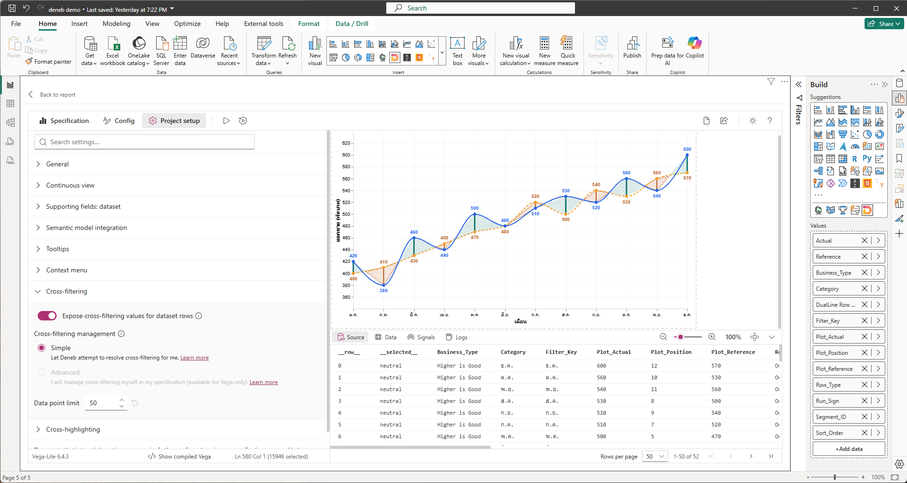

*ภาพ 8-3 Step 2: Editor แท็บ Project setup ขยายหมวด **Cross-filtering** สวิตช์ **Expose cross-filtering values for dataset rows** เปิด **Cross-filtering management** เลือก **Simple** (Advanced เป็นสีจาง) **Data point limit** = 50 ยังไม่มีการเลือกใน Deneb คอลัมน์ `__selected__` ในแท็บ Source เป็น `neutral` ทุกแถว Preview เข้มทุกเดือน และช่อง Values ของ Deneb (Build pane ทางขวา) เห็นแถบ `Actual` และ `Reference`*

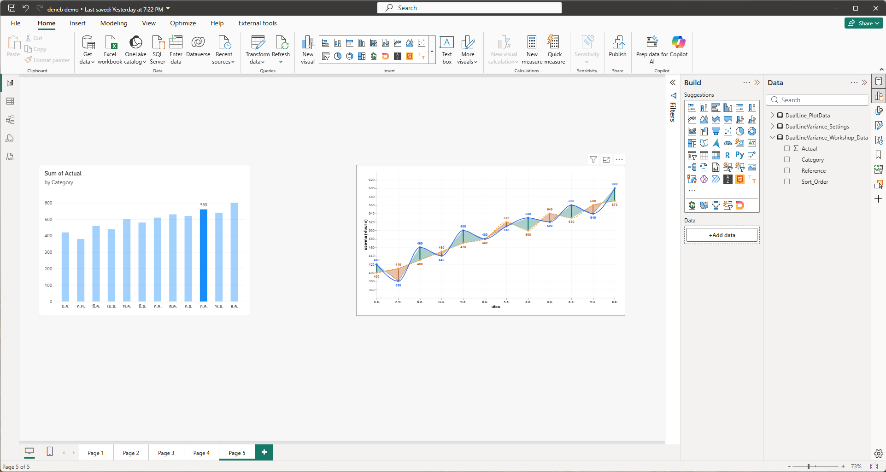

*ภาพ 8-4 Step 2: คลิกจุด Actual ของ ต.ค. ในกราฟ Deneb (ขวา) column chart (ซ้าย) เน้นแท่ง **ต.ค.** (560) แท่งเดียว แท่งอื่นจางลง Column chart รับการเลือกแบบ Highlight ซึ่งเป็นค่าตั้งต้นของ Power BI ไม่ใช่การกรองแท่งอื่นทิ้ง*

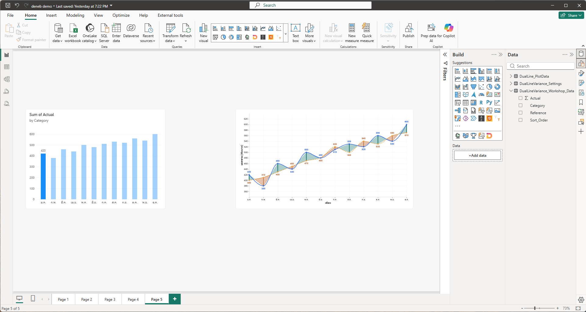

*ภาพ 8-5 Step 2: คลิกพื้นที่สีส้มของช่วง ม.ค.–ก.พ. ชิดฝั่ง ก.พ. column chart เน้นแท่ง **ม.ค.** (420) แท่งเดียว ไม่ใช่ ก.พ. เพราะแถวพื้นที่สีใช้ `Filter_Key` เป็นเดือนต้นช่วง*

### 5) JSON ที่เพิ่มหรือแก้เฉพาะ Step

ไม่มี ตามที่ผู้ใช้ตัดสินไว้ บทนี้สอนเฉพาะการตั้งค่า ไม่เพิ่มโค้ดสำหรับส่งการเลือกออกไปเอง (โหมด Simple ให้ Deneb จัดการ)

### 6) คำอธิบายโค้ด

ไม่มีโค้ดใหม่ สิ่งที่เกิดขึ้น: โหมด **Simple** ให้ Deneb เข้าใจเองว่าแถวไหนถูกคลิก และส่งการเลือกกลับไปให้ Power BI (คอลัมน์ `__selected__` ที่เห็นในแท็บ Source เก็บสถานะการเลือกของแต่ละแถว) Power BI ส่งต่อไปยัง Visual อื่นผ่าน Relationship

**ทำไมพื้นที่สีเลือกเดือนต้นช่วง** แถว `Boundary` และ `Crossing` ที่ใช้วาดพื้นที่ไม่มี `Category` จึงเชื่อมด้วย `Category` ไม่ได้ (บทที่ 4) แถวเหล่านี้ใช้ `Filter_Key` ซึ่งเท่ากับ `Category` ของเดือนต้นช่วงเสมอ การคลิกพื้นที่ของช่วง ม.ค.–ก.พ. จึงเลือก ม.ค. แม้จะคลิกใกล้ ก.พ. ผู้ใช้ตัดสินให้ยอมรับพฤติกรรมนี้และเขียนเป็นข้อควรรู้ ผู้เขียนทดสอบสามกรณีบนเครื่องจริง (ช่วง ม.ค.–ก.พ., ก.พ.–มี.ค. และ พ.ค.–มิ.ย.) ทุกกรณีเลือก Category เดียวคือเดือนต้นช่วง ภาพ 8-5 เป็นหนึ่งในกรณีเหล่านั้น ส่วนการคลิกจุด (ภาพ 8-4) เลือกเดือนของจุดนั้นตรงๆ

### 7) ภาพระหว่างทำ

ภาพ 8-3 ถึง 8-5

### 8) ผลลัพธ์ที่ควรได้

คลิกจุดของเดือนใด column chart เน้นแท่งเดือนนั้น คลิกพื้นที่สี เน้นแท่งของเดือนต้นช่วง

### 9) วิธีตรวจสอบผล

- ภาพ 8-4: คลิกจุด ต.ค. ได้แท่ง ต.ค. เพียงแท่งเดียว
- ภาพ 8-5: คลิกพื้นที่ช่วง ม.ค.–ก.พ. ได้แท่ง ม.ค. (ไม่ใช่ ก.พ.)
- ก่อนคลิกครั้งถัดไป ให้ล้าง selection (คลิกที่ว่าง) ไม่เช่นนั้นผลของครั้งก่อนค้าง

### 10) ปัญหาที่อาจพบและวิธีแก้

| อาการ | สาเหตุที่เป็นไปได้ | วิธีแก้ |
| --- | --- | --- |
| คลิกแล้ว column chart ไม่เปลี่ยน | ปิด Expose cross-filtering values หรือยังไม่มี Relationship | เปิดตามภาพ 8-3 และตรวจ Relationship ในบทที่ 4 Step 5 |
| คลิกพื้นที่สีได้เดือนที่ไม่คาด | พื้นที่สีเลือกเดือนต้นช่วง | เป็นพฤติกรรมที่ออกแบบ ให้คลิกจุดถ้าต้องการเดือนนั้นแน่นอน |
| ผลของการคลิกครั้งก่อนค้าง | มี selection ค้างอยู่ | คลิกที่ว่างของหน้ารายงาน (เมนู Clear selections ของ Deneb ไม่ล้าง selection ที่ทำใน Visual อื่น) |

### 11) แบบฝึกหัดสั้น

คลิกจุด พ.ค. แล้วดูว่า column chart เน้นแท่งใด แล้วคลิกที่ว่างเพื่อล้าง (ผู้เขียนยังไม่ได้ลองผลของจุด พ.ค. โดยตรง)

### 12) จุดตรวจผ่านก่อนทำ Step ถัดไป

- [ ] คลิกจุดแล้ว column chart เน้นเดือนเดียวกัน
- [ ] อธิบายได้ว่าทำไมคลิกพื้นที่สีจึงได้เดือนต้นช่วง

---

## Step 3 Cross-highlighting: เลือกแท่งแล้ว Deneb จางเดือนอื่น

### 1) เป้าหมาย

เมื่อเลือกแท่งใน column chart ให้กราฟ Deneb เน้นเดือนที่เลือก โดยจุดของเดือนอื่นจางเหลือ 0.5 ป้ายตัวเลขเหลือ 0.3 และ Connector เหลือ 0.2 (ค่า opacity ยิ่งน้อยยิ่งจาง) ส่วนเส้นและพื้นที่สีไม่จาง

### 2) สิ่งที่ควรเห็นก่อนเริ่ม

Cross-filtering ทำงานแล้วจาก Step 2 และช่อง Values ของ Deneb มีแถบ `Actual` และ `Reference` (หัวข้อ 8.1)

### 3) Fields/Measures ที่ใช้

measure `Actual` และ `Reference` (แถบ Sum ที่เปลี่ยนชื่อแล้ว) กับคอลัมน์ที่ Deneb สร้างให้: `Actual__highlight`, `Actual__highlightStatus`, `Reference__highlight`, `Reference__highlightStatus`

### 4) ขั้นตอนใน Power BI

1. เปิด Editor แท็บ **Project setup** ขยายหมวด **Cross-highlighting** เปิด **Expose cross-highlight values for measures** ตามภาพ 8-6
2. ขยายหมวด **Supporting fields: dataset** แล้วขยาย measure `Actual` และ `Reference` แต่ละตัวต้องติ๊ก **Highlight value** และ **Highlight status** ส่วน Highlight comparator ไม่ต้องติ๊ก ตามภาพ 8-7
3. เปิด Debug pane แท็บ **Data** เลือก Data set = `dataset` เลื่อนไปทางขวาให้เห็นคอลัมน์ highlight ตามภาพ 8-8 ต้องเห็นคอลัมน์ `Actual__highlight`, `Actual__highlightStatus`, `Reference__highlight`, `Reference__highlightStatus` (ถ้าเห็น `Sum of Actual__highlight` แทน ให้ไปเปลี่ยนชื่อแถบตามหัวข้อ 8.1)
4. กลับหน้ารายงาน เลือก **column chart** ที่แท็บ **Format** ของ ribbon กด **Edit interactions** แล้วที่ตัว Deneb เลือกไอคอน **Highlight** (ไอคอนกลางของสามตัวเหนือ Deneb: Filter, Highlight, None) ตามภาพ 8-9
5. **ยังไม่วาง spec ใหม่** ล้าง selection แล้วคลิกแท่ง **ก.ค.** ตามภาพ 8-10 Deneb ต้องยังไม่จาง
6. เปิด Editor วาง `CH08-S01-cross-highlight-opacity.vl.json` ทับทั้งไฟล์ กด Apply ตามภาพ 8-11
7. กลับหน้ารายงาน ล้าง selection แล้วคลิกแท่ง ก.ค. ตามภาพ 8-12 จุด ป้ายตัวเลข และ Connector ของเดือนอื่นต้องจางลง โดย Connector จางที่สุด รองลงมาคือป้ายตัวเลข และจุด
8. ล้าง selection แล้ว Ctrl+คลิกแท่ง พ.ค., ก.ค. และ ส.ค. ตามภาพ 8-13 เมื่อล้าง selection ทุกครั้ง ให้เปิดแท็บ Data ของ Debug pane ตรวจได้ว่า `Actual__highlightStatus` กลับเป็น `neutral` (และ `__selected__` เป็น `neutral`)

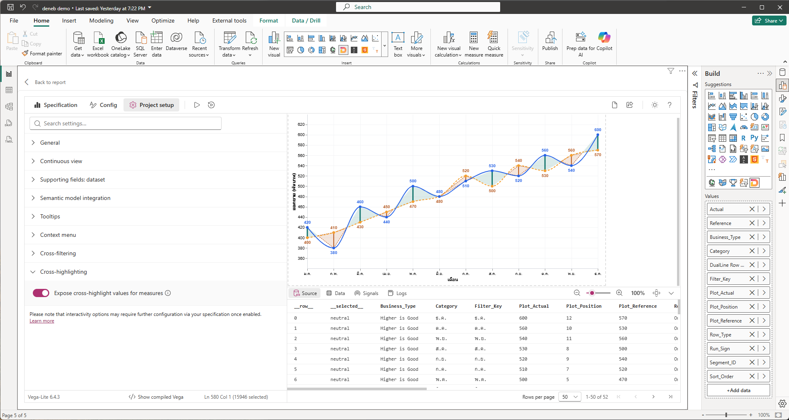

*ภาพ 8-6 Step 3: Editor แท็บ Project setup ขยายหมวด **Cross-highlighting** สวิตช์ **Expose cross-highlight values for measures** เปิด ข้อความท้ายหน้าเตือนว่าตัวเลือก Interactivity อาจต้องตั้งค่าเพิ่มใน spec ยังไม่มีการเลือก (`__selected__` เป็น `neutral` Preview เข้มทุกเดือน) และแถบใน Values เป็น `Actual`, `Reference`*

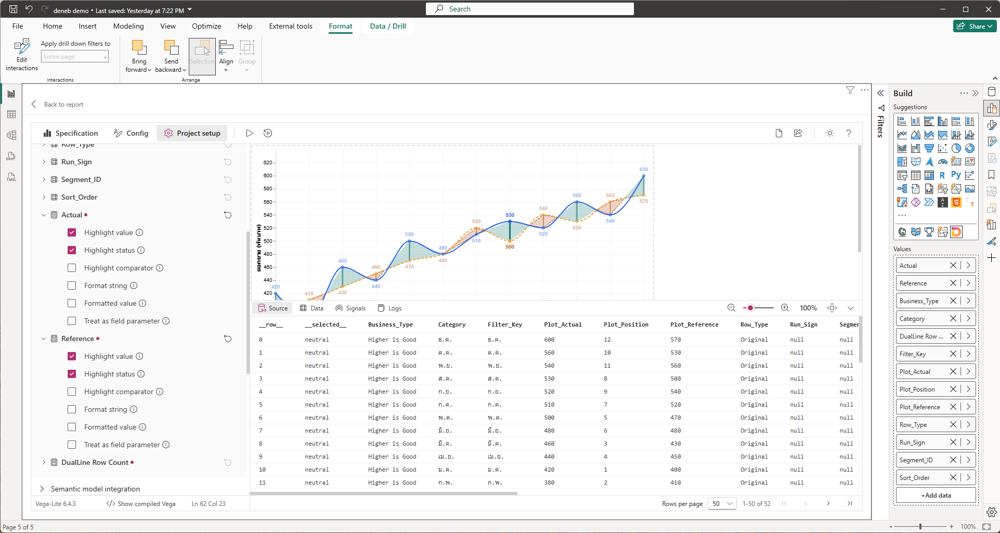

*ภาพ 8-7 Step 3: หมวด **Supporting fields: dataset** ขยาย measure `Actual` และ `Reference` (มีจุดสีแดงต่อท้ายชื่อบอกว่าเป็น measure) แต่ละตัวมีตัวเลือก Highlight value (ติ๊ก) Highlight status (ติ๊ก) Highlight comparator (ไม่ติ๊ก) Format string, Formatted value, Treat as field parameter (ไม่ติ๊ก) ช่อง Values ทางขวาเห็นแถบ `Actual` และ `Reference`*

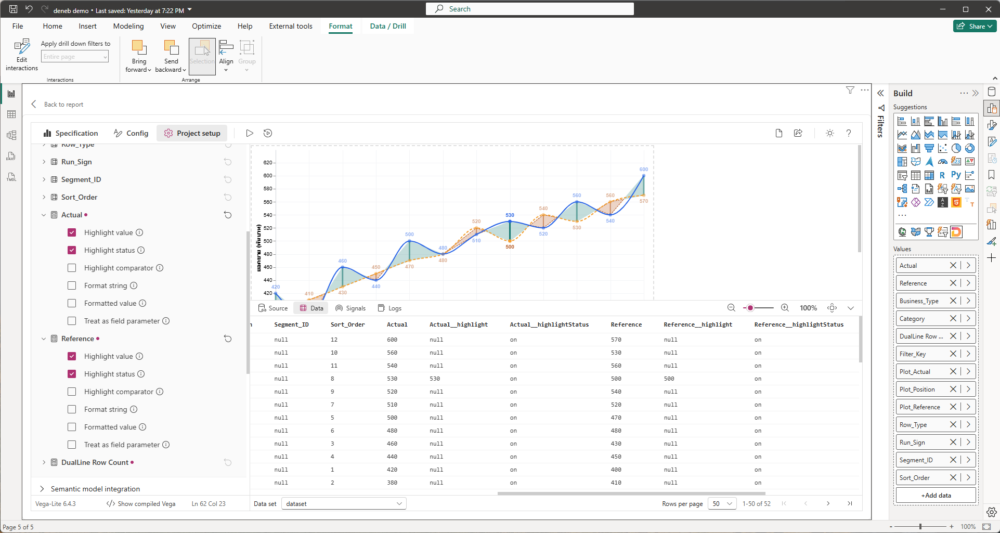

*ภาพ 8-8 Step 3: Debug pane แท็บ **Data** (Data set = `dataset`, 1-50 of 52) เลื่อนขวาเห็นคอลัมน์ `Actual`, `Actual__highlight`, `Actual__highlightStatus`, `Reference`, `Reference__highlight`, `Reference__highlightStatus` ทุกแถวที่เห็นใน dataset มี status เป็น `on` แถว Sort_Order 8 (ส.ค.) มีค่า highlight 530 และ 500 ส่วนแถวอื่นเป็น `null` แสดงว่ามีการเลือก ส.ค. ค้างอยู่ตอนถ่ายภาพ (Preview ด้านบนเห็น ส.ค. เข้มกว่าเดือนอื่น)*

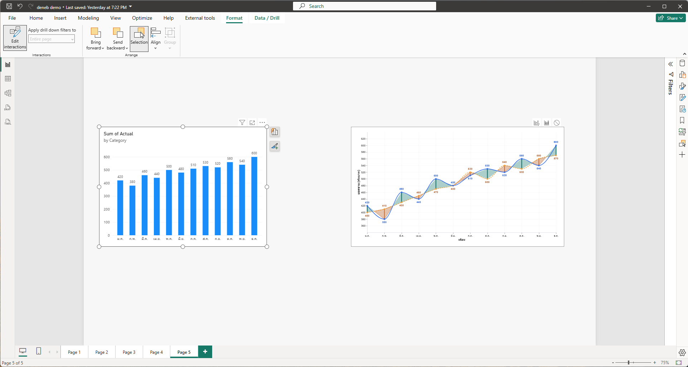

*ภาพ 8-9 Step 3: เลือก column chart แล้วเปิด Edit interactions (แท็บ Format) ทั้งสอง Visual แสดงไอคอนสามตัวเหนือ Deneb จากซ้ายไป Filter, Highlight, None ตัวที่เลือกอยู่คือ **Highlight** (ไอคอนกลาง แท่งทึบ ต่างจากไอคอนอื่นที่เป็นเส้นกรอบ)*

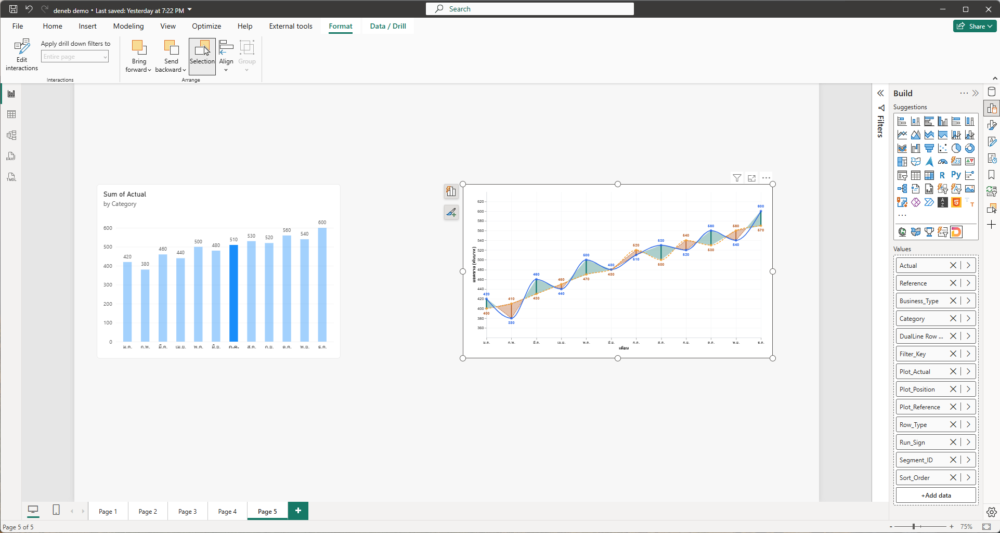

*ภาพ 8-10 Step 3: ยังใช้ spec `CH07-S02` Edit interactions = Highlight คลิกแท่ง ก.ค. (510) column chart เน้นแท่ง ก.ค. แต่ Deneb แสดงตามปกติ ไม่จางเลย เพราะ spec ยังไม่อ่านค่า highlight*

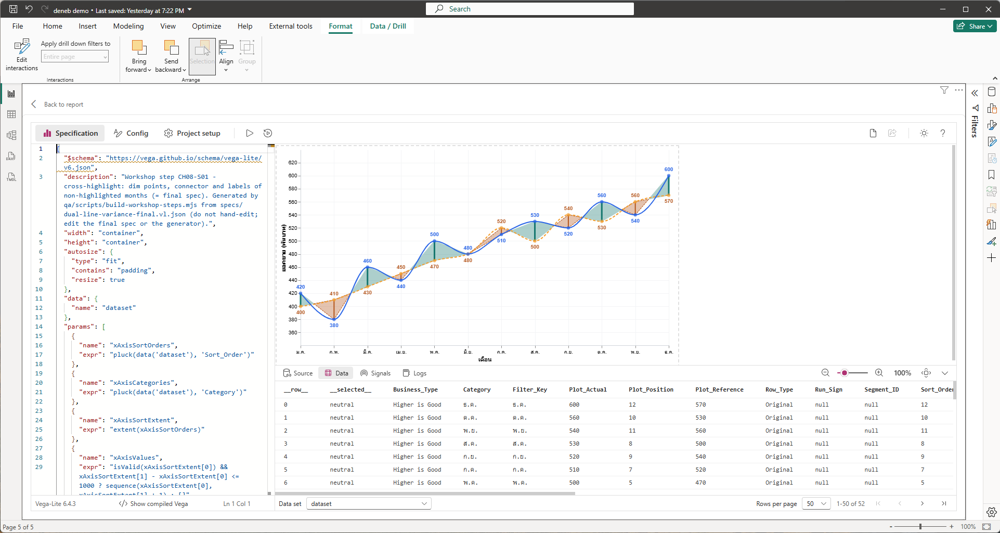

*ภาพ 8-11 Step 3: Editor วาง spec `CH08-S01` แล้ว (บรรทัดที่ 3 `description` เขียน CH08-S01) แท็บ Data ของ Debug pane เห็น `__selected__` เป็น `neutral` ยังไม่มีการเลือก กราฟเหมือนเดิม*

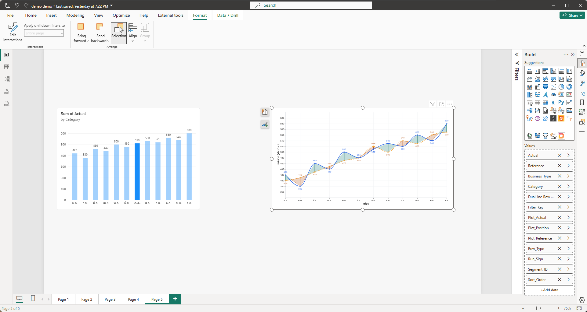

*ภาพ 8-12 Step 3: spec `CH08-S01` วางแล้ว คลิกแท่ง ก.ค. column chart เน้นแท่ง ก.ค. Deneb: จุด ป้ายตัวเลข และ Connector ของเดือนอื่นจางลง (ภาพนี้ถ่ายก่อนแยกระดับความจาง ทั้งสามอย่างจางเท่ากันที่ 0.5 ส่วน spec ปัจจุบันจุด 0.5 ป้าย 0.3 Connector 0.2) ส่วน ก.ค. (Actual 510 Reference 520) เข้มเต็ม เส้น Actual, เส้น Reference และพื้นที่สีไม่จาง*

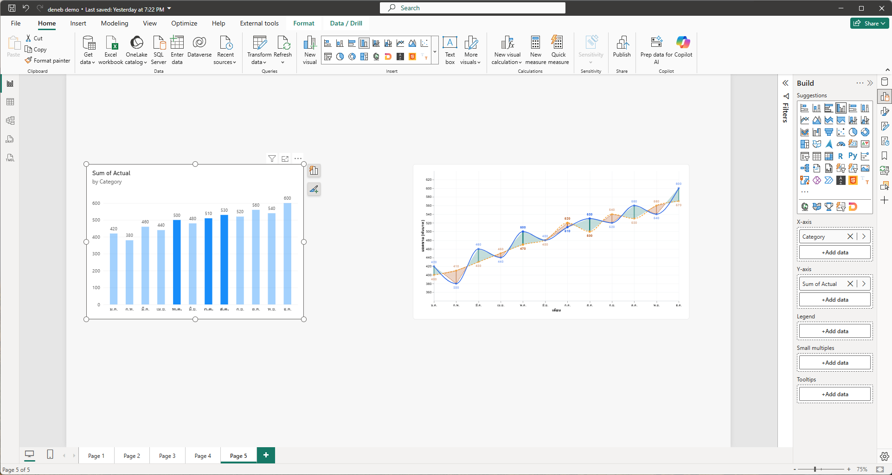

*ภาพ 8-13 Step 3: Ctrl+คลิกแท่ง พ.ค., ก.ค. และ ส.ค. column chart เน้นสามแท่ง Deneb เน้นจุด ป้าย และ Connector ของสามเดือนนี้ (พ.ค. 500/470, ก.ค. 510/520, ส.ค. 530/500) เดือนอื่นจาง (ถ่ายก่อนแยกระดับความจาง เหมือนภาพ 8-12)*

### 5) JSON ที่เพิ่มหรือแก้เฉพาะ Step

ไฟล์ `CH08-S01` ต่างจาก `CH07-S02` เพียงอย่างเดียว คือเพิ่ม `opacity` ใน `encoding` ของห้าชั้น (`connector_rule`, `point_reference`, `point_actual_hit_target`, `label_actual`, `label_reference`) ชั้นเส้นและพื้นที่สีไม่เปลี่ยน

ชั้นจุด Actual (ชั้น `label_actual` ใช้เงื่อนไข `test` เดียวกันนี้ แต่ค่าจาง (`value`) เป็น `0.3` และ `point_reference` กับ `label_reference` ใช้แบบเดียวกันแต่อ่านค่าของ Reference โดยจุดจาง 0.5 ป้ายจาง 0.3)

<!-- excerpt: CH08-S01-cross-highlight-opacity opacity:point_actual_hit_target -->
```json
"opacity": {
  "condition": {
    "test": "(isDefined(datum.Actual__highlightStatus) && (datum.Actual__highlightStatus == 'off' || (datum.Actual__highlightStatus == 'on' && isDefined(datum.Actual__highlight) && datum.Actual__highlight !== datum.Actual)))",
    "value": 0.5
  },
  "value": 1
}
```

ชั้น Connector (ต้องดูทั้งสอง measure)

<!-- excerpt: CH08-S01-cross-highlight-opacity opacity:connector_rule -->
```json
"opacity": {
  "condition": {
    "test": "((isDefined(datum.Actual__highlightStatus) && datum.Actual__highlightStatus != 'neutral') || (isDefined(datum.Reference__highlightStatus) && datum.Reference__highlightStatus != 'neutral')) && !((isDefined(datum.Actual__highlightStatus) && datum.Actual__highlightStatus == 'on' && isDefined(datum.Actual__highlight) && datum.Actual__highlight === datum.Actual) || (isDefined(datum.Reference__highlightStatus) && datum.Reference__highlightStatus == 'on' && isDefined(datum.Reference__highlight) && datum.Reference__highlight === datum.Reference))",
    "value": 0.2
  },
  "value": 1
}
```

### 6) คำอธิบายโค้ด

**ข้อมูลที่ Deneb ส่งมาจริง** จากภาพ 8-8 และผลทดสอบของผู้เขียนบน Deneb 2.0.0.0 เมื่อมีการเลือก (highlight) อยู่ Deneb ส่ง `Actual__highlightStatus` เป็น `on` ให้**ทุกแถว** รวมแถวที่ไม่ได้ถูกเลือก (ต่างจากเอกสารของ Deneb ที่ระบุว่าแถวที่ไม่ถูกเลือกเป็น `off`) แถวที่ถูกเลือกมี `Actual__highlight` เท่ากับค่า Actual ของแถว ส่วนแถวอื่นเป็น `null` เมื่อไม่มีการเลือก status เป็น `neutral` spec จึงต้องไม่พึ่ง `off` อย่างเดียว

**ระดับความจางต่างกันตามชั้น** เงื่อนไขว่าจะจางหรือไม่ (`test`) ใช้ตรรกะเดียวกัน แต่ค่าที่ใช้เมื่อจางต่างกัน: จุดทั้งสองชั้น **0.5**, ป้ายตัวเลขทั้งสองชั้น **0.3**, Connector **0.2** (ผู้ใช้ตัดสิน 26 ก.ย. 2026 ให้ Connector และป้ายจางกว่าจุด เพราะจุดคือสิ่งที่ผู้อ่านใช้ระบุเดือนที่เลือก) เส้นและพื้นที่สีไม่จาง

**เงื่อนไขของจุด Actual** ให้จาง (opacity 0.5) เมื่อ

- `Actual__highlightStatus` มีอยู่ (`isDefined`) และเป็น `off` หรือ
- เป็น `on` แต่ `Actual__highlight` ไม่ตรงกับค่า `Actual` ของแถวนั้น (ทั้ง `null` และค่าอื่นถือว่าไม่ตรง)

นอกเหนือจากนี้ opacity เป็น 1 ผลคือ ตอนไม่มีการเลือก (status `neutral`) ไม่จาง ตอนเลือก ก.ค. แถว ก.ค. (highlight เท่ากับ Actual) เข้ม แถวอื่น (highlight เป็น `null`) จาง `isDefined(x)` ของ Vega คืนค่าจริงเมื่อ x ไม่ใช่ `undefined` ดังนั้นค่า `null` ผ่านเงื่อนไขนี้ ต่างจาก `isValid` ที่ตัด `null` ด้วย ชั้นจุด Reference และป้าย Reference ใช้เงื่อนไขแบบเดียวกันกับ `Reference__*`

**เงื่อนไขของ Connector** อยู่ระหว่างสองจุดของเดือนเดียวกัน จึงจางเฉพาะเมื่อมี highlight ทำงานอยู่ (อย่างน้อยหนึ่ง measure ไม่ใช่ `neutral`) **และ** ค่าของเดือนนั้นไม่ได้ถูกเลือกทั้ง Actual และ Reference

**ทำไมเส้นและพื้นที่สีไม่จาง** ผู้ใช้ตัดสินให้เส้น Actual, Reference และพื้นที่สีคงเดิม เพราะจุดข้อมูลบอกเดือนที่เลือกได้อยู่แล้ว และการจางเส้นทั้งเส้นทำให้อ่านแนวโน้มยาก ผลที่เห็นตรงกับภาพ 8-12 และ 8-13

**Multi-select** เมื่อเลือกหลายแท่ง หลายเดือนมี highlight เท่ากับค่าของตัวเอง เงื่อนไขเดียวกันจึงเน้นทุกเดือนที่เลือก (ภาพ 8-13)

**ทำไมต้องดูภาพ 8-10** ภาพนั้นพิสูจน์ว่าการตั้งค่าใน Project setup อย่างเดียวไม่พอ ข้อมูลถึง Deneb แล้ว (ภาพ 8-8) แต่ spec ต้องอ่านและเปลี่ยน `opacity` เอง

### 7) ภาพระหว่างทำ

ภาพ 8-6 ถึง 8-13

### 8) ผลลัพธ์ที่ควรได้

เลือกแท่งแล้ว จุด (0.5) ป้าย (0.3) และ Connector (0.2) ของเดือนที่ไม่ได้เลือกจางลง เดือนที่เลือกเข้มเต็ม เส้นและพื้นที่สีไม่เปลี่ยน ยกเลิกการเลือกแล้วทุกอย่างกลับเข้ม

### 9) วิธีตรวจสอบผล

- ก่อนวาง `CH08-S01` (ภาพ 8-10) คลิกแท่ง ก.ค. Deneb ไม่จาง
- หลังวาง (ภาพ 8-12) จุด ป้ายตัวเลข Connector ของเดือนอื่นจาง ก.ค. เข้ม
- เลือกหลายแท่ง (ภาพ 8-13) ทุกเดือนที่เลือกเข้ม
- ล้าง selection แล้วทุกเดือนเข้มเท่ากัน

### 10) ปัญหาที่อาจพบและวิธีแก้

| อาการ | สาเหตุที่เป็นไปได้ | วิธีแก้ |
| --- | --- | --- |
| เลือกแท่งแล้ว Deneb ไม่จางเลย | ชื่อแถบเป็น `Sum of Actual` ทำให้คอลัมน์เป็น `Sum of Actual__highlight` ที่ spec ไม่รู้จัก | ตรวจแท็บ Data ตามภาพ 8-8 แล้วเปลี่ยนชื่อแถบเป็น `Actual` และ `Reference` (พบจริง ผู้เขียนเจอเมื่อทดสอบบทนี้) |
| ไม่จาง ทั้งที่ชื่อ field ถูก | Edit interactions ไม่ใช่ Highlight | เลือก column chart > Edit interactions > ไอคอน Highlight ที่ Deneb |
| ไม่จาง และเป็น Slicer เป็นต้นทาง | Slicer ไม่มีโหมด Highlight | ใช้ column chart หรือ bar chart |
| ไม่มีคอลัมน์ `*__highlight*` ในแท็บ Data | ไม่ได้เปิด Cross-highlight หรือ Supporting fields | ทำข้อ 1 และ 2 ในหัวข้อ 4 |
| ไม่จางเพราะยังเป็น spec `CH07-S02` | ยังไม่ได้วาง `CH08-S01` | วางไฟล์ Step ทั้งไฟล์แล้ว Apply |
| จางไม่ตรงเดือน | selection เก่าค้างอยู่ | คลิกที่ว่างเพื่อล้างแล้วเลือกใหม่ |

### 11) แบบฝึกหัดสั้น

ก่อนวาง `CH08-S01` ให้ลองแก้ค่า `0.5` ในเงื่อนไข opacity ของชั้น `point_actual_hit_target` เป็น `0.2` หลังวางแล้ว ดูว่าเดือนที่ไม่ได้เลือกจางลงกว่าเดิมหรือไม่ แล้วเปลี่ยนกลับ (ผู้เขียนยังไม่ได้ลองผลใน Deneb จริง)

### 12) จุดตรวจผ่านก่อนทำ Step ถัดไป

- [ ] แท็บ Data เห็นคอลัมน์ `Actual__highlight` และอีกสามตัวครบ
- [ ] เลือกแท่งแล้วจุด ป้าย Connector ของเดือนอื่นจาง
- [ ] อธิบายได้ว่าทำไมภาพ 8-10 ไม่จาง

---

## Step 4 Edit interactions: Filter และ None

### 1) เป้าหมาย

ดูว่าเมื่อเปลี่ยน Edit interactions จาก Highlight เป็น Filter หรือ None แล้ว Deneb ตอบสนองต่างกันอย่างไร

### 2) สิ่งที่ควรเห็นก่อนเริ่ม

Step 3 ทำงาน (Highlight) และวาง `CH08-S01` แล้ว

### 3) Fields/Measures ที่ใช้

Relationship `Filter_Key` ไป `Category` และการตั้ง Edit interactions ของ column chart

### 4) ขั้นตอนใน Power BI

1. เลือก column chart แล้วเปิด Edit interactions ที่ Deneb เลือกไอคอน **Filter** ล้าง selection แล้วคลิกแท่ง ก.ค. ตามภาพ 8-14
2. ที่ Deneb เลือกไอคอน **None** คลิกแท่ง ก.ค. ตามภาพ 8-15 (ภาพนี้ออกจากโหมด Edit interactions แล้ว จึงไม่เห็นไอคอน)
3. **คืนเป็น Highlight** เมื่อจบ Step

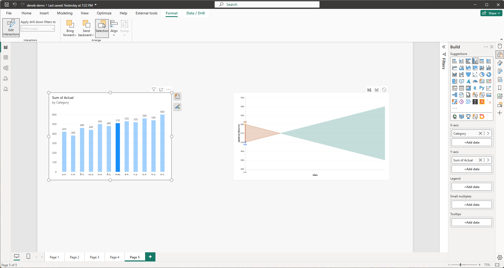

*ภาพ 8-14 Step 4: Edit interactions = Filter (ไอคอน Filter เหนือ Deneb เป็นตัวที่เลือก) คลิกแท่ง ก.ค. Deneb ไม่วาดทั้งปี เหลือจุดและป้ายของ ก.ค. (510 และ 520) และพื้นที่สีของช่วง ก.ค.–ส.ค. ที่ยื่นไปทางขวาโดยไม่มีจุดของ ส.ค. แกน X เหลือ ก.ค. และแกน Y ปรับเป็นช่วง 495 ถึง 535*

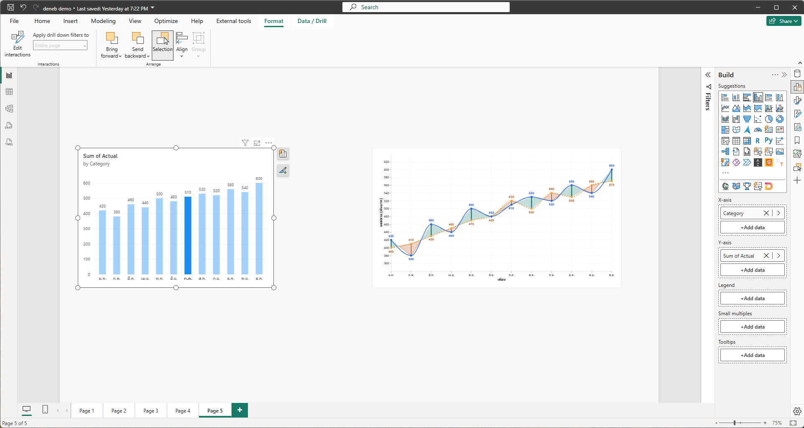

*ภาพ 8-15 Step 4: ตั้ง Edit interactions เป็น None แล้วออกจากโหมด Edit interactions column chart เลือกแท่ง ก.ค. Deneb แสดงครบทุกเดือนและไม่จาง สอดคล้องกับ None (ภาพนี้ไม่เห็นไอคอน จึงยืนยันโหมดจากผลของ Deneb)*

### 5) JSON ที่เพิ่มหรือแก้เฉพาะ Step

ไม่มี ไม่แตะ spec

### 6) คำอธิบายโค้ด

ไม่มีโค้ดใหม่ สามโหมดต่างกันที่วิธีที่ Power BI ส่งการเลือกให้ Deneb

| โหมด | สิ่งที่ Deneb ได้รับ | ผลที่เห็น |
| --- | --- | --- |
| Highlight | ข้อมูลครบ 52 แถว พร้อมคอลัมน์ `__highlight` และ `__highlightStatus` | จางเดือนอื่นตาม spec `CH08-S01` (ภาพ 8-12) |
| Filter | เฉพาะแถวที่ผ่านตัวกรอง (ตาม `Filter_Key`) | Deneb วาดเฉพาะแถวที่เหลือ (ภาพ 8-14) |
| None | ไม่มีการเปลี่ยนแปลง | ไม่ตอบสนอง (ภาพ 8-15) |

**ผลของโหมด Filter ที่ผู้อ่านอาจงง** ตัวกรองทำงานกับ `Filter_Key` ซึ่งเป็นเดือนต้นช่วงของแถวพื้นที่ เมื่อเลือก ก.ค. แถว `Original` ของ ก.ค. เหลือ 1 แถว และแถวพื้นที่ของช่วง ก.ค.–ส.ค. (ที่ `Filter_Key` = ก.ค.) เหลืออยู่ด้วย แต่แถวของ ส.ค. ไม่เหลือ จึงเห็นพื้นที่ยื่นไปถึงตำแหน่ง ส.ค. โดยไม่มีจุดของ ส.ค. แถวพื้นที่ของช่วง มิ.ย.–ก.ค. (`Filter_Key` = มิ.ย.) หายไป และแกน Y คำนวณใหม่จากข้อมูลที่เหลือ (บทที่ 5 Step 5) ซึ่งเป็นผลตามการออกแบบ ไม่ใช่ข้อผิดพลาด

### 7) ภาพระหว่างทำ

ภาพ 8-14 และ 8-15

### 8) ผลลัพธ์ที่ควรได้

Filter: Deneb เหลือเฉพาะเดือนที่เลือก None: Deneb ไม่เปลี่ยน

### 9) วิธีตรวจสอบผล

เทียบภาพ 8-14 (เหลือ ก.ค.) กับภาพ 8-12 (Highlight ยังเห็นครบทุกเดือน) และภาพ 8-15 (None ไม่เปลี่ยน)

### 10) ปัญหาที่อาจพบและวิธีแก้

| อาการ | สาเหตุที่เป็นไปได้ | วิธีแก้ |
| --- | --- | --- |
| กราฟเหลือจุดเดียวและดูแปลก | โหมด Filter กรอง `Filter_Key` | เป็นผลปกติ ตั้งกลับเป็น Highlight ถ้าต้องการเห็นครบ |
| ลืมคืนเป็น Highlight | ตั้ง None ค้าง | เปิด Edit interactions แล้วเลือก Highlight ที่ Deneb |

### 11) แบบฝึกหัดสั้น

ในโหมด Filter เลือกหลายแท่งด้วย Ctrl+คลิก ดูว่า Deneb เหลือเดือนใด แล้วคืนโหมด (ผู้เขียนยังไม่ได้ลองผล)

### 12) จุดตรวจผ่านก่อนทำ Step ถัดไป

- [ ] เห็นผลต่างของ Filter กับ None
- [ ] คืน Edit interactions เป็น Highlight แล้ว

---

## Step 5 เมนูคลิกขวา (Context menu)

### 1) เป้าหมาย

ตรวจการตั้งค่า Context menu ของ Deneb และดูเมนูที่ขึ้นเมื่อคลิกขวาที่จุดข้อมูล

### 2) สิ่งที่ควรเห็นก่อนเริ่ม

Edit interactions กลับเป็น Highlight แล้ว และไม่มี selection ค้าง

### 3) Fields/Measures ที่ใช้

การตั้งค่าใน Project setup เท่านั้น

### 4) ขั้นตอนใน Power BI

1. เปิด Editor แท็บ **Project setup** ขยายหมวด **Context menu** ตามภาพ 8-16 ต้องเห็นสวิตช์ **Show context menu on right-click** และ **Attempt to resolve data point-specific actions** เปิดทั้งคู่ (ไม่ต้องเปลี่ยน)
2. กลับหน้ารายงาน ล้าง selection แล้วคลิกขวาที่จุดสีน้ำเงินของ ต.ค. ตามภาพ 8-17

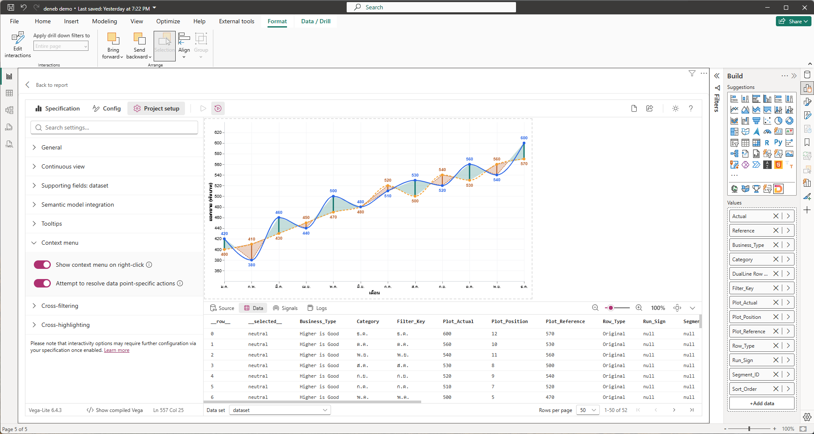

*ภาพ 8-16 Step 5: หมวด **Context menu** ขยาย สวิตช์ **Show context menu on right-click** และ **Attempt to resolve data point-specific actions** เปิดทั้งคู่*

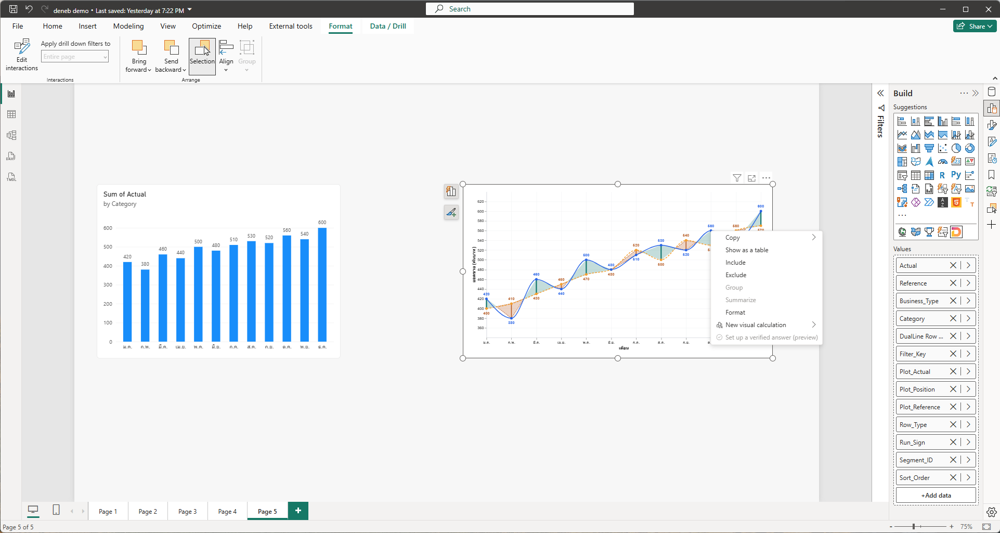

*ภาพ 8-17 Step 5: คลิกขวาที่จุดของ ต.ค. ในกราฟ Deneb เมนูของ Power BI ขึ้นรายการ Copy, Show as a table, Include, Exclude, Group (จาง), Summarize (จาง), Format, New visual calculation และ Set up a verified answer (preview) (จาง) column chart ทางซ้ายไม่เปลี่ยน เพราะคลิกขวาไม่สร้าง selection*

### 5) JSON ที่เพิ่มหรือแก้เฉพาะ Step

ไม่มี

### 6) คำอธิบายโค้ด

ไม่มีโค้ดใหม่ **Show context menu on right-click** ให้ Deneb เปิดเมนูของ Power BI เมื่อคลิกขวา และ **Attempt to resolve data point-specific actions** ให้ Deneb ลองหาว่าแถวใดอยู่ใต้เมาส์เพื่อให้เมนูทำงานกับแถวนั้น (เช่น Include/Exclude)

ผลทดสอบของผู้เขียนบนเครื่องจริง (24 ก.ย. 2026 ไม่มีภาพในบทนี้): Include ที่จุด ต.ค. กรอง Visual เหลือแถว `Original` ของ ต.ค. Include ที่พื้นที่สีกรองเหลือแถวพื้นที่เพียงแถวเดียว ซึ่งวาดพื้นที่ไม่ได้ กราฟจึงว่าง และ **Show as a table** แสดงข้อมูลทั้ง Visual ไม่ใช่แถวที่คลิก

### 7) ภาพระหว่างทำ

ภาพ 8-16 และ 8-17

### 8) ผลลัพธ์ที่ควรได้

คลิกขวาที่จุดแล้วเมนูขึ้น มี Include และ Exclude ใช้งานได้

### 9) วิธีตรวจสอบผล

เมนูตามภาพ 8-17 มี Include และ Exclude (ไม่จาง)

### 10) ปัญหาที่อาจพบและวิธีแก้

| อาการ | สาเหตุที่เป็นไปได้ | วิธีแก้ |
| --- | --- | --- |
| คลิกขวาแล้วไม่มีเมนูของ Power BI | ปิด Show context menu on right-click | เปิดตามภาพ 8-16 |
| Include/Exclude ใช้ไม่ได้ | ปิด Attempt to resolve data point-specific actions | เปิดตามภาพ 8-16 |
| กราฟว่างหลัง Include ที่พื้นที่สี | Include เลือกแถวพื้นที่แถวเดียว | ลบตัวกรองใน Filters pane ของ Visual |

### 11) แบบฝึกหัดสั้น

คลิกขวาที่จุด พ.ค. แล้วเลือก Include ดู Filters pane ของ Visual แล้วลบตัวกรองออก (ผู้เขียนยังไม่ได้ลองที่จุด พ.ค.)

### 12) จุดตรวจผ่านก่อนไปบทที่ 9

- [ ] สวิตช์ Context menu ทั้งสองเปิด
- [ ] เมนูคลิกขวาขึ้นเมื่อคลิกขวาที่จุด
- [ ] ลบตัวกรองที่เกิดจาก Include (ถ้ามี) แล้ว

---

## สรุปบทที่ 8

- ส่งออก (Cross-filtering) ตั้งที่หมวด Cross-filtering แบบ Simple คลิกจุดเลือกเดือนนั้น คลิกพื้นที่สีเลือกเดือนต้นช่วง
- รับเข้า (Cross-highlighting) ต้องเปิดสามอย่าง: Expose cross-highlight, Supporting fields (Highlight value และ status) และตั้ง Edit interactions เป็น Highlight ที่ column chart
- ชื่อแถบในช่อง Values ต้องเป็น `Actual` และ `Reference` เพื่อให้คอลัมน์ highlight ตรงกับที่ spec อ้าง
- spec ต้องอ่าน `__highlightStatus` และ `__highlight` เองจึงจะจาง Deneb 2.0.0.0 ส่ง status เป็น `on` ให้ทุกแถวขณะมีการเลือก
- Filter กรองแถวทิ้ง None ไม่ตอบสนอง
- เมนูคลิกขวาของ Deneb ใช้ Include/Exclude ได้ผ่านการตั้งค่าสองข้อ

## คำถามทบทวน

1. ทำไมคลิกพื้นที่สีช่วง ม.ค.–ก.พ. ชิดฝั่ง ก.พ. จึงเลือกแท่ง ม.ค.
2. ทำไมภาพ 8-10 (เปิด Cross-highlight แล้ว) Deneb จึงยังไม่จาง
3. ถ้าช่อง Values ของ Deneb ยังชื่อ `Sum of Actual` จะเกิดอะไรกับ Cross-highlight และตรวจได้จากที่ไหน
4. ทำไมเงื่อนไข opacity ไม่ใช้แค่ `Actual__highlightStatus == 'off'`
5. Filter กับ Highlight ต่างกันอย่างไรในสิ่งที่ Deneb ได้รับ

<details>
<summary>แนวคำตอบ</summary>

1. แถวพื้นที่ไม่มี `Category` ใช้ `Filter_Key` ซึ่งเท่ากับเดือนต้นช่วง (ม.ค.) จึงเลือก ม.ค.
2. ตัวเลือกใน Project setup แค่ทำให้ข้อมูล highlight มาถึง spec ยังไม่ได้ให้ spec เปลี่ยนหน้าตา ต้องวาง `CH08-S01` ที่อ่านค่าเหล่านั้น
3. คอลัมน์เป็น `Sum of Actual__highlight` spec หาไม่เจอ เงื่อนไขเป็นเท็จ กราฟไม่จาง ตรวจได้จากแท็บ Data ของ Debug pane (ภาพ 8-8)
4. Deneb 2.0.0.0 ส่ง status เป็น `on` ให้ทุกแถวขณะเลือก ไม่ใช่ `off` สำหรับแถวที่ไม่ถูกเลือก จึงต้องดูว่า `__highlight` ตรงกับค่าของแถวหรือไม่ด้วย
5. Highlight ส่งครบ 52 แถวพร้อมคอลัมน์ highlight ส่วน Filter ส่งเฉพาะแถวที่ผ่านตัวกรอง

</details>

## จุดตรวจผ่านก่อนไปบทที่ 9

- [ ] Deneb ตอบสนองทั้งสองทิศทาง (คลิกจุดแล้ว column chart ตาม เลือกแท่งแล้ว Deneb จาง)
- [ ] ช่อง Values มีแถบ `Actual` และ `Reference`
- [ ] Edit interactions กลับเป็น Highlight และไม่มี selection ค้าง
