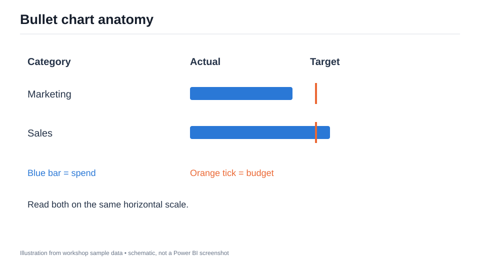
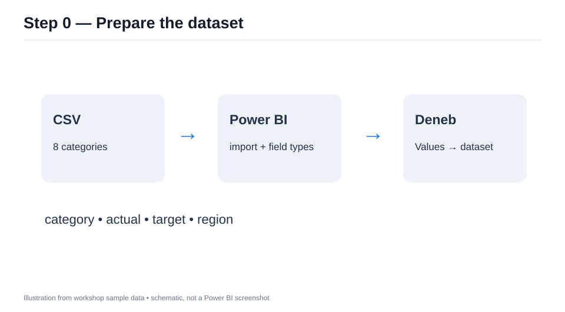
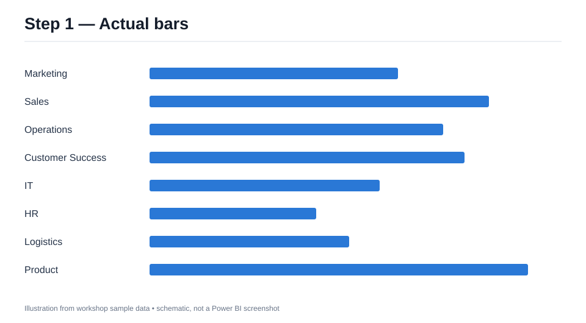
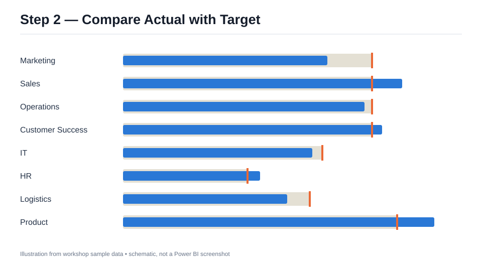
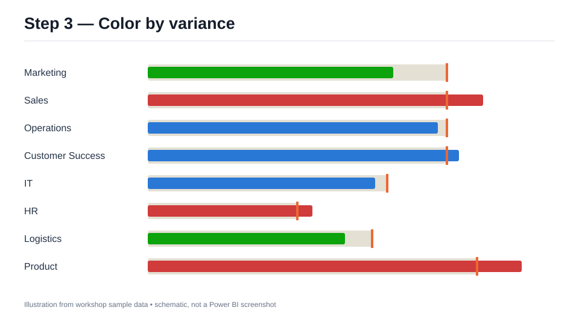
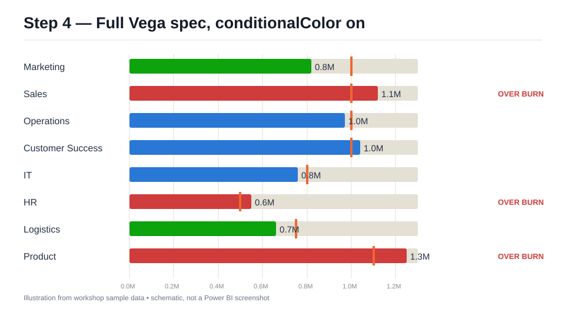

# สร้าง Bullet Chart ด้วย Deneb ใน Power BI

## eBook และ workshop แบบค่อยเป็นค่อยไป

**กลุ่มผู้อ่าน:** ผู้ใช้ Power BI ที่เคยสร้างกราฟพื้นฐานและต้องการควบคุมหน้าตาของ visual ด้วย JSON  
**เวลา:** ประมาณ 60–90 นาที  
**ผลลัพธ์:** จากแท่ง Actual ธรรมดา ไปสู่ Bullet Chart ที่มี Target, สีตาม variance และสเปก Vega ฉบับเต็มที่ถอดแนวคิดจาก custom visual เดิม

> ภาพประกอบทุกภาพเป็นภาพจำลองจากข้อมูล workshop เพื่อแสดงผลที่ควรเห็นในแต่ละขั้น เมนูจริงอาจต่างตามรุ่นของ Power BI และ Deneb

## แผนการเรียน

| ขั้น | สิ่งที่เพิ่ม | ไฟล์ |
|---|---|---|
| 0 | นำเข้าข้อมูลและจับคู่ฟิลด์ | `data/bullet_workshop.csv` |
| 1 | แท่ง Actual พื้นฐาน | `specs/01-bars.vl.json` |
| 2 | แถบ Target และขีดเป้าหมาย | `specs/02-target.vl.json` |
| 3 | คำนวณ variance และใช้สี | `specs/03-variance.vl.json` |
| 4 | ใช้ Vega spec ฉบับเต็มจาก custom visual เดิม | `../source/bulletChart/spec.json` |

## แนวคิดก่อนเริ่ม

Bullet chart แสดง Actual เป็นแท่งแนวนอน และ Target เป็นขีดตั้ง การวางสองค่าไว้บนสเกลเดียวกันช่วยให้เห็นว่าแต่ละหมวดอยู่ต่ำหรือสูงกว่าเป้าหมายเท่าไร ใน workshop นี้ถือว่าตัวเลขเป็น **งบใช้จ่าย** จึงตีความ Actual มากกว่า Target ว่าใช้งบเกิน; ถ้าใช้กับยอดขาย ความหมายของสีและสถานะต้องเปลี่ยนตามโจทย์

Deneb รับฟิลด์จากช่อง **Values** ของ visual แล้วส่งให้สเปกผ่าน dataset ชื่อ `dataset` ชื่อฟิลด์ใน JSON ต้องตรงกับชื่อที่แสดงใน Values [เอกสาร Deneb: Dataset](https://deneb.guide/docs/dataset)



## ขั้น 0 — เตรียมข้อมูลและ Deneb

1. ใน Power BI Desktop เลือก **Get data → Text/CSV** แล้วเปิด `workshop/data/bullet_workshop.csv` จากรากโปรเจ็กต์
2. ตรวจชนิดข้อมูล: `category` และ `region` เป็น Text; `actual` และ `target` เป็น Whole number จากนั้น Load
3. เพิ่ม Deneb จาก AppSource ลงในรายงานตามขั้นตอนของ Microsoft [Import a Power BI visual](https://learn.microsoft.com/en-us/power-bi/developer/visuals/import-visual)
4. วาง `category`, `actual`, `target`, `region` ลงในช่อง **Values** ของ Deneb ตรวจชื่อที่แสดงในช่องนี้ให้เป็น `category`, `actual`, `target`, `region` ทุกตัวอักษร หาก Power BI แสดง `Sum of actual` หรือ `Sum of target` ให้เปลี่ยนชื่อฟิลด์ใน Values เป็น `actual` และ `target` (เช่น ดับเบิลคลิกชื่อฟิลด์เพื่อ Rename) หรือเลือก **Don't summarize** เมื่อเหมาะกับข้อมูลหนึ่งแถวต่อหมวด ทั้งสองค่าต้องยังเป็นตัวเลข
5. สร้างสเปกใหม่โดยเลือก **Vega-Lite** และเทมเพลตว่าง เปิด editor เพื่อวาง JSON ของขั้น 1

**ตรวจสอบ:** Data pane ของ Deneb ควรมี 8 แถว และเห็นฟิลด์ `category`, `actual`, `target`, `region` หากเป็นศูนย์แถว ให้ตรวจตัวกรองและ Values ก่อนแก้ JSON



## ขั้น 1 — วาด Actual ด้วย Vega-Lite

เปิด `workshop/specs/01-bars.vl.json` คัดลอกทั้งไฟล์ลง editor แล้ว Apply สเปกใช้ `data: {"name":"dataset"}` เพื่อผูกข้อมูลจาก Power BI, วาง `category` ที่แกน Y และ `actual` ที่แกน X

```json
"data": {"name": "dataset"},
"mark": {"type": "bar", "color": "#2A78D6"}
```

**ลองทำ:** ชี้แท่ง Marketing จะเห็น Actual 820,000; Sales 1,120,000 เปลี่ยนตัวกรอง `region` แล้วจำนวนแท่งควรเปลี่ยน

**ผ่านเมื่อ:** มี 8 แท่งแนวนอน ไม่มีแจ้งเตือน field missing และ tooltip แสดง category กับ actual



## ขั้น 2 — เพิ่ม Target

แทน JSON ทั้งหมดด้วย `workshop/specs/02-target.vl.json` ขั้นนี้ใช้ `layer` ซ้อน 3 ชั้น: แถบสีเทาเป็น Target, แท่งน้ำเงินเป็น Actual, ขีดสีส้มเป็น Target ที่ตำแหน่งเดียวกัน

```json
"layer": [
  {"mark": {"type": "bar", "color": "#E4E0D4", "size": 25}},
  {"mark": {"type": "bar", "color": "#2A78D6", "size": 17}},
  {"mark": {"type": "tick", "color": "#EB6834", "thickness": 3, "size": 32}}
]
```

ในไฟล์จริง แต่ละ layer กำหนด `x.field` ให้เป็น `target` หรือ `actual` ด้วย แกน X ร่วมกันจึงเปรียบเทียบได้ตรงตำแหน่ง

**ลองทำ:** Sales และ Product ควรมีแท่ง Actual เลยขีด Target; Marketing ควรอยู่ก่อนขีด Target

**ผ่านเมื่อ:** ทุกแถวมีแถบเทา แท่ง Actual และขีดสีส้ม



## ขั้น 3 — เพิ่ม variance และสี

แทน JSON ด้วย `workshop/specs/03-variance.vl.json` สเปกเพิ่ม transform:

```text
variance % = (actual - target) / target × 100
```

ถ้า Target เป็น 0 ให้ variance เป็น `null` และแสดง `N/A` แทนการหารด้วยศูนย์ กติกาสีสำหรับข้อมูล **งบใช้จ่าย** คือ ต่ำกว่า −5% เป็นเขียว, ตั้งแต่ −5% ถึงต่ำกว่า +10% เป็นน้ำเงิน, ตั้งแต่ +10% เป็นแดง

**ลองคำนวณ:** Marketing = (820,000 − 1,000,000) / 1,000,000 = −18.0% สีเขียว; Sales = +12.0% สีแดง; Operations = −3.0% สีน้ำเงิน

**ผ่านเมื่อ:** Tooltip แสดง Variance และสีของสามหมวดตัวอย่างตรงตามข้างต้น ตรวจค่าขอบด้วย: IT = −5.0% ยังเป็นน้ำเงินเพราะเงื่อนไขเขียวใช้ค่าน้อยกว่า −5; HR = +10.0% เป็นแดงเพราะเงื่อนไขแดงเริ่มตั้งแต่ +10



## ขั้น 4 — ไปสู่สเปก Vega ฉบับเต็ม

สเปกเดิมใน `source/bulletChart/spec.json` เป็น **Vega** ไม่ใช่ Vega-Lite เพิ่ม Deneb visual ตัวใหม่ เลือก provider เป็น **Vega** แล้วลาก `category`, `actual`, `target` (และ `region` หากต้องการใช้กรอง) ลงใน Values เปลี่ยนชื่อที่แสดงให้ตรงกับ JSON จากนั้นเปิด **Edit → Spec** เพื่อวาง JSON ทั้งไฟล์ ตัวเลือก `tooltip1` ถึง `tooltip4` ใส่เพิ่มได้ภายหลัง

สเปกเต็มเพิ่มสิ่งที่สเปกสอนพื้นฐานยังไม่มี: การจัดพื้นที่ตามขนาด visual, label ตัวเลข Actual, status, หน่วย K/M/B, จำนวนแถวสูงสุด, animation และการเลือกแถว **แถบเทาในสเปกเต็มเป็น track พื้นหลังเต็มความกว้าง** และ Target แสดงด้วยขีดสีส้ม ต่างจากขั้น 2–3 ที่แถบเทายาวถึง Target ค่า variance % อยู่ใน tooltip ส่วนตัวเลขข้างแท่งเป็น Actual รายละเอียดการตั้งค่าอยู่ที่ `source/bulletChart/README.md` ค่าเริ่มต้นจำกัด 10 แถว; ข้อมูล workshop มี 8 แถวจึงแสดงครบ

**ปรับแต่งแรก:** ใน `signals` เปลี่ยน `"conditionalColor"` จาก `false` เป็น `true` เพื่อให้แท่งใช้กติกาสีจากขั้น 3 แล้วลองเปลี่ยน `"statusHighText"` จาก `"OVER BURN"` เป็น `"เกินงบ"` หากต้องการภาษาไทย

**ตั้งค่า interactivity:** ที่ **Settings → Vega → Power BI Interactivity** เปิด **Expose cross-filtering values for dataset rows** เพื่อให้คลิกเลือกแถวแล้ว cross-filter visual อื่นได้ ปล่อย **Tooltip Handler** ไว้ที่ On ตามค่าเริ่มต้น

**ทดสอบใน Power BI:** ตรวจ tooltip, การเลือกแถวและ cross-filter กับ visual อื่น, ขนาด visual แคบ/กว้าง และตัวกรอง region ตามคำแนะนำใน README ของสเปกเต็ม การแสดงใน Power BI Desktop ยังต้องตรวจจริงก่อนเผยแพร่รายงาน ภาพประกอบด้านล่างจำลองผลเมื่อเปิด `conditionalColor` แล้ว และยังใช้ข้อความสถานะเริ่มต้น `OVER BURN`



ภาพนี้จำลองสเกล 0–1.3M และเส้นกริดทุก 0.2M เพื่ออธิบายตำแหน่งแท่งกับ Target; ระยะจริงใน Power BI อาจเปลี่ยนตามขนาด visual และการเลือก tick ของ Vega

## สรุปและแบบฝึกต่อยอด

1. ในขั้น 4 แก้ `actual` ของ Product ใน CSV เป็น `1100000` ให้เท่ากับ Target แล้วกด **Refresh** ใน Power BI ผลควรเป็น variance `+0.0%`, แท่งสีน้ำเงินเมื่อเปิด `conditionalColor` และไม่มีป้าย status เพราะ `statusMidText` ว่างโดยค่าเริ่มต้น
2. เพิ่มแถวที่ `target` เป็น `0` ใน CSV แล้วกด **Refresh** ทดลองในขั้น 3 หรือ 4 Tooltip ควรแสดง variance เป็น `N/A` (ขั้น 4 แสดงร่วมกับค่าผลต่าง) และแท่งเป็นสีน้ำเงิน
3. ปรับ threshold เป็น −4% และ +11%: ในขั้น 3 แก้เงื่อนไข `< -5` และ `>= 10` ใน `03-variance.vl.json`; ในขั้น 4 แก้ทั้ง `varianceThreshold1/2` สำหรับสี และ `statusThreshold1/2` สำหรับสถานะใน `spec.json` จากนั้นอธิบายว่า IT (−5.0%) เปลี่ยนจากน้ำเงินเป็นเขียว และ HR (+10.0%) เปลี่ยนจากแดงเป็นน้ำเงิน หากแก้ threshold เพียงชุดเดียว สีและสถานะอาจไม่ตรงกัน ค่าเริ่มต้น `statusLowText` ว่าง จึงยังไม่มีป้ายใหม่ที่ IT ส่วนป้าย `OVER BURN` ของ HR จะหายไป
4. หากใช้ข้อมูลยอดขาย ให้กำหนดสีและข้อความสถานะใหม่ก่อนใช้กราฟตัดสินใจ

## ขอบเขตของการถอด custom visual

สเปก Vega ฉบับเต็มถอดหน้าตาและพฤติกรรมหลักจาก custom visual `bulletChart` ที่มีอยู่ในโปรเจ็กต์ แต่ไม่มีระบบ license, pane ตั้งค่าแบบเดิม หรือ scrolling ภายในกราฟ เมื่อแถวแน่น สเปกจะย่อความหนาแท่ง รายละเอียดความต่างอื่น ๆ อยู่ใน `source/bulletChart/README.md`

## แหล่งอ้างอิง

- [Deneb — Getting Started](https://deneb.guide/docs/getting-started)
- [Deneb — Dataset](https://deneb.guide/docs/dataset)
- [Deneb — Visual Editor](https://deneb.guide/docs/visual-editor)
- [Microsoft — Import Power BI visuals](https://learn.microsoft.com/en-us/power-bi/developer/visuals/import-visual)
- [Vega-Lite — Layer](https://vega.github.io/vega-lite/docs/layer.html)
